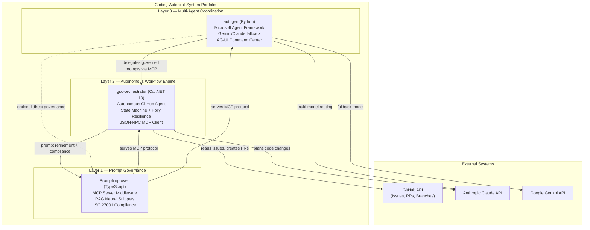

<objective>
Rewrite the Coding-Autopilot-System org profile README to showcase all three projects as a coherent AI platform.

Purpose: The org profile README is the first impression for hiring managers arriving at github.com/Coding-Autopilot-System. The current content references obsolete projects (autopilot-core, ci-autopilot) and does not mention gsd-orchestrator, Promptimprover, or autogen at all. A full rewrite is required.

Output: profile/README.md in the .github repo updated with system diagram, three project cards, tech coverage table, and author link.
</objective>

<execution_context>
@$HOME/.claude/get-shit-done/workflows/execute-plan.md
@$HOME/.claude/get-shit-done/templates/summary.md
</execution_context>

<context>
@.planning/PROJECT.md
@.planning/ROADMAP.md
@.planning/STATE.md
</context>

<tasks>

<task type="auto">
  <name>Task 1: Rewrite org profile README</name>
  <files>GitHub: Coding-Autopilot-System/.github/profile/README.md (main branch)</files>

  <read_first>
Retrieve the current SHA of profile/README.md BEFORE attempting the update — the SHA is required by the Contents API to prevent accidental blind overwrites:

```bash
gh api repos/Coding-Autopilot-System/.github/contents/profile/README.md --jq '.sha'
```

Known SHA from research (2026-05-21): `34f44b2cf767e165932494f2de63610564cd9abe`

Verify this matches the live value. If it has changed (another commit happened), use the current live SHA in the PUT body, not the one from research.

Also confirm the file path exists:
```bash
gh api repos/Coding-Autopilot-System/.github/contents/profile/README.md --jq '.path'
# Expected: "profile/README.md"
```
  </read_first>

  <action>
Update `profile/README.md` in the `Coding-Autopilot-System/.github` repo using `mcp__github__create_or_update_file`.

CRITICAL: Include the SHA retrieved in read_first. Without it, the API will return HTTP 422 ("sha" required).

**Mermaid subgraph warning:** Do NOT use colons in subgraph labels — GitHub's Mermaid renderer fails on `subgraph "Layer 1: Governance"`. Use em dashes (`—`) instead.

**Tool call parameters:**
- owner: `Coding-Autopilot-System`
- repo: `.github`
- path: `profile/README.md`
- message: `Rewrite org profile README — showcase gsd-orchestrator, Promptimprover, autogen`
- branch: `main`
- sha: (value retrieved in read_first — required)
- content: (the full README text below)

**Full README content to write:**

<readme_content>
# Coding-Autopilot-System

An enterprise-grade AI automation platform built at the intersection of autonomous agents,
prompt governance, and multi-agent coordination.

Three production-quality systems — written in C#/.NET 10, TypeScript, and Python —
that demonstrate how AI agents should be built for real-world reliability, compliance, and scale.

## System Architecture



## Projects

### [gsd-orchestrator](https://github.com/Coding-Autopilot-System/gsd-orchestrator) — Autonomous GitHub Agent


**C# / .NET 10** — Reads GitHub issues and autonomously plans, branches, edits, and opens PRs
using Claude AI. Implements a state machine with Polly resilience, file checkpointing for
durability, and a JSON-RPC MCP stdio client for prompt governance integration.

**Enterprise patterns:** State machine, dependency injection, Polly resilience policies, structured logging, async/await throughout with CancellationToken propagation.

---

### [Promptimprover](https://github.com/Coding-Autopilot-System/Promptimprover) — Prompt Governance MCP Server


**TypeScript** — MCP server middleware implementing prompt governance as a first-class
infrastructure concern. RAG-based neural snippet retrieval, compounding memory, auto-heal
middleware, and ISO 27001 compliance framing.

**Enterprise patterns:** MCP protocol server, RAG architecture, middleware pipeline, compliance-first design.

---

### [autogen](https://github.com/Coding-Autopilot-System/autogen) — Multi-Agent Coordination


**Python** — Multi-agent automation built on Microsoft AutoGen with model-fallback resilience
(Anthropic Claude / Google Gemini), AG-UI Command Center for agent state observability,
and DevUI integration for operator-in-the-loop control.

**Enterprise patterns:** Agent framework integration, model-fallback routing, observability tooling, operator control plane.

---

## Technology Coverage

| Area | Technologies |
|------|-------------|
| Languages | C# / .NET 10 · TypeScript · Python |
| AI Providers | Anthropic Claude · Google Gemini |
| Protocols | Model Context Protocol (MCP) · JSON-RPC 2.0 |
| Patterns | State machine · RAG · Multi-agent coordination |
| Resilience | Polly retry/circuit-breaker · Model fallback routing |
| Infrastructure | GitHub Actions · GitHub API · GitHub MCP Server |
| Compliance | ISO 27001 framing |

---

Built by [@OgeonX-Ai](https://github.com/OgeonX-Ai) — AI Engineer and Senior .NET Developer
</readme_content>
  </action>

  <verify>
```bash
# Verify the file was updated and mentions all three repos
gh api repos/Coding-Autopilot-System/.github/contents/profile/README.md \
  --jq '.content' | base64 -d | grep -c "gsd-orchestrator\|Promptimprover\|autogen"
# Expected: at least 3 (each repo name appears at least once)

# Verify Mermaid diagram is present (using em dash labels, not colons)
gh api repos/Coding-Autopilot-System/.github/contents/profile/README.md \
  --jq '.content' | base64 -d | grep "graph TB"
# Expected: "graph TB" (confirms Mermaid block is present)

# Verify subgraph labels use em dashes (not colons — colons break GitHub Mermaid renderer)
gh api repos/Coding-Autopilot-System/.github/contents/profile/README.md \
  --jq '.content' | base64 -d | grep "subgraph" | grep -v " — "
# Expected: empty output (all subgraph lines contain em dash, none have bare colons in labels)

# Verify OgeonX-Ai author link is present
gh api repos/Coding-Autopilot-System/.github/contents/profile/README.md \
  --jq '.content' | base64 -d | grep "OgeonX-Ai"
# Expected: "@OgeonX-Ai"

# Verify Technology Coverage table is present
gh api repos/Coding-Autopilot-System/.github/contents/profile/README.md \
  --jq '.content' | base64 -d | grep "Technology Coverage"
# Expected: "## Technology Coverage"
```
  </verify>

  <acceptance_criteria>
- `gh api repos/Coding-Autopilot-System/.github/contents/profile/README.md --jq '.content' | base64 -d | grep -c "gsd-orchestrator"` returns a value >= 2 (repo appears in diagram and in project card)
- `gh api repos/Coding-Autopilot-System/.github/contents/profile/README.md --jq '.content' | base64 -d | grep -c "Promptimprover"` returns a value >= 2
- `gh api repos/Coding-Autopilot-System/.github/contents/profile/README.md --jq '.content' | base64 -d | grep -c "autogen"` returns a value >= 2
- Content contains `"graph TB"` (Mermaid system diagram present)
- Content contains `"Layer 1 — Prompt Governance"` (em dash format — not colon format)
- Content contains `"Layer 2 — Autonomous Workflow Engine"` (em dash format)
- Content contains `"Layer 3 — Multi-Agent Coordination"` (em dash format)
- Content contains `"OgeonX-Ai"` (author attribution link present)
- Content contains `"Technology Coverage"` (tech table present)
- The file SHA in the API response is different from `34f44b2cf767e165932494f2de63610564cd9abe` (confirms the file was updated, not left unchanged)
  </acceptance_criteria>

  <done>The org profile README has been fully rewritten. Visiting github.com/Coding-Autopilot-System shows the new landing page with a Mermaid system diagram, three project cards (gsd-orchestrator, Promptimprover, autogen), technology coverage table, and author attribution.</done>
</task>

</tasks>

<threat_model>
## Trust Boundaries

| Boundary | Description |
|----------|-------------|
| executor→GitHub Contents API | Authenticated PUT updates profile/README.md in the .github org repo |

## STRIDE Threat Register

| Threat ID | Category | Component | Disposition | Mitigation Plan |
|-----------|----------|-----------|-------------|-----------------|
| T-03-01 | Tampering | profile/README.md SHA optimistic lock | mitigate | Always retrieve current SHA before PUT; include SHA in request body; API rejects blind overwrite without SHA |
| T-03-02 | Tampering | Mermaid diagram syntax | accept | Diagram content is static authored markdown; rendered server-side by GitHub; no user input involved |
| T-03-03 | Information Disclosure | gh CLI token exposure | accept | gh CLI uses ambient auth from `gh auth login` keychain; token not in command arguments |
| T-03-04 | Spoofing | Wrong SHA used for update | mitigate | READ current SHA in read_first step; use the live value, not the SHA cached in research (which may have changed if another commit occurred) |
</threat_model>

<verification>
After task completes, run consolidated verification for FOUND-02:

```bash
# Decode and check all three repo names appear
CONTENT=$(gh api repos/Coding-Autopilot-System/.github/contents/profile/README.md \
  --jq '.content' | base64 -d)

echo "=== Repo mentions ==="
echo "$CONTENT" | grep -c "gsd-orchestrator"
echo "$CONTENT" | grep -c "Promptimprover"
echo "$CONTENT" | grep -c "autogen"

echo "=== Diagram ==="
echo "$CONTENT" | grep "graph TB"

echo "=== Author ==="
echo "$CONTENT" | grep "OgeonX-Ai"
```

Expected: each repo count >= 2, "graph TB" present, "OgeonX-Ai" present.
</verification>

<success_criteria>
- Visiting github.com/Coding-Autopilot-System shows the new profile README
- All three projects are named, described, and linked in the README
- Mermaid system diagram renders correctly (graph TB with three layers)
- Technology coverage table is present
- OgeonX-Ai author link is present
- No references to autopilot-core, ci-autopilot, or autopilot-demo remain in the content
</success_criteria>

<output>
After completion, create `.planning/phases/01-foundation-quick-wins/01-03-SUMMARY.md` using the summary template at `@$HOME/.claude/get-shit-done/templates/summary.md`.
</output>
