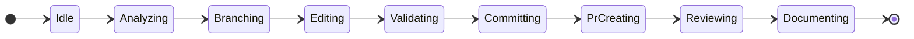
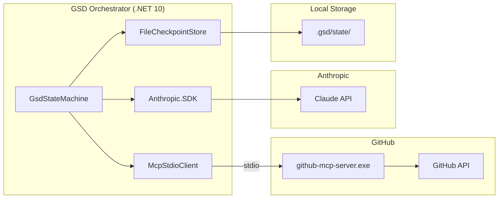

<objective>
Modify README.md in Coding-Autopilot-System/gsd-orchestrator to add:
1. A badge line (Task 1): CI, .NET 10, MIT License badges — positioned after the subtitle line and before the first `---` horizontal rule
2. A Diagrams section (Task 2): `## Diagrams` heading with (a) stateDiagram-v2 state machine + per-state prose bullets, and (b) flowchart LR component diagram — positioned between `## How it works` and `## Prerequisites`

Purpose: Give a hiring manager a complete picture of the system's behavior and architecture without reading source code. The CI badge signals production quality.
Output: Updated README.md committed to gsd-orchestrator on main.
</objective>

<execution_context>
@C:/Users/KimHarjamäki/.claude/get-shit-done/workflows/execute-plan.md
@C:/Users/KimHarjamäki/.claude/get-shit-done/templates/summary.md
</execution_context>

<context>
@C:/GithubMCP/.planning/ROADMAP.md
@C:/GithubMCP/.planning/STATE.md
@C:/GithubMCP/.planning/phases/02-gsd-orchestrator-ci-diagrams/02-CONTEXT.md
@C:/GithubMCP/.planning/phases/02-gsd-orchestrator-ci-diagrams/02-RESEARCH.md
@C:/GithubMCP/.planning/phases/02-gsd-orchestrator-ci-diagrams/02-01-SUMMARY.md

<interfaces>
<!-- All changes target: Coding-Autopilot-System/gsd-orchestrator (remote GitHub repo) -->
<!-- Use GitHub MCP tools: create_or_update_file (requires live SHA fetch first) -->
<!-- Pattern from Phase 1 (01-03-SUMMARY.md): always fetch live SHA before updating existing file -->

Key decisions from CONTEXT.md:
- D-01: stateDiagram-v2, direction LR, 9 states, NO transition labels
- D-02: Per-state prose bullets below the diagram, 1-2 lines each, enterprise tone
- D-03: flowchart LR with subgraphs; McpStdioClient → github-mcp-server.exe → GitHub API via stdio
- D-07: New ## Diagrams section between ## How it works and ## Prerequisites (do NOT restructure existing sections)
- D-08: Badge line below headline/subtitle, before first --- horizontal rule; 3 badges: CI, .NET 10, MIT License

Badge URLs (exact — from RESEARCH.md Pattern 4):
  CI:      https://github.com/Coding-Autopilot-System/gsd-orchestrator/actions/workflows/ci.yml/badge.svg
           links to: https://github.com/Coding-Autopilot-System/gsd-orchestrator/actions/workflows/ci.yml
  .NET 10: https://img.shields.io/badge/.NET-10-512BD4
           links to: https://dotnet.microsoft.com/download/dotnet/10.0
  License: https://img.shields.io/badge/license-MIT-green
           links to: LICENSE

State names (must match C# class names exactly):
  Idle, Analyzing, Branching, Editing, Validating, Committing, PrCreating, Reviewing, Documenting

Per-state prose (from RESEARCH.md Pattern 5 — verified from source code):
  Idle        — Fetches repository metadata and full issue body from GitHub via MCP. Reads labels and default branch.
  Analyzing   — Asks Claude to produce an implementation plan: branch name, files to modify, summary, and whether tests are required. Retries up to 3 times if JSON parse fails.
  Branching   — Creates a new feature branch from the default branch. Idempotent: if branch already exists, resumes from it.
  Editing     — For each file in the plan, runs a ReAct loop: reads current content, asks Claude to edit it, commits the result via create_or_update_file. Max 20 turns per file.
  Validating  — Runs four gates: file safety blocklist, merge conflict pre-flight, diff size, and test coverage intent. Blocks on critical failures; warns on soft failures.
  Committing  — Confirms the final commit SHA is present on the branch by calling get_branch. Records the commit URL.
  PrCreating  — Generates a PR title and body via Claude, then opens the pull request. Idempotent: checks for an existing open PR from the same branch before creating.
  Reviewing   — Posts a bot review comment explaining what changed and why. Requests reviewers from GSD_REVIEWERS env var if configured.
  Documenting — Updates docs/github-mcp-tools.md (regenerated from MCP tool list) and CHANGELOG.md (prepended with new entry) on the default branch. If GSD_AUTO_MERGE=true, squash-merges the PR.

Component diagram subgraphs:
  Orchestrator: GsdStateMachine, McpStdioClient, Anthropic.SDK, FileCheckpointStore
  GitHub:       github-mcp-server.exe, GitHub API
  Anthropic:    Claude API
  Storage:      .gsd/state/

Edges:
  GsdStateMachine --> McpStdioClient
  McpStdioClient  --stdio--> github-mcp-server.exe
  github-mcp-server.exe --> GitHub API
  GsdStateMachine --> Anthropic.SDK
  Anthropic.SDK   --> Claude API
  GsdStateMachine --> FileCheckpointStore
  FileCheckpointStore --> .gsd/state/

Anti-patterns (do NOT do):
  - Do NOT add transition labels to stateDiagram-v2 (Mermaid bug #2902/#5827)
  - Do NOT use `graph LR` (legacy syntax) — use `flowchart LR`
  - Do NOT restructure existing README sections (How it works, Prerequisites, Setup, etc.)
  - Do NOT add `direction` inside subgraph blocks
  - Do NOT use colons in subgraph labels (use em dashes if needed — Phase 1 lesson from 01-03-SUMMARY.md)
</interfaces>
</context>

<tasks>

<task type="auto">
  <name>Task 1: Insert badge line into README.md</name>
  <files>README.md</files>
  <read_first>
    - Coding-Autopilot-System/gsd-orchestrator: README.md — read the FULL current file content before modifying. Required to (1) get the live SHA for the update API call, and (2) identify the exact insertion point: the line after `**Stack:** .NET 10 (C#) · GitHub MCP Server · Anthropic Claude · Polly` and before the first `---` horizontal rule.
  </read_first>
  <action>
1. Use GitHub MCP `get_file_contents` to read the current `README.md` from `Coding-Autopilot-System/gsd-orchestrator`. Note the live `sha` from the response — required for the update call.

2. Locate the insertion point in the README: the badge line goes AFTER the `**Stack:**` subtitle line and BEFORE the first `---` horizontal rule. Based on RESEARCH.md, the structure is:

```
# GSD Orchestrator

Autonomous GitHub agentic workflow system. ...

**Stack:** .NET 10 (C#) · GitHub MCP Server · Anthropic Claude · Polly

[INSERT BADGE LINE HERE — on its own line, blank line before and after]

---

## How it works
```

3. Insert the following badge line (blank line before, blank line after, own line block):

```markdown
[](https://github.com/Coding-Autopilot-System/gsd-orchestrator/actions/workflows/ci.yml)
[](https://dotnet.microsoft.com/download/dotnet/10.0)
[](LICENSE)
```

4. Use GitHub MCP `create_or_update_file` to write the updated README.md back with:
   - `sha`: the value fetched in step 1 (MANDATORY — omitting sha on an existing file will fail with 409 conflict)
   - `message`: `docs: add CI, .NET 10, and License badges to README`
   - `branch`: `main`
   - `content`: the full updated README base64-encoded (or use the tool's content parameter as-is)

Do NOT change any other part of the README in this task.
</action>
  <verify>
    <automated>
      Use GitHub MCP `get_file_contents` on README.md after update — confirm the response content contains all three badge strings:
      - `https://github.com/Coding-Autopilot-System/gsd-orchestrator/actions/workflows/ci.yml/badge.svg`
      - `https://img.shields.io/badge/.NET-10-512BD4`
      - `https://img.shields.io/badge/license-MIT-green`
    </automated>
  </verify>
  <acceptance_criteria>
    - README.md contains `actions/workflows/ci.yml/badge.svg` (CI badge present)
    - README.md contains `img.shields.io/badge/.NET-10-512BD4` (.NET 10 badge present)
    - README.md contains `img.shields.io/badge/license-MIT-green` (License badge present)
    - README.md contains `[![CI]` (badge markdown syntax, not just URL)
    - README.md still contains `## How it works` (existing section not removed)
    - README.md still contains `## Prerequisites` (existing section not removed)
    - Badge line appears BEFORE the first `---` horizontal rule in the file (above How it works section)
    - README.md does NOT contain duplicate `# GSD Orchestrator` headings (file structure intact)
  </acceptance_criteria>
  <done>All three badges are present in README.md, positioned between the Stack subtitle and the first horizontal rule. Existing sections are intact.</done>
</task>

<task type="auto">
  <name>Task 2: Add ## Diagrams section to README.md (state machine + component diagram)</name>
  <files>README.md</files>
  <read_first>
    - Coding-Autopilot-System/gsd-orchestrator: README.md — read the current file content again (now contains the badge line from Task 1). Required to get the updated live SHA and identify the exact insertion point for the Diagrams section: between the closing content of `## How it works` and the `## Prerequisites` heading.
  </read_first>
  <action>
1. Use GitHub MCP `get_file_contents` to read the current README.md (post Task 1 update). Note the live SHA.

2. Locate the insertion point: the `## Diagrams` section goes AFTER the `## How it works` section ends (after its closing `---` separator or last paragraph) and BEFORE `## Prerequisites`. Based on RESEARCH.md:

```
## How it works
...
[end of How it works content]

[INSERT ## Diagrams SECTION HERE]

## Prerequisites
```

3. Insert the following complete `## Diagrams` section at that location:

```markdown
## Diagrams

### State Machine



**State descriptions:**

- **Idle** — Fetches repository metadata and full issue body from GitHub via MCP. Reads labels and default branch.
- **Analyzing** — Asks Claude to produce an implementation plan: branch name, files to modify, summary, and whether tests are required. Retries up to 3 times if JSON parse fails.
- **Branching** — Creates a new feature branch from the default branch. Idempotent: if the branch already exists, resumes from it.
- **Editing** — For each file in the plan, runs a ReAct loop: reads current content, asks Claude to edit it, commits the result via `create_or_update_file`. Max 20 turns per file.
- **Validating** — Runs four gates: file safety blocklist, merge conflict pre-flight, diff size, and test coverage intent. Blocks on critical failures; warns on soft failures.
- **Committing** — Confirms the final commit SHA is present on the branch by calling `get_branch`. Records the commit URL.
- **PrCreating** — Generates a PR title and body via Claude, then opens the pull request. Idempotent: checks for an existing open PR from the same branch before creating.
- **Reviewing** — Posts a bot review comment explaining what changed and why. Requests reviewers from `GSD_REVIEWERS` env var if configured.
- **Documenting** — Updates `docs/github-mcp-tools.md` and `CHANGELOG.md` on the default branch. If `GSD_AUTO_MERGE=true`, squash-merges the PR.

---

### Component Topology



```

Important rendering rules (DO NOT VIOLATE):
- The mermaid code fences must use triple backticks followed by `mermaid` (no space)
- `stateDiagram-v2` state names are EXACT: `PrCreating` (not PrCreation), `Documenting` (not Documentation)
- NO transition labels in the stateDiagram-v2 block
- NO `direction` inside subgraph blocks for the flowchart
- `flowchart LR` (not `graph LR`)

4. Use GitHub MCP `create_or_update_file` to write the updated README back with:
   - `sha`: the value fetched in step 1
   - `message`: `docs: add state machine and component diagrams to README`
   - `branch`: `main`
</action>
  <verify>
    <automated>
      Use GitHub MCP `get_file_contents` on README.md after update — confirm the response content contains:
      - `## Diagrams`
      - `stateDiagram-v2`
      - `direction LR`
      - `PrCreating`
      - `flowchart LR`
      - `McpStdioClient`
      - `github-mcp-server.exe`
      - `FileCheckpointStore`
      - `|stdio|`
    </automated>
  </verify>
  <acceptance_criteria>
    - README.md contains `## Diagrams` heading
    - README.md contains `stateDiagram-v2` (state machine diagram present)
    - README.md contains `direction LR` immediately after `stateDiagram-v2` declaration
    - README.md contains all 9 state transitions: `Idle`, `Analyzing`, `Branching`, `Editing`, `Validating`, `Committing`, `PrCreating`, `Reviewing`, `Documenting`
    - README.md contains `[*] --> Idle` (start pseudo-state)
    - README.md contains `Documenting --> [*]` (terminal pseudo-state)
    - README.md does NOT contain `:` after `-->` arrows inside the stateDiagram-v2 block (no transition labels)
    - README.md contains `**State descriptions:**` followed by 9 bullet points
    - README.md contains `flowchart LR` (component diagram present, not `graph LR`)
    - README.md contains `subgraph Orchestrator[` (Orchestrator subgraph present)
    - README.md contains `subgraph GitHub[` (GitHub subgraph present)
    - README.md contains `|stdio|` (McpStdioClient to MCP server edge label)
    - README.md contains `FileCheckpointStore` (checkpoint component present)
    - README.md contains `.gsd/state/` (storage path in diagram)
    - `## Diagrams` section appears BEFORE `## Prerequisites` in the file
    - `## Diagrams` section appears AFTER `## How it works` in the file
    - README.md still contains all original sections: `## How it works`, `## Prerequisites`, `## Architecture`, `## Project structure`
    - README.md still contains the 3 badges inserted in Task 1 (not overwritten)
    - `## Diagrams` section does NOT contain `direction` keyword inside any `subgraph` block
  </acceptance_criteria>
  <done>The Diagrams section is present in README.md between How it works and Prerequisites. Both Mermaid diagrams use correct syntax. Per-state prose is present with 9 bullets. All three badges from Task 1 remain intact. Hiring manager can scan the README and understand the full system in 60 seconds.</done>
</task>

</tasks>

<threat_model>
## Trust Boundaries

| Boundary | Description |
|----------|-------------|
| README.md content → GitHub CDN | Badge SVGs fetched client-side from shields.io and GitHub CDN; no user data transmitted |
| Mermaid code blocks → GitHub renderer | Static diagram syntax rendered server-side by GitHub's Mermaid engine; no user input |

## STRIDE Threat Register

| Threat ID | Category | Component | Disposition | Mitigation Plan |
|-----------|----------|-----------|-------------|-----------------|
| T-02-04 | Tampering | README.md badge URLs | accept | Badge URLs point to read-only CDN endpoints; no secrets or auth tokens in URLs; shields.io is public infrastructure |
| T-02-05 | Information Disclosure | shields.io static badges | accept | Badges contain only public metadata (.NET version, license type); no org or user identifiers beyond the repo name which is already public |
| T-02-06 | Spoofing | CI badge showing stale state | accept | Native GitHub badge reflects real Actions run state; no way to spoof green badge without a passing run; this is by design |
</threat_model>

<verification>
After both tasks complete:
1. View `https://github.com/Coding-Autopilot-System/gsd-orchestrator` — three badges visible below the headline
2. README source contains `## Diagrams` section between `## How it works` and `## Prerequisites`
3. Both Mermaid code blocks render on the GitHub README page (not raw text)
4. CI badge links to the Actions workflow page when clicked
5. All 9 states appear in the state machine diagram
6. Component diagram shows all four subgraphs with cross-subgraph edges
</verification>

<success_criteria>
- README.md contains all three badge images (CI, .NET 10, MIT License) positioned after the Stack subtitle line
- README.md `## Diagrams` section exists between `## How it works` and `## Prerequisites`
- stateDiagram-v2 block contains all 9 states with direction LR and no transition labels
- 9 per-state prose bullets present below the state diagram
- flowchart LR component diagram shows all four subgraphs and all seven edges including stdio label
- Existing README sections (How it works, Prerequisites, Architecture, Project structure) are untouched
- GSD-02, GSD-03, GSD-09 requirements are fully satisfied
</success_criteria>

<output>
After completion, create `C:/GithubMCP/.planning/phases/02-gsd-orchestrator-ci-diagrams/02-02-SUMMARY.md`
</output>
