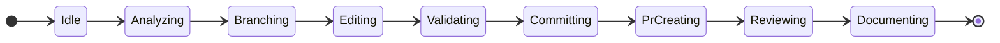
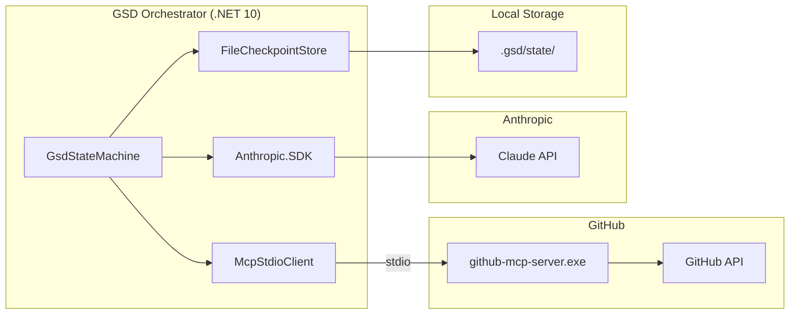

# Phase 2: gsd-orchestrator CI & Diagrams — Research

**Researched:** 2026-05-22
**Domain:** GitHub Actions (YAML), Mermaid diagram syntax, shields.io badges, .NET 10 CI
**Confidence:** HIGH (core decisions verified via official docs and runner-images issues)

---

<user_constraints>
## User Constraints (from CONTEXT.md)

### Locked Decisions

- **D-01:** `stateDiagram-v2` with `direction LR`. 9 states (Idle, Analyzing, Branching, Editing, Validating, Committing, PrCreating, Reviewing, Documenting). No transition labels (avoids Mermaid issues #2902, #5827).
- **D-02:** Per-state prose below the diagram: 1-2 lines per state (what it does, what triggers the transition). Written as a bullet list in enterprise tone.
- **D-03:** Component diagram: `McpStdioClient → github-mcp-server.exe → GitHub API`, `Anthropic.SDK → Claude API`, `FileCheckpointStore → .gsd/state/`. Use `graph LR` or `flowchart LR` with subgraphs.
- **D-04 (Claude's discretion):** CI triggers: `push` to `main` + `pull_request`.
- **D-05 (Claude's discretion):** Build target: `src/GsdOrchestrator/GsdOrchestrator.csproj` directly (not `.slnx`).
- **D-06 (Claude's discretion):** Runner `windows-latest`. Steps: `dotnet restore` → `dotnet build --no-restore --configuration Release`.
- **D-07 (Claude's discretion):** New `## Diagrams` section between `## How it works` and `## Prerequisites`.
- **D-08 (Claude's discretion):** Badge line below headline — CI badge, `.NET 10` (shields.io), `MIT License` (shields.io).

### Claude's Discretion

Exact YAML structure, badge styles, prose wording for per-state descriptions.

### Deferred Ideas (OUT OF SCOPE)

None — discussion stayed within phase scope.
</user_constraints>

---

<phase_requirements>
## Phase Requirements

| ID | Description | Research Support |
|----|-------------|------------------|
| GSD-01 | GitHub Actions CI workflow (.NET 10 build) with passing badge in README | Exact workflow YAML verified; badge URL pattern confirmed |
| GSD-02 | Mermaid state machine diagram in README (Idle → Done) | stateDiagram-v2 syntax confirmed; 9-state chain pattern verified |
| GSD-03 | Mermaid component diagram in README (orchestrator ↔ MCP ↔ Claude) | flowchart LR subgraph syntax confirmed; component topology verified from code |
| GSD-09 | README badges: CI, .NET 10, License | Native GitHub badge URL pattern confirmed; shields.io static badge format confirmed |
</phase_requirements>

---

## Summary

Phase 2 adds three assets to the `Coding-Autopilot-System/gsd-orchestrator` repository: a `.github/workflows/ci.yml` file that runs `dotnet build` on `windows-latest`, two Mermaid diagrams in the README, and a badges line. All changes are purely additive — no application code is modified.

The primary CI risk is the `.NET 10 SDK MSBuild version mismatch` introduced in March 2026: SDK feature band `10.0.2xx` requires MSBuild 18, which is only available in the `windows-2025-vs2026` image (VS2026). The current `windows-latest` image (Windows Server 2025, VS2022) ships with both `10.0.107` (1xx band) and `10.0.203` (2xx band). Pinning `dotnet-version: '10.0.1xx'` in `setup-dotnet@v5` guarantees the 1xx feature band is selected, which is MSBuild 17-compatible and will pass on `windows-latest`. This is the recommended mitigation confirmed by the runner-images issue #13789.

For the Mermaid diagrams, the key restrictions are: (1) transition labels on `stateDiagram-v2` cause rendering bugs in GitHub's Mermaid engine — D-01 already mandates label-free transitions, which is correct; (2) `flowchart LR` with `subgraph` blocks renders correctly in GitHub as long as nodes are connected across subgraph boundaries (direction overrides are ignored on cross-subgraph edges, but the parent LR direction is preserved).

**Primary recommendation:** Pin `dotnet-version: '10.0.1xx'` in the CI workflow; use label-free stateDiagram-v2 and flowchart LR as decided; use the native GitHub badge URL (not shields.io) for CI status.

---

## Architectural Responsibility Map

| Capability | Primary Tier | Secondary Tier | Rationale |
|------------|-------------|----------------|-----------|
| CI workflow execution | GitHub Actions runner | — | Pure infrastructure; runs on GitHub-hosted runner |
| Mermaid diagram rendering | GitHub Markdown renderer | — | GitHub natively renders `mermaid` fenced code blocks in README |
| Badge display | GitHub CDN / shields.io CDN | — | Badge SVGs are fetched client-side from external URLs embedded in Markdown |
| README content | Git repository (static file) | — | Markdown file committed to repo; no server logic |

---

## Standard Stack

### Core

| Tool/Action | Version | Purpose | Why Standard |
|-------------|---------|---------|--------------|
| `actions/checkout` | v6 (v6.0.2, 2026-01-09) | Checks out repository code | Official action; v6 runs on Node 24, avoids Node 20 deprecation |
| `actions/setup-dotnet` | v5 (v5.2.0, 2025-03-05) | Installs .NET SDK | Official action; v5 supports feature band pinning format `A.B.Cxx` |
| `dotnet restore` | CLI (sdk-bundled) | Restores NuGet packages | Standard first step before build |
| `dotnet build` | CLI (sdk-bundled) | Compiles the project | Standard .NET build command |

[VERIFIED: github.com/actions/checkout releases] — v6.0.2 is latest as of 2026-01-09
[VERIFIED: github.com/actions/setup-dotnet releases] — v5.2.0 is latest as of 2025-03-05

### .NET SDK Version Strategy

**Safe version pin:** `dotnet-version: '10.0.1xx'`

This uses the feature band notation supported by `setup-dotnet` since .NET 5. The `1xx` band (currently `10.0.107`) requires MSBuild 17.14, which is present on `windows-latest` (Windows Server 2025 with VS2022). The `2xx` band (`10.0.203`) requires MSBuild 18 (VS2026 only) and will fail on the current `windows-latest` image.

[VERIFIED: github.com/actions/runner-images/issues/13789] — MSBuild mismatch confirmed and workaround pinning to 1xx band confirmed working
[VERIFIED: github.com/actions/setup-dotnet README] — `A.B.Cxx` format explicitly documented as supported

### Badge Tools

| Badge | Source | URL Pattern |
|-------|--------|-------------|
| CI status | Native GitHub | `https://github.com/{owner}/{repo}/actions/workflows/{file}/badge.svg` |
| `.NET 10` | shields.io static | `https://img.shields.io/badge/.NET-10-512BD4` |
| `MIT License` | shields.io static | `https://img.shields.io/badge/license-MIT-green` |

[VERIFIED: docs.github.com — adding-a-workflow-status-badge] — native GitHub badge URL confirmed
[VERIFIED: shields.io/badges] — static badge format `label-message-color` confirmed

**Installation:** No packages to install — all changes are YAML, Markdown, and config files only.

---

## Architecture Patterns

### System Architecture Diagram

```
README.md
  │
  ├── [badge line]
  │     ├── CI badge → github.com/Coding-Autopilot-System/gsd-orchestrator/actions/workflows/ci.yml/badge.svg
  │     ├── .NET 10 badge → img.shields.io (static)
  │     └── License badge → img.shields.io (static)
  │
  ├── ## How it works  (existing — untouched)
  │
  ├── ## Diagrams  (NEW)
  │     ├── stateDiagram-v2 (state machine flow)
  │     └── flowchart LR (component topology)
  │
  └── ## Prerequisites  (existing — untouched)

.github/workflows/ci.yml  (NEW)
  └── job: build
        ├── actions/checkout@v6
        ├── actions/setup-dotnet@v5 (10.0.1xx)
        ├── dotnet restore
        └── dotnet build --no-restore --configuration Release
```

### Recommended File Structure

```
.github/
└── workflows/
    └── ci.yml                 # NEW — .NET 10 build workflow
README.md                      # MODIFIED — badge line + ## Diagrams section
```

### Pattern 1: GitHub Actions .NET Build Workflow

**What:** Triggers on push to main and pull_request; installs .NET SDK; restores and builds the project file directly.

**When to use:** Any .NET project needing a CI badge. Use `.csproj` target (not `.slnx`) for maximum portability.

**Exact YAML:**

```yaml
# Source: verified against docs.github.com/actions/tutorials/build-and-test-code/net
name: CI

on:
  push:
    branches: [ main ]
  pull_request:

jobs:
  build:
    runs-on: windows-latest
    steps:
      - uses: actions/checkout@v6

      - name: Setup .NET 10
        uses: actions/setup-dotnet@v5
        with:
          dotnet-version: '10.0.1xx'

      - name: Restore dependencies
        run: dotnet restore src/GsdOrchestrator/GsdOrchestrator.csproj

      - name: Build
        run: dotnet build src/GsdOrchestrator/GsdOrchestrator.csproj --no-restore --configuration Release
```

**Key decisions verified:**
- `actions/checkout@v6` — latest, Node 24 [VERIFIED: releases page]
- `actions/setup-dotnet@v5` — latest [VERIFIED: releases page]
- `dotnet-version: '10.0.1xx'` — pins to 1xx feature band; avoids MSBuild 18 requirement [VERIFIED: issue #13789]
- `--no-restore` on build — standard optimization (restore already ran)
- `--configuration Release` — produces optimized build; matches production intent

### Pattern 2: stateDiagram-v2 Linear Chain

**What:** 9-state linear chain from `[*]` to `[*]`, direction LR, no labels.

**Exact syntax:**



**Rules:**
- State names MUST match C# class names exactly: `PrCreating` (not `PrCreation`), `Documenting` (not `Documentation`)
- No transition labels — labels cause rendering regressions in Mermaid v11+ (issues #2902, #5827)
- `direction LR` placed immediately after `stateDiagram-v2` declaration
- `[*]` as start and end nodes is the standard Mermaid idiom for initial/terminal pseudo-states

[VERIFIED: mermaid.js.org/syntax/stateDiagram.html]

### Pattern 3: flowchart LR Component Diagram with Subgraphs

**What:** Shows three integration points as a component topology. Subgraphs visually group external dependencies from internal components.

**Exact syntax:**



**Rules:**
- `flowchart LR` (not deprecated `graph LR`) — preferred syntax
- Subgraph direction is overridden by parent when cross-subgraph edges exist — this is expected and acceptable
- Arrow label `|stdio|` on the `MCP --> MCPS` edge is acceptable and accurate (not a state transition label — flowchart edge labels render correctly)
- Keep node labels concise to avoid overflow at small viewport widths

[VERIFIED: mermaid.js.org/syntax/flowchart.html]

### Pattern 4: README Badge Line

```markdown
[](https://github.com/Coding-Autopilot-System/gsd-orchestrator/actions/workflows/ci.yml)
[](https://dotnet.microsoft.com/download/dotnet/10.0)
[](LICENSE)
```

**Rules:**
- Native GitHub badge URL uses the workflow filename `ci.yml` exactly — must match the `name:` in the YAML file path
- `512BD4` is the official .NET purple brand color [ASSUMED — common usage; exact hex not verified against Microsoft brand guide]
- Badge line goes on its own line block, after the subtitle and before the first `---` horizontal rule

[VERIFIED: docs.github.com — adding-a-workflow-status-badge]
[VERIFIED: shields.io/badges — static badge format]

### Pattern 5: Per-State Prose (from code reading)

Based on reading all 9 state files, the accurate 1-2 line descriptions are:

| State | What it does | Transition trigger |
|-------|-------------|-------------------|
| **Idle** | Fetches repository metadata and full issue body from GitHub via MCP. Reads labels and default branch. | Issue loaded → transitions to Analyzing |
| **Analyzing** | Asks Claude to produce an implementation plan: branch name, files to modify, summary, and whether tests are required. Retries up to 3 times if JSON parse fails. | Valid plan parsed → transitions to Branching |
| **Branching** | Creates a new feature branch from the default branch. Idempotent: if branch already exists, resumes from it. | Branch created (or found) → transitions to Editing |
| **Editing** | For each file in the plan, runs a ReAct loop: reads current content, asks Claude to edit it, commits the result via `create_or_update_file`. Max 20 turns per file. | All files processed → transitions to Validating |
| **Validating** | Runs four gates: file safety blocklist, merge conflict pre-flight, diff size, and test coverage intent. Blocks on critical failures; warns on soft failures. | Gates pass (or warn) → transitions to Committing |
| **Committing** | Confirms the final commit SHA is present on the branch by calling `get_branch`. Records the commit URL. | SHA confirmed → transitions to PrCreating |
| **PrCreating** | Generates a PR title and body via Claude, then opens the pull request. Idempotent: checks for an existing open PR from the same branch before creating. | PR created (or found) → transitions to Reviewing |
| **Reviewing** | Posts a bot review comment explaining what changed and why. Requests reviewers from `GSD_REVIEWERS` env var if configured. | Comment posted → transitions to Documenting |
| **Documenting** | Updates `docs/github-mcp-tools.md` (regenerated from MCP tool list) and `CHANGELOG.md` (prepended with new entry) on the default branch. If `GSD_AUTO_MERGE=true`, squash-merges the PR. | Docs committed → transitions to Done |

[VERIFIED: read src/GsdOrchestrator/Workflows/States/*.cs directly]

### Anti-Patterns to Avoid

- **Using `GithubMCP.slnx` as build target in CI:** The `.slnx` format is newer; `dotnet build GithubMCP.slnx` may fail on fresh runners depending on .NET SDK version. Build the `.csproj` directly.
- **Using `dotnet-version: '10.0.x'`:** This resolves to the latest installed SDK which may be `10.0.203` (requires MSBuild 18). Use `'10.0.1xx'` instead.
- **Adding transition labels to `stateDiagram-v2`:** Known rendering bugs in Mermaid v11+. D-01 already excludes them — do not add them.
- **Using `graph LR` instead of `flowchart LR`:** `graph` is the legacy syntax; `flowchart` is the current standard and renders consistently.
- **Embedding CI badge inside an `## Architecture` section:** The badge line must be at the top of the README, immediately below the headline, not buried in a section.

---

## Don't Hand-Roll

| Problem | Don't Build | Use Instead | Why |
|---------|-------------|-------------|-----|
| .NET SDK installation | Custom install scripts | `actions/setup-dotnet@v5` | Handles multiple version formats, caching, PATH setup |
| CI badge generation | Custom SVG | Native GitHub badge URL | Zero-config, always reflects real CI state |
| NuGet caching | Custom cache steps | `cache: true` in setup-dotnet (optional) | Built-in; requires `packages.lock.json` to enable |

**Key insight:** This phase contains no library-selection decisions — the tooling is entirely GitHub infrastructure (Actions, Mermaid rendering, shields.io), and all components are free, zero-config, and standard.

---

## Runtime State Inventory

> Phase is additive (new files + README edits). No rename/refactor. Skipping full inventory.

**No runtime state affected.** This phase creates `.github/workflows/ci.yml` and modifies `README.md`. No stored data, running services, OS-registered state, secrets, or build artifacts are involved.

---

## Common Pitfalls

### Pitfall 1: .NET SDK Feature Band MSBuild Mismatch

**What goes wrong:** `dotnet build` fails with "SDK requires MSBuild 18.0.0 but 17.14 is available" if the `10.0.2xx` feature band SDK is selected.

**Why it happens:** `windows-latest` (as of 2026-05-22) has both `10.0.107` and `10.0.203` installed. Without pinning, the installer may choose the higher version. SDK `10.0.200+` requires MSBuild 18 (VS2026), which is not on the standard `windows-latest` image.

**How to avoid:** Use `dotnet-version: '10.0.1xx'` in `setup-dotnet@v5`. This pins to the 1xx feature band (`10.0.107` or any later 1xx patch), which works with MSBuild 17.14.

**Warning signs:** Build fails on first run; error contains "requires at least version 18.0.0 of MSBuild".

[VERIFIED: github.com/actions/runner-images/issues/13789]

### Pitfall 2: Mermaid Rendering Regression with Transition Labels

**What goes wrong:** State diagram appears broken or partially rendered on GitHub, with states overlapping or missing arrows.

**Why it happens:** Mermaid v11+ has known regressions for `stateDiagram-v2` with transition labels (issue #5827). GitHub's Mermaid renderer may lag behind the latest release but still exhibits these issues.

**How to avoid:** D-01 already mandates no transition labels. Do not add them even if they "seem harmless". The 9-state linear chain renders correctly without labels.

**Warning signs:** Diagram renders as plain text or with garbled layout after pushing to GitHub.

### Pitfall 3: Workflow File Path Mismatch in Badge URL

**What goes wrong:** CI badge shows "no status" or "workflow not found" even after the first successful run.

**Why it happens:** The badge URL `badge.svg` references the workflow filename exactly as it appears on disk under `.github/workflows/`. If the file is named `ci.yml` but the badge URL says `build.yml`, the badge returns no status.

**How to avoid:** Badge URL must use the exact filename: `ci.yml`. Confirm after the first workflow run completes.

**Warning signs:** Badge shows grey "unknown" state after the workflow has run successfully.

### Pitfall 4: `dotenv.net` Build vs. Runtime Confusion

**What goes wrong:** Developer assumes `dotenv.net` will cause CI build failures because `.env` is not present in CI.

**Why it happens:** `DotEnv.Load()` is a runtime call in `Program.cs`. `dotnet build` compiles the assembly but does not execute it. No `.env` file is needed for a build-only CI step.

**How to avoid:** The CI workflow uses only `dotnet restore` and `dotnet build`. No `dotnet run` or `dotnet test` step. The absence of `.env` is irrelevant at build time.

**Additional note from code reading:** `Program.cs` calls `DotEnv.Load(options: new DotEnvOptions(probeForEnv: true, probeLevelsToSearch: 4))`. The `ignoreExceptions` default is `true`, meaning missing `.env` silently continues even at runtime. No exceptions at build time regardless.

[VERIFIED: github.com/bolorundurowb/dotenv.net README — default ignoreExceptions: true]
[VERIFIED: read src/GsdOrchestrator/Program.cs directly]

### Pitfall 5: Mermaid Flowchart Subgraph Direction Override

**What goes wrong:** Developer sets `direction LR` inside a subgraph, expecting internal nodes to lay out differently from the outer diagram.

**Why it happens:** Mermaid documentation states: "If any of a subgraph's nodes are linked to the outside, subgraph direction will be ignored." Since all subgraph nodes in the component diagram have cross-subgraph edges, all individual subgraph directions are overridden by the parent `flowchart LR`.

**How to avoid:** Set direction only at the top level (`flowchart LR`). Do not add `direction` inside subgraph blocks.

[VERIFIED: mermaid.js.org/syntax/flowchart.html]

---

## Code Examples

### Complete ci.yml

```yaml
# Source: verified against docs.github.com/actions/tutorials/build-and-test-code/net
# and github.com/actions/runner-images/issues/13789 (MSBuild pinning)
name: CI

on:
  push:
    branches: [ main ]
  pull_request:

jobs:
  build:
    runs-on: windows-latest
    steps:
      - uses: actions/checkout@v6

      - name: Setup .NET 10
        uses: actions/setup-dotnet@v5
        with:
          dotnet-version: '10.0.1xx'

      - name: Restore dependencies
        run: dotnet restore src/GsdOrchestrator/GsdOrchestrator.csproj

      - name: Build
        run: dotnet build src/GsdOrchestrator/GsdOrchestrator.csproj --no-restore --configuration Release
```

### Badge Line (Markdown)

```markdown
[](https://github.com/Coding-Autopilot-System/gsd-orchestrator/actions/workflows/ci.yml)
[](https://dotnet.microsoft.com/download/dotnet/10.0)
[](LICENSE)
```

### README Diff — Insertion Points

```
# GSD Orchestrator

Autonomous GitHub agentic workflow system. ...

**Stack:** .NET 10 (C#) · GitHub MCP Server · Anthropic Claude · Polly

[INSERT BADGE LINE HERE]

---

## How it works
...

[INSERT ## Diagrams SECTION HERE]

## Prerequisites
```

The badge line goes between the subtitle line (`**Stack:**...`) and the `---` horizontal rule.

The `## Diagrams` section goes between the closing `---` of `## How it works` and the `## Prerequisites` heading.

---

## State of the Art

| Old Approach | Current Approach | When Changed | Impact |
|--------------|------------------|--------------|--------|
| `graph LR` | `flowchart LR` | Mermaid v8+ | `graph` still works but `flowchart` is canonical |
| `actions/checkout@v4` | `actions/checkout@v6` | Jan 2026 | v6 uses Node 24; avoids Node 20 deprecation warnings |
| `actions/setup-dotnet@v4` | `actions/setup-dotnet@v5` | Sep 2024 | v5 uses Node 24; required with current runners |
| `dotnet-version: '10.0.x'` | `dotnet-version: '10.0.1xx'` | March 2026 | Prevents MSBuild 18 incompatibility on windows-latest |

**Deprecated/outdated:**

- `graph LR` syntax: still functional but `flowchart LR` is the current standard. Use `flowchart`.
- `stateDiagram` (v1): superseded by `stateDiagram-v2`. Never use v1.
- `actions/checkout@v3` / `v4`: Node 20, being deprecated by GitHub from fall 2026. Use `@v6`.

---

## Assumptions Log

| # | Claim | Section | Risk if Wrong |
|---|-------|---------|---------------|
| A1 | `.NET` purple color `512BD4` is the correct brand hex for the shields.io badge | Code Examples | Low — purely cosmetic; any blue/purple is acceptable |
| A2 | `windows-latest` as of 2026-05-22 still uses VS2022 (not VS2026) for the default `windows-2025` image | Pitfalls / CI YAML | HIGH — if windows-latest has already rolled to VS2026 (expected June 2026), the `10.0.1xx` pin is still safe (works on both MSBuild 17 and 18) |
| A3 | GitHub's Mermaid renderer version does not have a fixed known version; it lags behind mermaid-js releases | Architecture Patterns | Medium — linear label-free stateDiagram-v2 is the safest possible syntax and renders correctly across all known GitHub Mermaid versions |

**Risk assessment for A2:** The `10.0.1xx` pin is safe regardless of VS version. If VS2026 is present, it will have MSBuild 18 and will also accept 1xx band. The pin only narrows the risk floor, never increases it.

---

## Open Questions

1. **Will `windows-latest` switch to VS2026 before the workflow is merged?**
   - What we know: Transition from windows-2025 to windows-2025-vs2026 for the `windows-latest` label is scheduled for June 2026. Today is 2026-05-22.
   - What's unclear: Exact date in June.
   - Recommendation: Use `10.0.1xx` pin regardless. It is safe on both VS2022 and VS2026.

2. **Should the CI workflow add NuGet caching?**
   - What we know: `setup-dotnet` supports `cache: true` but requires `packages.lock.json`. The project has no lock file. Without a lock file, caching falls back to no-op.
   - What's unclear: Whether the added complexity is worth the ~10-30 second restore savings for a portfolio project.
   - Recommendation: Omit caching for now. The workflow's purpose is to show a passing badge, not maximize build speed. Add caching in a later CI hardening phase if desired.

---

## Environment Availability

> Phase creates GitHub-hosted CI — no local environment dependencies apply. All execution occurs on GitHub's runners.

| Dependency | Required By | Available | Version | Fallback |
|------------|------------|-----------|---------|----------|
| GitHub Actions (github.com) | CI workflow execution | Yes | — | None needed |
| `windows-latest` runner | D-06 | Yes | Windows Server 2025, VS2022 | `windows-2025` is equivalent |
| .NET 10 SDK `10.0.1xx` | Build step | Yes (on runner, fetched by setup-dotnet) | 10.0.107 | setup-dotnet installs on demand |
| shields.io | `.NET` and License badges | Yes | CDN-hosted | Native GitHub badge for CI needs no fallback |

---

## Validation Architecture

> `nyquist_validation: true` in config.json — section included.

### Test Framework

| Property | Value |
|----------|-------|
| Framework | None — this phase is YAML and Markdown only; no test framework applies |
| Config file | N/A |
| Quick run command | `dotnet build src/GsdOrchestrator/GsdOrchestrator.csproj` (verifies CI script is correct) |
| Full suite command | Push to branch → check GitHub Actions run result |

### Phase Requirements → Test Map

| Req ID | Behavior | Test Type | Automated Command | File Exists? |
|--------|----------|-----------|-------------------|--------------|
| GSD-01 | CI workflow YAML is syntactically valid | smoke | `dotnet build src/GsdOrchestrator/GsdOrchestrator.csproj` | No — ci.yml created in Wave 1 |
| GSD-01 | CI badge shows passing after first run | manual | Push to main → observe badge after ~2 min | N/A |
| GSD-02 | Mermaid stateDiagram-v2 renders on GitHub | manual | View README on GitHub after push | N/A |
| GSD-03 | Mermaid flowchart LR renders on GitHub | manual | View README on GitHub after push | N/A |
| GSD-09 | All 3 badges render in README | manual | View README on GitHub after push | N/A |

### Sampling Rate

- **Per task commit:** `dotnet build src/GsdOrchestrator/GsdOrchestrator.csproj` (confirms project still builds locally — sanity check only, not CI)
- **Per wave merge:** Open README on GitHub, verify Mermaid renders; check Actions tab for green CI run
- **Phase gate:** CI badge green on `main` branch; all 3 badges visible in README; both Mermaid diagrams rendered

### Wave 0 Gaps

None — no test infrastructure files needed. This phase's "tests" are GitHub UI observations (badge state, Mermaid rendering), not automated test suites. The implementation task is: create `.github/workflows/ci.yml` and modify `README.md`.

---

## Security Domain

> `security_enforcement` not explicitly false in config.json — section included.

### Applicable ASVS Categories

| ASVS Category | Applies | Standard Control |
|---------------|---------|-----------------|
| V2 Authentication | No | No user auth in CI workflows or static badges |
| V3 Session Management | No | Static files only |
| V4 Access Control | Partial | GitHub Actions default: no secrets needed for this workflow (build-only, no deploy, no API calls) |
| V5 Input Validation | No | No user input processed |
| V6 Cryptography | No | No cryptographic operations |

### Security Notes for CI Workflow

- **No secrets required:** This CI workflow is build-only. It does not call the GitHub API, Anthropic API, or read `.env` variables. The `GITHUB_TOKEN` is implicitly available but not needed.
- **`pull_request` trigger:** For public repos, `pull_request` from forks does not expose secrets by default (GitHub's safe behavior). Build-only workflows with `pull_request` are safe for public repos.
- **`.github/workflows/` blocklist:** `ValidatingState.cs` blocks the orchestrator from modifying files under `.github/workflows/`. This means the autonomous workflow cannot overwrite its own CI configuration — this is a security feature already in place.

[VERIFIED: read src/GsdOrchestrator/Workflows/States/ValidatingState.cs — line 13: `BlockedPathPrefixes = [".github/workflows/"]`]

---

## Sources

### Primary (HIGH confidence)

- `github.com/actions/setup-dotnet` README — supported dotnet-version formats including `A.B.Cxx`
- `github.com/actions/setup-dotnet/releases` — v5.2.0 is current (2025-03-05)
- `github.com/actions/checkout/releases` — v6.0.2 is current (2026-01-09)
- `docs.github.com/en/actions/monitoring-and-troubleshooting-workflows/monitoring-workflows/adding-a-workflow-status-badge` — native badge URL pattern
- `mermaid.js.org/syntax/stateDiagram.html` — stateDiagram-v2 syntax, direction LR, [*] nodes
- `mermaid.js.org/syntax/flowchart.html` — flowchart LR subgraph syntax and direction override limitation
- `shields.io/badges` — static badge URL format
- `github.com/actions/runner-images/issues/13789` — .NET 10 MSBuild mismatch on windows-latest; pinning 10.0.1xx as workaround
- `github.com/bolorundurowb/dotenv.net` README — default `ignoreExceptions: true` behavior
- All 9 state files in `src/GsdOrchestrator/Workflows/States/` — read directly for per-state descriptions

### Secondary (MEDIUM confidence)

- `github.com/actions/runner-images/issues/13294` — .NET 10 SDK added to runner images (closed/completed)
- `github.com/actions/runner-images/issues/14016` — windows-2025-vs2026 now GA (VS2026 available via explicit label)
- WebSearch confirming windows-latest has both `10.0.107` and `10.0.203` installed as of image `20260503.31.1`

### Tertiary (LOW confidence)

- `512BD4` as .NET purple brand hex — commonly used across community README examples, not verified against official Microsoft brand guide

---

## Metadata

**Confidence breakdown:**

- Standard stack (Actions YAML): HIGH — all action versions verified from release pages
- .NET SDK pinning strategy: HIGH — root cause and fix confirmed by official runner-images issue
- Mermaid syntax: HIGH — verified from official mermaid.js.org docs
- Badge URL formats: HIGH — verified from official GitHub docs and shields.io
- Per-state descriptions: HIGH — derived from direct code reading of all 9 state files
- .NET brand color hex: LOW — assumed from community convention

**Research date:** 2026-05-22
**Valid until:** 2026-08-22 (stable infrastructure; CI runner image transitions are the primary risk factor)
