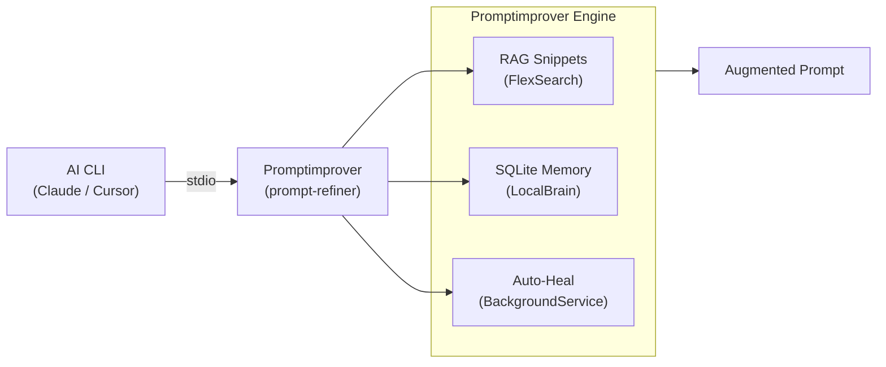

# Phase 4: Promptimprover Polish - Pattern Map

**Mapped:** 2026-05-23
**Files analyzed:** 6 deliverables (CI workflow, README rewrite, 4 wiki pages)
**Analogs found:** 6 / 6

---

## File Classification

| New/Modified File | Role | Data Flow | Closest Analog | Match Quality |
|-------------------|------|-----------|----------------|---------------|
| `Coding-Autopilot-System/Promptimprover/.github/workflows/ci.yml` | config (CI workflow) | batch | `02-01-PLAN.md` — gsd-orchestrator CI workflow (Node 22 adaptation) | role-match |
| `Coding-Autopilot-System/Promptimprover/README.md` | documentation (README rewrite) | request-response | `02-02-PLAN.md` — gsd-orchestrator README badges + diagrams | exact |
| `Promptimprover.wiki.git/Home.md` | documentation (wiki home) | request-response | `03-01-PLAN.md` Task 2 Step 2 — gsd-orchestrator Home.md | exact |
| `Promptimprover.wiki.git/Setup-Guide.md` | documentation (wiki setup) | request-response | `03-01-PLAN.md` Task 2 Step 3 — gsd-orchestrator Setup-Guide.md | exact |
| `Promptimprover.wiki.git/Architecture.md` | documentation (wiki architecture) | request-response | `03-01-PLAN.md` Task 2 Step 4 — gsd-orchestrator Architecture.md | exact |
| `Promptimprover.wiki.git/Configuration-Reference.md` | documentation (wiki config ref) | request-response | `03-01-PLAN.md` Task 2 Step 5 — gsd-orchestrator Configuration-Reference.md | exact |

**Note:** All deliverables target the REMOTE `Coding-Autopilot-System/Promptimprover` repository — not the local `C:/GithubMCP` repo. The local repo contains only plans; patterns are extracted from those plans.

---

## Pattern Assignments

### `Coding-Autopilot-System/Promptimprover/.github/workflows/ci.yml` (config, batch)

**Analog:** `C:/GithubMCP/.planning/phases/02-gsd-orchestrator-ci-diagrams/02-01-PLAN.md`

**CI workflow structure pattern** (02-01-PLAN.md lines 86-112):
```yaml
name: CI

on:
  push:
    branches: [ master ]   # NOTE: Promptimprover default branch = master (not main)
  pull_request:

jobs:
  build-and-test:
    runs-on: ubuntu-latest
    defaults:
      run:
        working-directory: universal-refiner
    steps:
      - uses: actions/checkout@v4

      - name: Setup Node 22
        uses: actions/setup-node@v4
        with:
          node-version: '22'

      - name: Install dependencies
        run: npm ci

      - name: Generate version file
        run: node scripts/sync-version.mjs

      - name: Type check
        run: npx tsc --noEmit

      - name: Run tests
        run: npm test
```

**Key adaptations from Phase 2 .NET analog:**
- Runner: `ubuntu-latest` (Node is cross-platform; Phase 2 used `windows-latest` for .NET)
- `working-directory: universal-refiner` — equivalent to Phase 2's project file path targeting
- `actions/setup-node@v4` — equivalent to Phase 2's `actions/setup-dotnet@v5`
- NO `npm run build` — Windows CMD build script fails on Ubuntu; use `npx tsc --noEmit` instead
- `node scripts/sync-version.mjs` MUST precede `npx tsc --noEmit` (generates `src/core/generated-version.ts`)
- Branch trigger: `master` (not `main`) — critical, Promptimprover default_branch = `master`

**Commit pattern** (02-01-PLAN.md line 114):
```
ci: add Node 22 GitHub Actions build workflow
```

**Verification pattern** (02-01-PLAN.md lines 121-128):
```bash
gh api repos/Coding-Autopilot-System/Promptimprover/contents/.github/workflows/ci.yml
# Confirm file exists; response contains name: CI and correct branch trigger
```

---

### `Coding-Autopilot-System/Promptimprover/README.md` (documentation, request-response)

**Analog:** `C:/GithubMCP/.planning/phases/02-gsd-orchestrator-ci-diagrams/02-02-PLAN.md`

**File update pattern — always fetch SHA first** (02-02-PLAN.md lines 130-131):
```
1. Use GitHub MCP get_file_contents to read current README.md
2. Note the live `sha` from the response — MANDATORY for update call (omitting sha causes 409 conflict)
3. Use create_or_update_file with the sha, updated content, commit message, branch: master
```

**Badge line pattern** (02-02-PLAN.md lines 151-153, adapted for Promptimprover):
```markdown
[](https://github.com/Coding-Autopilot-System/Promptimprover/actions/workflows/ci.yml)
[](https://nodejs.org/)
[](LICENSE)
```

**Cross-repo ecosystem line pattern** (04-CONTEXT.md D-10):
```markdown
Part of the [Coding-Autopilot-System](https://github.com/Coding-Autopilot-System) ecosystem:
[gsd-orchestrator](https://github.com/Coding-Autopilot-System/gsd-orchestrator) | [autogen](https://github.com/Coding-Autopilot-System/autogen)
```

**README section ordering pattern** (02-02-PLAN.md objective + 04-RESEARCH.md README Structure):
```
1. # Promptimprover                    (H1 title)
2. Badge line                          (CI + Node 22 + MIT, immediately below H1)
3. Cross-repo ecosystem line           (immediately below badges, D-10)
4. Hero paragraph                      (D-03 framing text)
5. ## Features                         (D-04 technical capability list)
6. ## Architecture                     (Mermaid flowchart LR diagram, D-07/D-08)
7. ## Quickstart                       (3-4 lines: clone, build_and_install.ps1, add MCP, D-05)
8. ## License                          (MIT reference)
```

**Mermaid diagram pattern** (02-02-PLAN.md lines 244-273, Phase 2 component diagram as template):


**Mermaid anti-patterns** (02-02-PLAN.md lines 276-282):
- Do NOT use `-->` arrow directly into a subgraph declaration — connect to nodes inside
- Do NOT use `graph LR` (legacy) — use `flowchart LR`
- Verify rendering after push (Pitfall 6 in RESEARCH.md)

**Commit message pattern** (02-02-PLAN.md lines 156-160):
```
docs: rewrite README with hero framing, badges, architecture diagram, and cross-repo links
```

---

### `Promptimprover.wiki.git/Home.md` (documentation, request-response)

**Analog:** `C:/GithubMCP/.planning/phases/03-gsd-orchestrator-wiki-release/03-01-PLAN.md` Task 2 Step 2

**Wiki clone+push delivery pattern** (03-01-PLAN.md lines 153-156):
```bash
rm -rf /tmp/pi-wiki
git clone https://x-access-token:$(gh auth token)@github.com/Coding-Autopilot-System/Promptimprover.wiki.git /tmp/pi-wiki
# Write .md files into /tmp/pi-wiki/
cd /tmp/pi-wiki
```

**Home.md two-scroll layout pattern** (03-01-PLAN.md lines 163-186, adapted for Promptimprover):
```markdown
# Promptimprover

[](...)
[](...)
[](...)

[hero paragraph — 2-3 sentences, enterprise tone, D-03 framing]

## Quickstart

Add `prompt-refiner` to your MCP client configuration:

```json
{
  "mcpServers": {
    "prompt-refiner": {
      "command": "prompt-refiner"
    }
  }
}
```

## Documentation

| Page | Description |
|------|-------------|
| [Setup Guide](Setup-Guide) | Prerequisites, install, and first prompt refinement |
| [Architecture](Architecture) | Pipeline components and data flow |
| [Configuration Reference](Configuration-Reference) | Environment variables and config files |
```

**Phase 3 Home.md constraints that apply identically here** (03-01-PLAN.md line 365):
- Home.md must NOT contain `git clone` (full clone sequence belongs in Setup Guide)
- Navigation links use bare page names: `[Setup Guide](Setup-Guide)` — no `.md` extension

---

### `Promptimprover.wiki.git/Setup-Guide.md` (documentation, request-response)

**Analog:** `C:/GithubMCP/.planning/phases/03-gsd-orchestrator-wiki-release/03-01-PLAN.md` Task 2 Step 3

**Setup Guide structure pattern** (03-01-PLAN.md lines 194-271, adapted for Promptimprover):
```
## Prerequisites
  - Windows (10 or later)
  - Node.js 22 (https://nodejs.org/)
  - Claude Desktop or Cursor (MCP client)

## Installation
  git clone https://github.com/Coding-Autopilot-System/Promptimprover.git
  cd Promptimprover
  .\build_and_install.ps1

## Add to MCP Client
  [JSON config snippet — 5 lines max — showing "prompt-refiner" in mcpServers]

## What a Successful Setup Looks Like
  [Expected output: MCP server starts, tool list appears, first prompt returns augmented output]
```

**"What a successful setup looks like" pattern** (03-01-PLAN.md lines 243-271 — D-04 principle applied to Promptimprover):
- MCP server starts (no crash, no "command not found")
- Tool list includes `refine_prompt` (MCP client shows available tools)
- First prompt refinement returns an augmented prompt (actual output sample)

**Standalone principle** (03-CONTEXT.md D-03): Setup Guide is NOT a reference to the README. Every step must be copy-pasteable. No "see README for details."

**build_and_install.ps1 steps to reference** (04-RESEARCH.md lines 432-437):
```powershell
cd universal-refiner
npm install
npm run build
npm install -g .
# Installs `prompt-refiner` command globally
```

---

### `Promptimprover.wiki.git/Architecture.md` (documentation, request-response)

**Analog:** `C:/GithubMCP/.planning/phases/03-gsd-orchestrator-wiki-release/03-01-PLAN.md` Task 2 Step 4

**Architecture page pattern** (03-01-PLAN.md lines 279-313, adapted):
```
## Architecture

[Reuse same flowchart LR diagram from README — verbatim, D-13]

[Per-component prose below diagram:]

### PromptRefinerServer
MCP server entry point; registers tools, handles `refine_prompt` tool calls via stdio transport.

### ProjectScout / Detectors
Detects tech stack (Node, Python) and architectural patterns at the project root; provides context for prompt augmentation.

### NeuralSnippets
FlexSearch-based RAG over local codebase files; retrieves relevant code examples matching the prompt query.

### LocalBrain
JSON-backed pattern store in `.refiner/memory.json`; accumulates project-specific rules and patterns learned over time.

### PromptRefiner / PromptOptimizer
Applies project context, learned patterns, RAG snippets, and standards mandates to the raw prompt; returns the augmented result.

### BackgroundAutonomyService
chokidar file watcher; triggers commit ingestion and lesson extraction on file change.

### EventStore / CorrelationEngine / LessonExtractor
SQLite-backed history: ingests git commits, correlates outcomes, extracts actionable lessons for predictive refinement.

### CommandCenterDashboard
Web UI on port 3000 (local only); displays agent logs and blackboard state.
```

**Diagram reuse rule** (04-CONTEXT.md D-13): Architecture page MUST use the IDENTICAL `flowchart LR` diagram from the README. Do NOT create a different diagram.

---

### `Promptimprover.wiki.git/Configuration-Reference.md` (documentation, request-response)

**Analog:** `C:/GithubMCP/.planning/phases/03-gsd-orchestrator-wiki-release/03-01-PLAN.md` Task 2 Step 5

**Config Reference table pattern** (03-01-PLAN.md lines 317-337, adapted for Promptimprover):
```markdown
## Environment Variables

| Name | Type | Required | Default | Description |
|------|------|----------|---------|-------------|
| `PORT` | integer | No | `3000` | Web port for CommandCenter dashboard UI |
| `PROMPT_REFINER_GLOBAL_DIR` | string | No | `~/.refiner` | Global directory for runtime logs |
| `PROMPT_REFINER_LOG_LEVEL` | string | No | `info` | Log verbosity: `debug`, `info`, `warn`, `error` |

## File-Based Configuration

| File | Location | Purpose |
|------|----------|---------|
| `.gemini-refiner.json` | Project root | Optional: `mandates[]` (custom rules), `ignoredPaths[]` (paths to skip) |
| `.refiner/memory.json` | Project root `.refiner/` | LocalBrain pattern store (auto-created on first run) |
| `.refiner/blackboard.json` | Project root `.refiner/` | AgenticBlackboard intent/log state (auto-created) |
```

**Source:** All config values verified from 04-RESEARCH.md lines 303-323 (traced to `config.ts`, `local-brain.ts`, `index.ts`).

---

## Shared Patterns

### Wiki Delivery (clone+push to wiki.git)
**Source:** `C:/GithubMCP/.planning/phases/03-gsd-orchestrator-wiki-release/03-01-PLAN.md` lines 381-396
**Apply to:** All four wiki page deliverables (Wave 2)
```bash
rm -rf /tmp/pi-wiki
git clone https://x-access-token:$(gh auth token)@github.com/Coding-Autopilot-System/Promptimprover.wiki.git /tmp/pi-wiki
# Write Home.md, Setup-Guide.md, Architecture.md, Configuration-Reference.md into /tmp/pi-wiki/
cd /tmp/pi-wiki
git add Home.md Setup-Guide.md Architecture.md Configuration-Reference.md
git -c user.email="bot@gsd" -c user.name="GSD Bot" commit -m "docs: add Promptimprover wiki pages (PI-03)"
git push origin master
# CRITICAL: wiki.git uses `master` branch always — NOT `main`
```

### GitHub MCP File Update (SHA-safe pattern)
**Source:** `C:/GithubMCP/.planning/phases/02-gsd-orchestrator-ci-diagrams/02-02-PLAN.md` lines 130-161
**Apply to:** README.md rewrite, CI workflow creation
```
1. get_file_contents → captures live SHA
2. Prepare updated content
3. create_or_update_file with sha: <live SHA>, branch: master, message: <commit msg>
   - For new files (ci.yml): omit sha parameter
   - For existing files (README.md): sha is MANDATORY — omitting causes 409 Conflict
```

### Badge URL Format
**Source:** `C:/GithubMCP/.planning/phases/02-gsd-orchestrator-ci-diagrams/02-02-PLAN.md` lines 151-153
**Apply to:** README.md badge line, Wiki Home.md badge line
```markdown
# CI badge — must include ?branch=master (default branch is master, not main)
[](https://github.com/Coding-Autopilot-System/Promptimprover/actions/workflows/ci.yml)
[](https://nodejs.org/)
[](LICENSE)
```

### Enterprise Tone Constraint
**Source:** `C:/GithubMCP/.planning/PROJECT.md` Constraints section
**Apply to:** All deliverables
- No emoji anywhere (README, wiki pages, CI file, commit messages)
- No toy/demo language ("simple", "easy", "just")
- Precise, technical language; assume tech lead audience
- Feature list ordered for credibility (RAG → memory → auto-heal → context scouting)

### Wave Structure
**Source:** `C:/GithubMCP/.planning/phases/03-gsd-orchestrator-wiki-release/03-00-PLAN.md` (Wave 0 pattern)
**Apply to:** Phase 4 plan structure
```
Wave 0 (manual checkpoint):
  - User navigates to https://github.com/Coding-Autopilot-System/Promptimprover/wiki
  - Clicks "Create the first page", saves stub
  - Verify: git ls-remote https://github.com/Coding-Autopilot-System/Promptimprover.wiki.git HEAD
  - Must return 40-char SHA before Wave 2 can proceed

Wave 1 (automated — CI + README):
  - Create .github/workflows/ci.yml via GitHub MCP create_or_update_file
  - Rewrite README.md via GitHub MCP get_file_contents + create_or_update_file

Wave 2 (automated — Wiki):
  - Depends on Wave 0 (wiki.git must exist)
  - Clone wiki.git, write 4 pages, push master
```

---

## No Analog Found

All deliverables have direct analogs from Phases 2 and 3. No files without analog.

| File | Role | Data Flow | Analog Quality |
|------|------|-----------|----------------|
| (none) | — | — | All covered |

---

## Critical Differences from Analogs

These differences between Phase 4 deliverables and their Phase 2/3 analogs MUST be applied — they are not optional variations:

| Property | Phase 2/3 Analog Value | Phase 4 Correct Value | Impact |
|----------|------------------------|----------------------|--------|
| Default branch | `main` (gsd-orchestrator) | `master` (Promptimprover) | CI trigger, badge URL `?branch=master`, git push |
| Runner | `windows-latest` (.NET) | `ubuntu-latest` (Node) | Phase 2 CI workflow |
| Build step | `dotnet build` | `npx tsc --noEmit` (NOT `npm run build`) | Windows CMD syntax in build script fails on Ubuntu |
| Pretest step | N/A | `node scripts/sync-version.mjs` before tsc | generated-version.ts must exist before type check |
| Test framework | N/A (no tests in Phase 2) | `npm test` (vitest run) | CI must include test step |
| Wiki git remote | `gsd-orchestrator.wiki.git` | `Promptimprover.wiki.git` | Clone URL |
| Temp dir | `/tmp/gsd-wiki` | `/tmp/pi-wiki` | Local staging directory |
| Node version | N/A | `node-version: '22'` | actions/setup-node@v4 |
| `mcp-server/` | N/A | NEVER mentioned | Excluded from CI, excluded from README |

---

## Metadata

**Analog search scope:** `C:/GithubMCP/.planning/phases/02-gsd-orchestrator-ci-diagrams/`, `C:/GithubMCP/.planning/phases/03-gsd-orchestrator-wiki-release/`
**Files scanned:** 6 plan files (02-01, 02-02, 03-00, 03-01, 03-02, 02-CONTEXT.md)
**Pattern extraction date:** 2026-05-23
