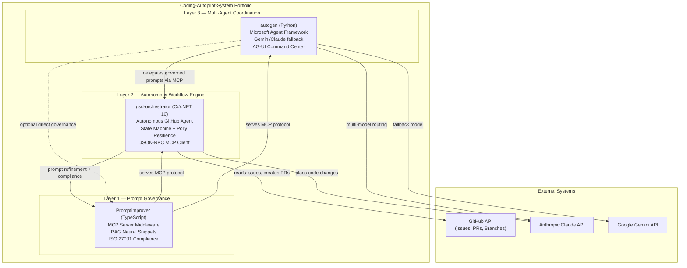
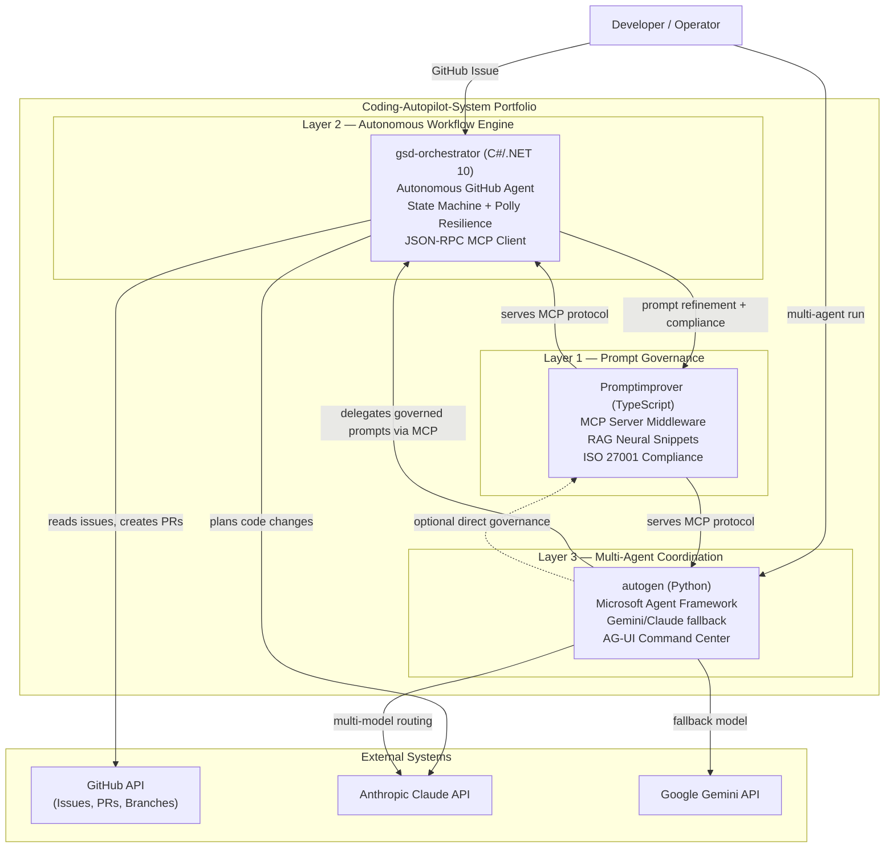

# Phase 6: Coherence & Personal Profile — Pattern Map

**Mapped:** 2026-05-24
**Files analyzed:** 3 remote file operations (COH-01, COH-02, COH-03)
**Analogs found:** 3 / 3

---

## File Classification

| New/Modified File | Role | Data Flow | Closest Analog | Match Quality |
|-------------------|------|-----------|----------------|---------------|
| `OgeonX-Ai/OgeonX-Ai/README.md` | documentation (profile README rewrite) | transform (full file replacement) | `04-02-PLAN.md` — Promptimprover README full rewrite | exact (same GitHub MCP SHA-safe update pattern; same enterprise tone; same no-emoji constraint) |
| `Coding-Autopilot-System/gsd-orchestrator/README.md` | documentation (cross-repo line insertion) | transform (partial content insertion, full file PUT) | `04-02-PLAN.md` — Promptimprover README badge + cross-repo line addition | exact (same Contents API PUT; same cross-repo line format; same SHA-first pattern) |
| `Coding-Autopilot-System/.github/profile/README.md` | documentation (org profile diagram update) | transform (selective diagram enhancement) | `01-03-PLAN.md` — original org profile README full rewrite | exact (same repo, same file path, same Mermaid `graph TB` diagram pattern, same SHA-safe PUT) |

---

## Pattern Assignments

### `OgeonX-Ai/OgeonX-Ai/README.md` (documentation, transform — COH-01)

**Analog:** `C:\GithubMCP\.planning\phases\04-promptimprover-polish\04-02-PLAN.md`

**SHA-safe file update pattern** (04-02-PLAN.md Task 1 Step 1 and Step 3):
```
Step 1: get_file_contents
  - owner: "OgeonX-Ai"
  - repo: "OgeonX-Ai"
  - path: "README.md"
  Note the `sha` field — MANDATORY for the update call. Omitting causes 409 Conflict.
  Known SHA at research time: 224e7b0b3b8b4ac902d5e98bd14ae87bfdd3e295
  Re-fetch immediately before PUT in case of intervening commits.

Step 2: compose full new README content (see content specification below)

Step 3: create_or_update_file
  - owner: "OgeonX-Ai"
  - repo: "OgeonX-Ai"
  - path: "README.md"
  - message: "docs: rewrite personal profile README - link to Coding-Autopilot-System"
  - content: [base64-encoded new README content]
  - sha: [SHA captured in Step 1 — MANDATORY]
  - branch: "main"
```

**Full profile README content to write** (from RESEARCH.md COH-01 structure):
```markdown
# Kim Harjamaki

AI Engineer and Senior .NET Developer building autonomous AI systems at the
intersection of .NET 10, TypeScript, and Python.

## Coding-Autopilot-System

An enterprise-grade AI automation platform demonstrating autonomous agent
pipelines, prompt governance, and multi-agent coordination:

| Project | Stack | Description |
|---------|-------|-------------|
| [gsd-orchestrator](https://github.com/Coding-Autopilot-System/gsd-orchestrator) | C# / .NET 10 | Autonomous GitHub agent — reads issues, creates branches, edits code, opens PRs |
| [Promptimprover](https://github.com/Coding-Autopilot-System/Promptimprover) | TypeScript | MCP server middleware for prompt governance and compounding memory |
| [autogen](https://github.com/Coding-Autopilot-System/autogen) | Python | Multi-agent orchestration runtime with Gemini/Claude provider fallback |

[View the full org](https://github.com/Coding-Autopilot-System)

## Technical Profile

| Area | Technologies |
|------|-------------|
| Languages | C# / .NET 10, TypeScript, Python |
| AI Providers | Anthropic Claude, Google Gemini |
| Protocols | Model Context Protocol (MCP), JSON-RPC 2.0 |
| Patterns | State machine, RAG, multi-agent coordination |
| Cloud | Azure, GitHub Actions |

## Contact

LinkedIn: https://linkedin.com/in/kimharjamaki
Email: ogeonx@gmail.com
```

**Enterprise tone constraints** (PROJECT.md, verified in 04-02-PLAN.md line 184-190):
- No emoji anywhere — existing profile has emoji throughout (must be stripped entirely)
- No "Azure Architect" or "ElevenLabs" framing — the new profile leads with Coding-Autopilot-System
- No "simple", "easy", "just" or toy/demo language
- Contact section: retain real LinkedIn URL and email from existing profile

**Verification command** (pattern from 04-02-PLAN.md acceptance_criteria):
```bash
gh api repos/OgeonX-Ai/OgeonX-Ai/contents/README.md --jq '.content' | base64 -d | grep -c "Coding-Autopilot-System"
# Expected: >= 3 (title table org link + full org link + repo links)
gh api repos/OgeonX-Ai/OgeonX-Ai/contents/README.md --jq '.content' | base64 -d | grep -ic "ElevenLabs\|Azure Architect"
# Expected: 0
```

---

### `Coding-Autopilot-System/gsd-orchestrator/README.md` (documentation, transform — COH-02)

**Analog:** `C:\GithubMCP\.planning\phases\04-promptimprover-polish\04-02-PLAN.md` (cross-repo line pattern)

**SHA-safe insertion pattern** (04-02-PLAN.md Task 1, Step 1 and Step 3 — adapted for insertion):
```
Step 1: get_file_contents
  - owner: "Coding-Autopilot-System"
  - repo: "gsd-orchestrator"
  - path: "README.md"
  Note the `sha` field. Known SHA at research time: 68bb92f9c3bbf7d05c7185c5287089f512c75c09
  Re-fetch immediately before PUT.
  Decode current content: echo "$RESPONSE_CONTENT" | base64 -d > /tmp/gsd-readme-current.md

Step 2: Construct the updated content
  Insert the ecosystem line block IMMEDIATELY AFTER the badge block (after the
  [![License: MIT] line) and BEFORE the first --- horizontal rule divider.
  Write the full updated content (with insertion) to /tmp/gsd-readme-updated.md

Step 3: create_or_update_file
  - owner: "Coding-Autopilot-System"
  - repo: "gsd-orchestrator"
  - path: "README.md"
  - message: "docs: add Coding-Autopilot-System ecosystem link (COH-02)"
  - content: [base64 -w 0 /tmp/gsd-readme-updated.md]
  - sha: [SHA captured in Step 1]
  - branch: "main"
```

**Exact cross-repo ecosystem line to insert** (RESEARCH.md COH-02 section, verified from live Promptimprover/autogen content):
```markdown
Part of the [Coding-Autopilot-System](https://github.com/Coding-Autopilot-System) ecosystem:
[Promptimprover](https://github.com/Coding-Autopilot-System/Promptimprover) | [autogen](https://github.com/Coding-Autopilot-System/autogen)
```

**Insertion position** (RESEARCH.md Pitfall 4):
```
BEFORE insertion:
  [](...)
  [](...)
  [](LICENSE)

  ---

AFTER insertion:
  [](...)
  [](...)
  [](LICENSE)

  Part of the [Coding-Autopilot-System](https://github.com/Coding-Autopilot-System) ecosystem:
  [Promptimprover](https://github.com/Coding-Autopilot-System/Promptimprover) | [autogen](https://github.com/Coding-Autopilot-System/autogen)

  ---
```

**bash insertion approach** (RESEARCH.md Code Examples section):
```bash
# Fetch current content
CURRENT=$(gh api repos/Coding-Autopilot-System/gsd-orchestrator/contents/README.md --jq '.content' | base64 -d)
SHA=$(gh api repos/Coding-Autopilot-System/gsd-orchestrator/contents/README.md --jq '.sha')

# Write current content to temp file, then construct updated file
echo "$CURRENT" > /tmp/gsd-readme-current.md
# Insert ecosystem line after the MIT license badge line, before the first ---
# (Use Python or awk for reliable insertion on Windows Git Bash; sed may need quoting adjustment)
python3 -c "
import sys
content = open('/tmp/gsd-readme-current.md').read()
badge_marker = '[![License: MIT]'
ecosystem_block = '\n\nPart of the [Coding-Autopilot-System](https://github.com/Coding-Autopilot-System) ecosystem:\n[Promptimprover](https://github.com/Coding-Autopilot-System/Promptimprover) | [autogen](https://github.com/Coding-Autopilot-System/autogen)'
# Find the end of the badge line and insert after it
lines = content.split('\n')
result = []
for i, line in enumerate(lines):
    result.append(line)
    if line.startswith('[![License: MIT]'):
        result.append('')
        result.append('Part of the [Coding-Autopilot-System](https://github.com/Coding-Autopilot-System) ecosystem:')
        result.append('[Promptimprover](https://github.com/Coding-Autopilot-System/Promptimprover) | [autogen](https://github.com/Coding-Autopilot-System/autogen)')
open('/tmp/gsd-readme-updated.md', 'w').write('\n'.join(result))
"

NEW_CONTENT=$(base64 -w 0 /tmp/gsd-readme-updated.md)
gh api repos/Coding-Autopilot-System/gsd-orchestrator/contents/README.md \
  --method PUT \
  -f message="docs: add Coding-Autopilot-System ecosystem link (COH-02)" \
  -f content="$NEW_CONTENT" \
  -f sha="$SHA"
```

**Verification command** (pattern from 04-02-PLAN.md acceptance_criteria):
```bash
gh api repos/Coding-Autopilot-System/gsd-orchestrator/contents/README.md --jq '.content' | base64 -d | grep -c "Coding-Autopilot-System ecosystem"
# Expected: 1
```

**Critical constraint:** The entire file must be preserved. Only the ecosystem line block is added. The rest of the 7,754-byte README (badges, Mermaid diagrams, Architecture section, Quickstart, etc.) must remain byte-for-byte identical.

---

### `Coding-Autopilot-System/.github/profile/README.md` (documentation, transform — COH-03)

**Analog:** `C:\GithubMCP\.planning\phases\01-foundation-quick-wins\01-03-PLAN.md`

**SHA-safe org profile update pattern** (01-03-PLAN.md Task 1 read_first + action):
```
Step 1: Fetch current SHA
  gh api repos/Coding-Autopilot-System/.github/contents/profile/README.md --jq '.sha'
  Known SHA at research time: f8386ba9d8fb232c8c986782523d1fcfc1cf812b
  Re-fetch immediately before PUT — if any earlier plan in Phase 6 does NOT touch this file,
  the SHA remains valid; but always re-fetch to be safe.

Step 2: Read current content (to understand what is there and what needs to change)
  gh api repos/Coding-Autopilot-System/.github/contents/profile/README.md \
    --jq '.content' | base64 -d

Step 3: create_or_update_file
  - owner: "Coding-Autopilot-System"
  - repo: ".github"
  - path: "profile/README.md"
  - message: "docs: update org profile diagram with User entry-point node (COH-03)"
  - content: [base64-encoded updated README content]
  - sha: [SHA captured in Step 1]
  - branch: "main"
```

**Mermaid diagram pattern from analog** (01-03-PLAN.md lines 108-140 — the existing `graph TB` produced by Phase 1):


**Enhanced diagram with User entry-point node** (RESEARCH.md COH-03 recommended enhancement — `graph TD` + User node):


**Mermaid rendering constraints** (01-03-PLAN.md Task 1 action, critical warning):
- Do NOT use colons in subgraph labels — GitHub's Mermaid renderer fails on `subgraph "Layer 1: Governance"`. Use em dashes (`—`) as in the existing diagram.
- `graph TD` and `graph TB` are equivalent in Mermaid; both render top-to-bottom. `graph TD` is preferred for clarity.
- The `User` node placed OUTSIDE all subgraphs (above them) is the minimal change from existing content.

**Planner decision note** (RESEARCH.md Open Questions): The existing `graph TB` diagram already satisfies COH-03. The planner may: (a) replace the diagram section with the enhanced `graph TD` + User node version above, or (b) leave the diagram as-is and only update any project links if needed. Both approaches satisfy COH-03. Recommendation: add the User entry-point node — it is a 2-line addition to the existing diagram.

**Verification command** (pattern from 01-03-PLAN.md verify block):
```bash
gh api repos/Coding-Autopilot-System/.github/contents/profile/README.md \
  --jq '.content' | base64 -d | grep -c "autogen\|gsd-orchestrator\|Promptimprover"
# Expected: >= 3

gh api repos/Coding-Autopilot-System/.github/contents/profile/README.md \
  --jq '.content' | base64 -d | grep "graph T"
# Expected: "graph TB" or "graph TD" — confirms Mermaid diagram present
```

---

## Shared Patterns

### GitHub MCP File Update — SHA-Safe Pattern
**Source:** `C:\GithubMCP\.planning\phases\04-promptimprover-polish\04-PATTERNS.md` Shared Patterns section
**Source (original):** `C:\GithubMCP\.planning\phases\02-gsd-orchestrator-ci-diagrams\02-02-PLAN.md` lines 130-161
**Apply to:** All three COH operations (COH-01, COH-02, COH-03)

```
Standard sequence for ANY existing file update:
  1. get_file_contents (or gh api repos/.../contents/PATH --jq '.sha')
     → captures live SHA
  2. Compose new content (full replacement — Contents API has no partial update)
  3. create_or_update_file (or gh api --method PUT):
     - sha: <live SHA>       ← MANDATORY for existing files; omitting → 409 Conflict
     - content: <base64 -w 0 encoded content>
     - branch: "main"        ← all three target repos use `main`
     - message: <commit message>
```

### base64 Encoding on Windows (Git Bash)
**Source:** `C:\GithubMCP\.planning\phases\06-coherence-personal-profile\06-RESEARCH.md` Pitfall 6
**Apply to:** All three COH operations

```bash
# CORRECT — no line wrapping:
base64 -w 0 /tmp/new-readme.md

# WRONG — default may wrap at 76 chars → GitHub API returns 422:
base64 /tmp/new-readme.md

# Alternative if -w 0 is unavailable:
openssl base64 -A -in /tmp/new-readme.md
```

### Enterprise Tone Constraint
**Source:** `C:\GithubMCP\.planning\phases\04-promptimprover-polish\04-PATTERNS.md` Shared Patterns > Enterprise Tone
**Apply to:** COH-01 (profile README rewrite)

- No emoji anywhere (existing OgeonX-Ai profile uses emoji throughout — all must be stripped)
- No toy/demo language ("simple", "easy", "just", "quick demo")
- Technical, precise language; assume tech lead / hiring manager audience
- Enterprise tone throughout — "AI Engineer and Senior .NET Developer", not casual bio phrasing

### Cross-Repo Ecosystem Line Format
**Source:** `C:\GithubMCP\.planning\phases\04-promptimprover-polish\04-PATTERNS.md` Pattern Assignments > README > Cross-repo ecosystem line
**Verified from:** Live Promptimprover README and autogen README content
**Apply to:** COH-02 (gsd-orchestrator insertion)

```markdown
# Established format — plain markdown links, no shields.io badge, no emoji:
Part of the [Coding-Autopilot-System](https://github.com/Coding-Autopilot-System) ecosystem:
[Promptimprover](https://github.com/Coding-Autopilot-System/Promptimprover) | [autogen](https://github.com/Coding-Autopilot-System/autogen)

# sibling repos listed: Promptimprover and autogen (NOT gsd-orchestrator — that is this repo)
```

### Commit Message Convention
**Source:** `C:\GithubMCP\.planning\phases\04-promptimprover-polish\04-02-PLAN.md` Step 3 message field
**Apply to:** All three COH operations

```
COH-01: "docs: rewrite personal profile README - link to Coding-Autopilot-System"
COH-02: "docs: add Coding-Autopilot-System ecosystem link (COH-02)"
COH-03: "docs: update org profile diagram with User entry-point node (COH-03)"
```

---

## No Analog Found

All three operations have direct analogs from prior phases.

| File | Analog Quality |
|------|----------------|
| (none) | All three operations covered by exact analogs |

---

## Verified File SHAs

SHAs verified 2026-05-24 — valid at research time. Re-fetch immediately before each PUT:

| File | SHA (research-time) | Re-fetch command |
|------|---------------------|------------------|
| `OgeonX-Ai/OgeonX-Ai/README.md` | `224e7b0b3b8b4ac902d5e98bd14ae87bfdd3e295` | `gh api repos/OgeonX-Ai/OgeonX-Ai/contents/README.md --jq '.sha'` |
| `Coding-Autopilot-System/gsd-orchestrator/README.md` | `68bb92f9c3bbf7d05c7185c5287089f512c75c09` | `gh api repos/Coding-Autopilot-System/gsd-orchestrator/contents/README.md --jq '.sha'` |
| `Coding-Autopilot-System/.github/profile/README.md` | `f8386ba9d8fb232c8c986782523d1fcfc1cf812b` | `gh api repos/Coding-Autopilot-System/.github/contents/profile/README.md --jq '.sha'` |

---

## Metadata

**Analog search scope:** `C:\GithubMCP\.planning\phases\01-foundation-quick-wins\`, `C:\GithubMCP\.planning\phases\04-promptimprover-polish\`, `C:\GithubMCP\.planning\phases\05-autogen-polish\`
**Files scanned:** 01-03-PLAN.md, 04-02-PLAN.md, 05-02-PLAN.md, 04-PATTERNS.md, 05-PATTERNS.md (partial)
**Pattern extraction date:** 2026-05-24
