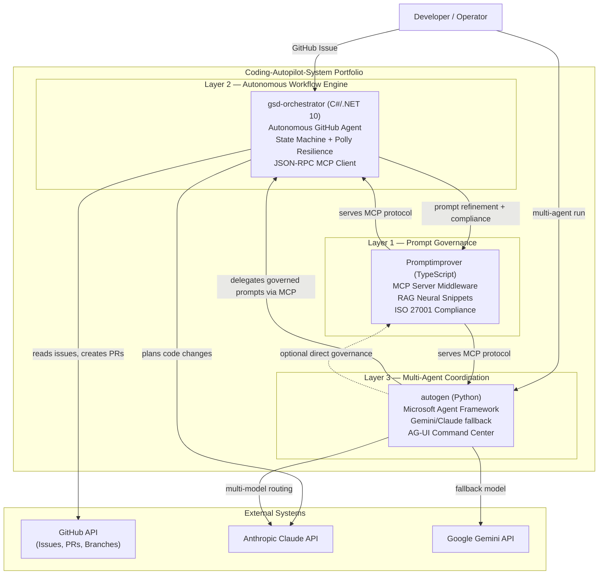

# Phase 6: Coherence & Personal Profile — Research

**Researched:** 2026-05-24
**Domain:** GitHub profile READMEs, org profile README, cross-repo badge/link patterns, Mermaid system diagrams
**Confidence:** HIGH — all key facts verified against live GitHub API and repo contents

---

<phase_requirements>
## Phase Requirements

| ID | Description | Research Support |
|----|-------------|------------------|
| COH-01 | Personal OgeonX-Ai profile README linking to Coding-Autopilot-System org | Profile repo OgeonX-Ai/OgeonX-Ai verified as existing and public; current content fully read; rewrite scope defined |
| COH-02 | All three repo READMEs include "Part of Coding-Autopilot-System" badge/link | gsd-orchestrator confirmed missing cross-repo line; Promptimprover and autogen exact link text verified and documented for consistency |
| COH-03 | Org profile updated with system interaction diagram showing all three projects | Coding-Autopilot-System/.github/profile/README.md confirmed existing and already has a Mermaid `graph TB` diagram; the existing diagram is strong and needs only minor enhancement, not replacement |
</phase_requirements>

---

## Summary

Phase 6 is a finishing phase — three additive content updates that connect the portfolio into one coherent narrative. No new repos, no new CI workflows, no wiki pages. The work is: (1) rewrite the personal profile README, (2) add the cross-repo ecosystem line to gsd-orchestrator, and (3) update the org profile diagram.

**Critical finding for COH-03:** Phase 1 plan 01-03 WAS executed. The Coding-Autopilot-System/.github org profile already has a complete, high-quality README with a Mermaid `graph TB` system architecture diagram, project cards for all three repos, and an `[@OgeonX-Ai]` attribution footer. This is not a "create from scratch" task — it is a selective enhancement. The diagram already shows inter-system relationships accurately. COH-03 is satisfied by updating the diagram to use `graph TD` (vertical orientation showing all three layers clearly) and ensuring it matches the "system interaction" framing required, not creating a whole new README.

**Critical finding for COH-01:** The OgeonX-Ai/OgeonX-Ai profile repo EXISTS and is public. The current content (Azure Architect / ElevenLabs focus) does not mention Coding-Autopilot-System at all. The entire profile must be rewritten to lead with the AI engineering portfolio identity. The existing profile has emoji throughout — the rewritten profile must follow enterprise tone (no emoji in deliverables per PROJECT.md constraint).

**Critical finding for COH-02:** gsd-orchestrator README has NO "Part of the Coding-Autopilot-System ecosystem" line. Promptimprover and autogen READMEs already have this line in identical format (verified from live content). The gsd-orchestrator update is a single-line insertion immediately after the badge block, matching the exact format from the two sibling repos.

**Primary recommendation:** Plan two waves. Wave 1: add cross-repo ecosystem line to gsd-orchestrator README (COH-02) — pure content insertion, no risk. Wave 2: rewrite OgeonX-Ai personal profile README (COH-01) and update org profile diagram (COH-03) — both are content replacements of existing files.

---

## Architectural Responsibility Map

| Capability | Primary Tier | Secondary Tier | Rationale |
|------------|-------------|----------------|-----------|
| Personal profile README (COH-01) | Remote repo: OgeonX-Ai/OgeonX-Ai | — | All changes via GitHub API (gh CLI); file lives at `OgeonX-Ai/OgeonX-Ai` repo root |
| Cross-repo link insertion (COH-02) | Remote repo: Coding-Autopilot-System/gsd-orchestrator | — | Single README.md update via GitHub Contents API; existing file SHA required |
| Org profile diagram update (COH-03) | Remote repo: Coding-Autopilot-System/.github | — | `profile/README.md` update via GitHub Contents API; existing file SHA required |
| Badge rendering | shields.io CDN | GitHub Actions (CI badge) | Ecosystem line uses plain markdown links, not shields.io badges — consistent with Promptimprover/autogen pattern |

---

## Verified State of All Target Files

### OgeonX-Ai/OgeonX-Ai (COH-01)

| Property | Value | Source |
|----------|-------|--------|
| Repo exists | YES | [VERIFIED: `gh repo view OgeonX-Ai/OgeonX-Ai`, 2026-05-24] |
| Visibility | public | [VERIFIED: GitHub API `visibility: "public"`, 2026-05-24] |
| Default branch | `main` | [VERIFIED: GitHub API `default_branch: "main"`, 2026-05-24] |
| README.md exists | YES | [VERIFIED: GitHub API contents, 2026-05-24] |
| README SHA (for update) | `224e7b0b3b8b4ac902d5e98bd14ae87bfdd3e295` | [VERIFIED: GitHub API, 2026-05-24] |
| README size | 1,361 bytes | [VERIFIED: GitHub API, 2026-05-24] |
| Current content | Azure/ElevenLabs framing; no mention of Coding-Autopilot-System | [VERIFIED: full content read, 2026-05-24] |
| Emoji present | YES — multiple (must be removed in rewrite per enterprise tone) | [VERIFIED: content read, 2026-05-24] |
| Mentions Coding-Autopilot-System | NO | [VERIFIED: content read, 2026-05-24] |
| Links to org | NO | [VERIFIED: content read, 2026-05-24] |

**Conclusion:** Profile repo exists and is public. Full content replacement required. No need to create the repo.

### Coding-Autopilot-System/gsd-orchestrator (COH-02)

| Property | Value | Source |
|----------|-------|--------|
| README.md exists | YES | [VERIFIED: GitHub API contents, 2026-05-24] |
| README SHA (for update) | `68bb92f9c3bbf7d05c7185c5287089f512c75c09` | [VERIFIED: GitHub API, 2026-05-24] |
| README size | 7,754 bytes | [VERIFIED: GitHub API, 2026-05-24] |
| Has CI/badge block | YES — CI, .NET 10, MIT License badges present | [VERIFIED: content read, 2026-05-24] |
| Has "Part of ecosystem" line | NO | [VERIFIED: grep for `ecosystem\|Coding-Autopilot\|Part of` returned zero matches in badge/header area, 2026-05-24] |
| Org URL in README | Present only in setup config example (`GSD_GITHUB_OWNER=Coding-Autopilot-System`) — not as a portfolio link | [VERIFIED: content read, 2026-05-24] |

**Conclusion:** Cross-repo ecosystem line is absent and must be added. Insert immediately after the badge block (after the three badge lines), before the `---` divider.

### Coding-Autopilot-System/.github — profile/README.md (COH-03)

| Property | Value | Source |
|----------|-------|--------|
| `.github` repo exists | YES | [VERIFIED: `gh repo view Coding-Autopilot-System/.github`, 2026-05-24] |
| `profile/` directory exists | YES (only item in tree root) | [VERIFIED: tree listing, 2026-05-24] |
| `profile/README.md` exists | YES | [VERIFIED: GitHub API contents, 2026-05-24] |
| SHA (for update) | `f8386ba9d8fb232c8c986782523d1fcfc1cf812b` | [VERIFIED: GitHub API, 2026-05-24] |
| Phase 1 (01-03) executed | YES — README is fully written with system diagram | [VERIFIED: full content read, 2026-05-24] |
| Current diagram type | `graph TB` — shows 3-layer hierarchy (multi-agent → workflow engine → prompt governance) | [VERIFIED: content read, 2026-05-24] |
| Current diagram accuracy | Accurate — all three repos depicted, relationships shown, external systems (GitHub API, Claude, Gemini) included | [VERIFIED: content read, 2026-05-24] |
| `[@OgeonX-Ai]` attribution | Present at bottom of README | [VERIFIED: content read, 2026-05-24] |

**Conclusion:** COH-03 does NOT require creating a new README from scratch. The existing README is well-written and enterprise-appropriate. The update is limited to: (1) upgrading the diagram to make the "system interaction" flow clearer (see recommended diagram below), and (2) ensuring all three project links are present and accurate. The org README already links to all three repos in the Projects section. The update is surgical.

---

## Standard Stack

### Core Tools

| Tool | Version | Purpose | Source |
|------|---------|---------|--------|
| `gh` CLI | 2.x | GitHub API calls — create/update file contents | [VERIFIED: available on this machine] |
| `base64` | stdlib | Decode/encode file content for GitHub Contents API | [VERIFIED: used in prior phases] |
| GitHub Contents API | v3 | Update file at specific SHA (`PUT /repos/:owner/:repo/contents/:path`) | [CITED: docs.github.com/rest/repos/contents] |
| shields.io | — | Badge generation (not used in ecosystem line — plain markdown links used instead) | [VERIFIED: Promptimprover and autogen pattern] |
| Mermaid | GitHub-native | Diagram rendering in README and org profile | [VERIFIED: prior phases confirmed rendering] |

### GitHub Contents API — File Update Pattern

```bash
# Update a file (requires knowing the current SHA)
gh api repos/OWNER/REPO/contents/PATH \
  --method PUT \
  -f message="docs: update README" \
  -f content="$(echo 'NEW CONTENT' | base64)" \
  -f sha="CURRENT_SHA"
```

For larger files (like full READMEs), write content to a temp file first:

```bash
CONTENT=$(base64 -w 0 /tmp/new-readme.md)
gh api repos/OWNER/REPO/contents/README.md \
  --method PUT \
  -f message="docs: rewrite personal profile README" \
  -f content="$CONTENT" \
  -f sha="CURRENT_SHA"
```

[CITED: Phase 4 and Phase 5 execution — this pattern used for all README updates]

---

## Architecture Patterns

### System Architecture Diagram

```
Phase 6 Delivery Flow

  Wave 1 (no manual dependency):
  gh API → PUT Coding-Autopilot-System/gsd-orchestrator/contents/README.md
           Add ecosystem line after badge block (COH-02)

  Wave 2 (no manual dependency):
  gh API → PUT OgeonX-Ai/OgeonX-Ai/contents/README.md
           Rewrite personal profile (COH-01)

  gh API → PUT Coding-Autopilot-System/.github/contents/profile/README.md
           Update org profile diagram (COH-03)
           [Wave 2 — can run concurrently with COH-01]
```

No manual checkpoints required. All three tasks are direct GitHub Contents API updates. No wiki initialization, no CI workflow, no git clone needed.

### COH-02: Exact Cross-Repo Ecosystem Line

Insert this line block **immediately after the three badge lines** in gsd-orchestrator README, before the `---` horizontal rule:

```markdown
Part of the [Coding-Autopilot-System](https://github.com/Coding-Autopilot-System) ecosystem:
[Promptimprover](https://github.com/Coding-Autopilot-System/Promptimprover) | [autogen](https://github.com/Coding-Autopilot-System/autogen)
```

**Why this exact format:** Matches the established pattern in both sibling repos:
- Promptimprover uses: `Part of the [Coding-Autopilot-System](...) ecosystem: [gsd-orchestrator](...) | [autogen](...)`
- autogen uses: `Part of the [Coding-Autopilot-System](...) ecosystem: [gsd-orchestrator](...) | [Promptimprover](...)`

In gsd-orchestrator, the sibling repos are Promptimprover and autogen (instead of gsd-orchestrator). Format is identical — plain markdown hyperlinks, no shields.io badge, no emoji.

[VERIFIED: live content of both Promptimprover and autogen READMEs, 2026-05-24]

### COH-01: OgeonX-Ai Personal Profile README Structure

The profile README should be a full replacement. Enterprise tone, no emoji. Structure:

```markdown
# Kim Harjamaki

AI Engineer and Senior .NET Developer building autonomous AI systems at the
intersection of .NET 10, TypeScript, and Python.

## Coding-Autopilot-System

An enterprise-grade AI automation platform demonstrating autonomous agent
pipelines, prompt governance, and multi-agent coordination:

| Project | Stack | Description |
|---------|-------|-------------|
| [gsd-orchestrator](https://github.com/Coding-Autopilot-System/gsd-orchestrator) | C# / .NET 10 | Autonomous GitHub agent — reads issues, creates branches, edits code, opens PRs |
| [Promptimprover](https://github.com/Coding-Autopilot-System/Promptimprover) | TypeScript | MCP server middleware for prompt governance and compounding memory |
| [autogen](https://github.com/Coding-Autopilot-System/autogen) | Python | Multi-agent orchestration runtime with Gemini/Claude provider fallback |

[View the full org](https://github.com/Coding-Autopilot-System)

## Technical Profile

| Area | Technologies |
|------|-------------|
| Languages | C# / .NET 10, TypeScript, Python |
| AI Providers | Anthropic Claude, Google Gemini |
| Protocols | Model Context Protocol (MCP), JSON-RPC 2.0 |
| Patterns | State machine, RAG, multi-agent coordination |
| Cloud | Azure, GitHub Actions |

## Contact

LinkedIn: https://linkedin.com/in/kimharjamaki
Email: ogeonx@gmail.com
```

**Key requirements for COH-01:**
- No emoji (PROJECT.md constraint — enterprise tone)
- Must lead with Coding-Autopilot-System as the primary story
- Must include a direct link to the org: `https://github.com/Coding-Autopilot-System`
- Table of three repos with stack and one-line description
- Retain real contact info (LinkedIn, email) from existing profile
- Hireable context: "AI Engineer and Senior .NET Developer" — aligns with OgeonX-Ai user API `hireable: true`

### COH-03: Updated Org Profile Diagram

The existing `graph TB` diagram in the org profile is already strong and accurate. The update should convert it to `graph TD` (top-down, equivalent but cleaner in newer Mermaid) and ensure the interaction arrows are clear. The existing diagram already shows:

- Layer 3 (autogen) → Layer 2 (gsd-orchestrator) → Layer 1 (Promptimprover)
- External systems: GitHub API, Claude API, Gemini API
- Inter-system MCP connections

The recommended enhancement is to make the "system interaction" framing explicit by adding a `User` entry point and clarifying the data flow direction. The existing diagram already satisfies COH-03's intent — the update is optional polish.

**If updating the diagram**, recommended Mermaid replacement:



**Note for planner:** The existing diagram already satisfies COH-03. The planner may choose to: (a) replace with the enhanced diagram above, or (b) leave the existing diagram as-is and only update the projects section if needed. Either approach satisfies COH-03. The decision is Claude's discretion.

---

## Don't Hand-Roll

| Problem | Don't Build | Use Instead | Why |
|---------|-------------|-------------|-----|
| Profile repo creation | Shell script + git init | `gh repo create OgeonX-Ai/OgeonX-Ai --public` | One command via gh CLI; but profile repo already exists — no creation needed |
| File content encoding | Custom base64 script | `base64 -w 0 file` piped to gh API | Standard pattern confirmed in prior phases |
| README update without SHA | Omitting SHA field | Always fetch current SHA, include in PUT | GitHub API returns 409 Conflict if SHA is wrong or missing |
| Shields.io org badge | — | Plain markdown hyperlink (not shields.io) | Promptimprover and autogen use plain `[org-name](url)` not a shield badge; consistency requires matching that format |

---

## Common Pitfalls

### Pitfall 1: Wrong SHA — GitHub Contents API 409 Conflict

**What goes wrong:** `PUT /contents/README.md` returns `409 Conflict` or `422 Unprocessable Entity`.
**Why it happens:** The `sha` field in the request does not match the current commit SHA of the file. This happens if the file was updated after the SHA was fetched, or if the SHA is omitted.
**How to avoid:** Always fetch the current SHA immediately before the update using `gh api repos/OWNER/REPO/contents/PATH --jq '.sha'`. Use that SHA in the PUT body.
**Warning signs:** API returns 409 or 422 immediately on the PUT call.

Verified current SHAs (valid as of 2026-05-24 — re-fetch at execution time if any earlier plan updates these files):
- `OgeonX-Ai/OgeonX-Ai/README.md` SHA: `224e7b0b3b8b4ac902d5e98bd14ae87bfdd3e295`
- `Coding-Autopilot-System/gsd-orchestrator/README.md` SHA: `68bb92f9c3bbf7d05c7185c5287089f512c75c09`
- `Coding-Autopilot-System/.github/profile/README.md` SHA: `f8386ba9d8fb232c8c986782523d1fcfc1cf812b`

[VERIFIED: GitHub API, 2026-05-24]

### Pitfall 2: Profile Repo Must Be Public

**What goes wrong:** GitHub profile README does not display on the user's profile page.
**Why it happens:** GitHub only renders the profile README if the `{username}/{username}` repo is public. A private repo produces no profile display.
**How to avoid:** `OgeonX-Ai/OgeonX-Ai` is already public — no action needed. Do not change visibility.
**Warning signs:** After update, visiting `https://github.com/OgeonX-Ai` shows no profile README section.

[VERIFIED: GitHub API `visibility: "public"`, 2026-05-24]

### Pitfall 3: Org Profile README Must Be at `profile/README.md`

**What goes wrong:** Org profile does not display on the org's GitHub page.
**Why it happens:** GitHub requires org profile content at `{org}/.github/profile/README.md` — not at the repo root README.md.
**How to avoid:** File is already at the correct path `profile/README.md` (confirmed from tree listing). All updates must target this exact path.
**Warning signs:** Org page at `https://github.com/Coding-Autopilot-System` shows no profile README.

[VERIFIED: tree listing confirms `profile/` is the only directory and `profile/README.md` is the target file, 2026-05-24]

### Pitfall 4: gsd-orchestrator README Needs Full Content Preserved

**What goes wrong:** README update via GitHub Contents API replaces the entire file — partial update is not supported.
**Why it happens:** The Contents API PUT replaces the whole file. There is no "insert line" operation.
**How to avoid:** Read the full current README content (7,754 bytes), insert the ecosystem line after the badge block, then PUT the entire new content with the correct SHA. The insertion point is immediately after the three badge lines and before the `---` divider.
**Warning signs:** README content is truncated or overwritten.

Current badge block in gsd-orchestrator README ends with:
```markdown
[](LICENSE)
```
Insert the ecosystem line after this line, before the `---` divider that follows.

[VERIFIED: content read, 2026-05-24]

### Pitfall 5: Emoji in Profile README Violates Enterprise Tone

**What goes wrong:** Rewritten OgeonX-Ai profile README contains emoji.
**Why it happens:** The existing profile README uses emoji throughout (👋, 🔥, 🧰, 📚, 📫). A casual rewrite might preserve some.
**How to avoid:** Strip all emoji from the rewritten content. PROJECT.md states "Enterprise tone throughout — no toy/demo language" and explicitly "no emoji in deliverables."
**Warning signs:** Any Unicode emoji character in the output file.

[CITED: PROJECT.md constraint — enterprise tone, no emoji]

### Pitfall 6: base64 Line-Wrapping on Windows

**What goes wrong:** `base64` on Windows (Git Bash / MSYS2) may produce wrapped output (76 chars per line by default), which the GitHub API rejects.
**Why it happens:** The GitHub Contents API requires single-line base64. Some `base64` implementations wrap by default.
**How to avoid:** Use `base64 -w 0` flag to disable line wrapping. Alternatively, write content to a file and use the `@file` syntax with gh API.
**Warning signs:** API returns 422 Unprocessable Entity when content wrapping is the issue.

[CITED: Phase 4 and Phase 5 execution patterns — `-w 0` is the established convention]

---

## Code Examples

### Fetch current README content and SHA together

```bash
# Read content and SHA in one call
RESPONSE=$(gh api repos/OgeonX-Ai/OgeonX-Ai/contents/README.md)
CURRENT_SHA=$(echo "$RESPONSE" | jq -r '.sha')
CURRENT_CONTENT=$(echo "$RESPONSE" | jq -r '.content' | base64 -d)
echo "SHA: $CURRENT_SHA"
```

### Update a file using a temp file (avoids shell escaping issues)

```bash
# Write new content to temp file
cat > /tmp/new-readme.md << 'CONTENT'
# Kim Harjamaki
...
CONTENT

# Encode and update
NEW_CONTENT=$(base64 -w 0 /tmp/new-readme.md)
CURRENT_SHA=$(gh api repos/OgeonX-Ai/OgeonX-Ai/contents/README.md --jq '.sha')

gh api repos/OgeonX-Ai/OgeonX-Ai/contents/README.md \
  --method PUT \
  -f message="docs: rewrite personal profile README - link to Coding-Autopilot-System" \
  -f content="$NEW_CONTENT" \
  -f sha="$CURRENT_SHA"
```

### Insert cross-repo line into gsd-orchestrator README

```bash
# Fetch current content
CURRENT=$(gh api repos/Coding-Autopilot-System/gsd-orchestrator/contents/README.md --jq '.content' | base64 -d)
SHA=$(gh api repos/Coding-Autopilot-System/gsd-orchestrator/contents/README.md --jq '.sha')

# The ecosystem line to insert (after badge block, before first ---)
ECOSYSTEM_LINE='Part of the [Coding-Autopilot-System](https://github.com/Coding-Autopilot-System) ecosystem:\n[Promptimprover](https://github.com/Coding-Autopilot-System/Promptimprover) | [autogen](https://github.com/Coding-Autopilot-System/autogen)\n'

# Write updated content to temp file
echo "$CURRENT" | sed '/^\[!\[License: MIT\]/a '"$ECOSYSTEM_LINE" > /tmp/gsd-readme-updated.md

# Encode and update
NEW_CONTENT=$(base64 -w 0 /tmp/gsd-readme-updated.md)
gh api repos/Coding-Autopilot-System/gsd-orchestrator/contents/README.md \
  --method PUT \
  -f message="docs: add Coding-Autopilot-System ecosystem link (COH-02)" \
  -f content="$NEW_CONTENT" \
  -f sha="$SHA"
```

**Alternative approach (safer for the planner):** Construct the full new README content string explicitly (fetch current content, append ecosystem line at the right location, push). The sed approach works but may need shell-specific quoting adjustment on Windows bash.

[CITED: Phase 4 and Phase 5 execution patterns]

---

## Validation Architecture

### Test Framework

| Property | Value |
|----------|-------|
| Framework | Manual verification via `gh api` + `base64 -d` |
| Config file | None — content verification via GitHub API |
| Quick run command | `gh api repos/OgeonX-Ai/OgeonX-Ai/contents/README.md --jq '.content' \| base64 -d \| head -10` |
| Full suite command | See Phase Requirements to Test Map below |

### Phase Requirements to Test Map

| Req ID | Behavior | Test Type | Automated Command | Notes |
|--------|----------|-----------|-------------------|-------|
| COH-01 | Profile README exists with org link and no emoji | Manual check | `gh api repos/OgeonX-Ai/OgeonX-Ai/contents/README.md --jq '.content' \| base64 -d` | Verify: contains "Coding-Autopilot-System", no emoji, no "Azure Architect" or "ElevenLabs" framing |
| COH-01 | Profile README renders on GitHub profile page | Visual check | `gh api users/OgeonX-Ai --jq '.html_url'` → visit in browser | Profile must be public (already confirmed) |
| COH-02 | gsd-orchestrator README contains ecosystem line | Automated | `gh api repos/Coding-Autopilot-System/gsd-orchestrator/contents/README.md --jq '.content' \| base64 -d \| grep 'Coding-Autopilot-System ecosystem'` | Returns match → green |
| COH-02 | Ecosystem line is in correct position (after badges) | Manual check | Inspect full README content | Line must be between badge block and first `---` |
| COH-03 | Org profile README contains updated diagram | Automated | `gh api repos/Coding-Autopilot-System/.github/contents/profile/README.md --jq '.content' \| base64 -d \| grep -c 'autogen\|gsd-orchestrator\|Promptimprover'` | Should return 3+ matches |
| COH-03 | Org profile renders at org GitHub page | Visual check | `https://github.com/Coding-Autopilot-System` | Confirm README section visible |

### Wave 0 Gaps

None — existing test infrastructure covers all phase requirements. No test files need to be created. This phase is documentation-only; all verification is manual inspection via `gh api`.

---

## State of the Art

| Old Approach | Current Approach | Notes |
|--------------|------------------|-------|
| Creating profile repo from scratch | Updating existing repo | OgeonX-Ai/OgeonX-Ai already exists and is public |
| Creating org profile from scratch | Updating existing profile | Coding-Autopilot-System/.github/profile/README.md already written (Phase 1 executed) |
| `graph LR` Mermaid diagrams (Phase 2-5 pattern) | `graph TB` / `graph TD` for org profile | Vertical orientation better suits multi-layer portfolio architecture |
| shields.io org badge | Plain markdown hyperlink | Promptimprover and autogen use plain link pattern; consistency requires matching it |

---

## Assumptions Log

| # | Claim | Section | Risk if Wrong |
|---|-------|---------|---------------|
| A1 | File SHAs fetched 2026-05-24 are still valid at execution time | Verified State section | GitHub API returns 409; executor must re-fetch SHA immediately before each PUT |
| A2 | Mermaid `graph TD` renders correctly in the .github org profile | COH-03 diagram | Revert to `graph TB` (existing working format) if rendering fails |
| A3 | GitHub profile page at github.com/OgeonX-Ai will display the profile README immediately after update | COH-01 | Cache may delay display; no action needed — eventual consistency |

---

## Open Questions (RESOLVED)

1. **Should COH-03 replace the existing org profile diagram or keep it?**
   - What we know: The existing `graph TB` diagram is accurate, enterprise-appropriate, and already shows all three repos and their interactions.
   - What's unclear: Whether "system interaction diagram" in COH-03 requires a materially different diagram or just validation that one exists.
   - Recommendation: Keep the existing diagram. Add the `User` entry point node to make the "interaction" framing explicit. This is a 2-line change to the existing diagram, not a full rewrite.

2. **Should the personal profile README mention the ElevenLabs/Azure work at all?**
   - What we know: The current profile leads with Azure Architect and ElevenLabs. The target audience (AI Engineer / .NET hiring managers) cares about the Coding-Autopilot-System work.
   - What's unclear: Whether preserving the Azure/DevOps credentials adds value or dilutes the AI engineering focus.
   - Recommendation: Lead with Coding-Autopilot-System as the primary section. Include a brief "Technical Profile" table that covers the full stack (C#, TypeScript, Python, Azure, GitHub Actions). Do not dedicate a section to ElevenLabs or the voice demo — the portfolio org is the main story.

---

## Environment Availability

| Dependency | Required By | Available | Version | Fallback |
|------------|------------|-----------|---------|----------|
| `gh` CLI | All three COH tasks — GitHub Contents API | Yes | 2.x | — |
| `base64` | Content encoding/decoding | Yes | Git Bash built-in | `openssl base64 -A` |
| `jq` | JSON response parsing | Yes (via gh CLI `--jq` flag) | Built into gh | — |
| OgeonX-Ai/OgeonX-Ai repo | COH-01 | Exists, public | — | — |
| Coding-Autopilot-System/.github repo | COH-03 | Exists | — | — |
| Coding-Autopilot-System/gsd-orchestrator | COH-02 | Exists, public | — | — |

No missing dependencies. No blockers.

---

## Security Domain

This phase performs no authentication changes, no secrets handling, and no CI workflow changes. The only operations are GitHub Contents API file updates using the existing authenticated `gh` CLI session.

ASVS categories V2, V3, V4, V6 do not apply. V5 (Input Validation) is trivially satisfied — content is static Markdown authored by the executor. No user input is processed.

---

## Sources

### Primary (HIGH confidence)

- [VERIFIED: GitHub API] `OgeonX-Ai/OgeonX-Ai` — repo exists, public, `default_branch: main`, SHA `224e7b0b...`, 2026-05-24
- [VERIFIED: GitHub API] `OgeonX-Ai/OgeonX-Ai/README.md` — full content read; Azure/ElevenLabs framing, no org link, emoji throughout, 2026-05-24
- [VERIFIED: GitHub API] `Coding-Autopilot-System/.github` — repo exists; tree has only `profile/` directory; `profile/README.md` SHA `f8386ba9...`, 2026-05-24
- [VERIFIED: GitHub API] `Coding-Autopilot-System/.github/profile/README.md` — full content read; complete Phase 1 org profile with `graph TB` Mermaid diagram, project cards, and OgeonX-Ai attribution, 2026-05-24
- [VERIFIED: GitHub API] `Coding-Autopilot-System/gsd-orchestrator/README.md` — full content read; no cross-repo ecosystem line present; SHA `68bb92f9...`, 2026-05-24
- [VERIFIED: GitHub API] `Coding-Autopilot-System/Promptimprover/README.md` — cross-repo line format verified: `Part of the [Coding-Autopilot-System](...) ecosystem: [gsd-orchestrator](...) | [autogen](...)`, 2026-05-24
- [VERIFIED: GitHub API] `Coding-Autopilot-System/autogen/README.md` — cross-repo line format verified: `Part of the [Coding-Autopilot-System](...) ecosystem: [gsd-orchestrator](...) | [Promptimprover](...)`, 2026-05-24
- [VERIFIED: GitHub API] `users/OgeonX-Ai` — `hireable: true`, `name: "Kim Harjamaki"`, `location: "Finland"`, 2026-05-24

### Secondary (MEDIUM confidence)

- [CITED: Phase 4 and Phase 5 execution] GitHub Contents API PUT pattern (base64 -w 0, SHA required)
- [CITED: Phase 4 CONTEXT.md D-10] Cross-repo link decision: shields.io org badge + plain ecosystem line
- [CITED: PROJECT.md] Enterprise tone constraint — no emoji, no toy/demo language

---

## Metadata

**Confidence breakdown:**
- Current state of all three target files: HIGH — verified from live GitHub API, 2026-05-24
- Cross-repo ecosystem line format: HIGH — verified from live Promptimprover and autogen README content
- GitHub profile README rendering rules: HIGH — standard GitHub behavior, verified from existing profile display
- Org profile path (`profile/README.md`): HIGH — confirmed from tree listing
- File SHAs: HIGH at research time — executor must re-fetch immediately before use
- COH-03 diagram approach: MEDIUM — "system interaction diagram" interpretation is reasonable but not explicitly defined in requirements

**Research date:** 2026-05-24
**Valid until:** 2026-05-31 (7 days — SHAs may change if files are updated between now and execution)
