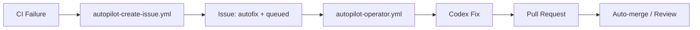

# Phase 8: CAS Secondary Repos Level A — Research

**Researched:** 2026-05-26
**Domain:** GitHub API portfolio documentation, YAML CI validation, GitHub wiki initialization, PowerShell repos, Bicep/security repos
**Confidence:** HIGH

---

## Summary

Three Coding-Autopilot-System repos need Level A documentation elevation:

- **autopilot-core** — org-level AI operator that scans issues and runs Codex to open fix PRs. PowerShell, no license, no CI badge, no topics, wiki uninitialized.
- **autopilot-demo** — target repo that triggers the autopilot intake workflow when CI fails. PowerShell, no license, no CI badge, no topics, wiki uninitialized.
- **cloud-security-service-model** — enterprise Azure/hybrid cloud security operating model (Bicep + Markdown docs). Has MIT license and a working CI (markdown lint + link check). Wiki uninitialized. README is already substantive but needs hero line, CI badge, and cross-links.

**Primary recommendation:** Add 08-00 manual checkpoint to initialize all three wikis, then execute Wave 1 (autopilot-core + autopilot-demo in parallel) and Wave 2 (cloud-security-service-model). All three repos need topics. autopilot-core and autopilot-demo need MIT LICENSE files and a new ci.yml on ubuntu-latest. cloud-security-service-model already has CI — just needs badge in README, topics, and wiki pages.

---

## Phase Requirements

<phase_requirements>

| ID | Description | Research Support |
|----|-------------|------------------|
| ACOR-01 | autopilot-core Level A docs — README rewrite, CI badge, wiki 4 pages, topics, cross-links | Language: PowerShell. No LICENSE, no CI badge workflow, no topics. Wiki uninitialized. Current README has architecture ASCII diagram. Has docs/ with README.md, dashboard.md, runbooks/, status.md. CI strategy: YAML workflow validation on ubuntu-latest. README SHA: `4a0d3938456528f7a8cbe5b350f86caa6670addf` |
| ACOR-02 | autopilot-demo Level A docs — README rewrite, CI badge, wiki 4 pages, topics, cross-links | Language: PowerShell. No LICENSE, no topics. Has demo-ci.yml (echo, passes). Wiki uninitialized. README is 2 lines. Need separate ci.yml for portfolio badge. README SHA: `cb1dce205fd319fbfaca42b6c1c789328ef18467` |
| CSEC-01 | cloud-security-service-model documentation — README rewrite (framework/methodology framing), wiki 4 pages, topics | Language: Bicep. MIT license exists. Has working ci.yml (markdown lint + link check + Mermaid verify). Wiki uninitialized. README already describes the framework model. 20+ docs/ files available for wiki content. README SHA: `4e6e9c9209c5904b67c97d27714de814756c1652` |

</phase_requirements>

---

## Architectural Responsibility Map

| Capability | Primary Tier | Rationale |
|------------|-------------|-----------|
| MIT LICENSE creation | GitHub MCP file create | Same pattern as Phase 1 (FOUND-03) |
| CI workflow (YAML validate) | GitHub MCP file create | New ci.yml on ubuntu-latest, no self-hosted runner needed |
| README rewrite | GitHub MCP file update | `mcp__github__create_or_update_file` against main branch |
| GitHub topics | GitHub REST API | `PUT /repos/{owner}/{repo}/topics` |
| Wiki pages | Git clone of `.wiki.git` | Push via git after manual checkpoint initializes each wiki |
| Repo description update | GitHub REST API | `PATCH /repos/{owner}/{repo}` with `description` field |

---

## Repository State (Verified)

### autopilot-core

| Property | Value |
|----------|-------|
| Default branch | `main` |
| Language | PowerShell |
| License | NONE — must create MIT |
| Has wiki (enabled) | true |
| Wiki initialized | NO — `git ls-remote` returns "Repository not found" |
| Topics | Empty array |
| Description | "CI Autopilot control plane and operator" |
| README SHA | `4a0d3938456528f7a8cbe5b350f86caa6670addf` |
| Existing CI | None on ubuntu-latest (all workflows use `self-hosted, Windows`) |
| Operational workflows | autopilot-operator.yml, autopilot-org-installer.yml, autopilot-create-issue.yml, autopilot-docs-daily.yml |
| Docs structure | docs/README.md, docs/dashboard.md, docs/runbooks/, docs/status.md, docs/index.html |
| GitHub Pages | docs/index.html present |

### autopilot-demo

| Property | Value |
|----------|-------|
| Default branch | `main` |
| Language | PowerShell |
| License | NONE — must create MIT |
| Has wiki (enabled) | true |
| Wiki initialized | NO — `git ls-remote` returns "Repository not found" |
| Topics | Empty array |
| Description | "CI Autopilot demo repo" |
| README SHA | `cb1dce205fd319fbfaca42b6c1c789328ef18467` |
| Existing workflows | demo-ci.yml (echo, passes on ubuntu-latest), autopilot-create-issue.yml |
| Current README | 2 lines ("# Autopilot Demo Repo" + trigger instructions) |

### cloud-security-service-model

| Property | Value |
|----------|-------|
| Default branch | `main` |
| Language | Bicep |
| License | MIT (already present) |
| Has wiki (enabled) | true |
| Wiki initialized | NO — `git ls-remote` returns "Repository not found" |
| Topics | Empty array |
| Description | "Mock documents for cloud security service model" — needs improvement |
| README SHA | `4e6e9c9209c5904b67c97d27714de814756c1652` |
| Existing CI | ci.yml (markdown lint + link check + Mermaid verify + JSON validation) |
| Docs structure | 20+ docs/ files (00-executive-overview.md through 22-diagrams/) |
| GitHub Pages | docs/index.html |

---

## Standard Stack

### CI for autopilot-core and autopilot-demo

Both repos are PowerShell with GitHub Actions YAML workflow files. No test suite. Best CI pattern: YAML validation on ubuntu-latest using Python's built-in `yaml` module.

```yaml
name: CI

on:
  push:
    branches: [main]
  pull_request:
    branches: [main]

jobs:
  validate:
    runs-on: ubuntu-latest
    steps:
      - uses: actions/checkout@v4
      - name: Validate workflow YAML
        run: |
          python -c "
          import yaml, glob
          files = glob.glob('.github/workflows/*.yml')
          for f in files:
              with open(f) as fh:
                  yaml.safe_load(fh)
              print('  OK:', f)
          print('Validated', len(files), 'workflow files')
          "
```

**Why this passes:** Python's `yaml` module is pre-installed on ubuntu-latest GitHub runners. No external packages needed. The YAML files in both repos are valid (verified by listing them). This gives a meaningful CI check (workflow file integrity) without requiring a self-hosted runner.

**For autopilot-demo specifically:** The existing `demo-ci.yml` is named "Demo CI" and is the intake trigger demo. The new `ci.yml` should be named "CI" to get the standard CI badge. Both can coexist — they serve different purposes.

### cloud-security-service-model CI

Already has `ci.yml` with markdown lint + link check + Mermaid verify + JSON validation. Add the badge to README pointing to this existing workflow.

---

## README Hero Lines

### autopilot-core
> Org-level AI autopilot operator — scans GitHub issues labeled `autofix + queued`, invokes Codex to generate fixes, and opens pull requests automatically across the Coding-Autopilot-System organization

Mermaid flowchart (replace ASCII diagram):


### autopilot-demo
> Demo target for the Coding-Autopilot-System AI repair pipeline — triggers intake workflows when CI fails, demonstrating end-to-end agentic fix from failure detection to pull request

### cloud-security-service-model (enhanced)
> Enterprise cloud security operating model for Azure and hybrid environments — defines service scope, governance, controls-as-code, metrics, and measurable outcomes for security leaders and platform teams

---

## GitHub Topics

### autopilot-core
`github-actions`, `ci-automation`, `autonomous-agents`, `codex`, `devops`, `workflow-automation`, `powershell`, `github-org`, `operator`

### autopilot-demo
`github-actions`, `ci-automation`, `demo`, `autonomous-agents`, `codex`, `devops`, `workflow-automation`, `powershell`

### cloud-security-service-model
`cloud-security`, `azure`, `security-operations`, `iso27001`, `devsecops`, `enterprise-security`, `azure-security`, `hybrid-cloud`, `operating-model`, `cissp`

---

## Wiki Pages Map

### autopilot-core wiki

| Wiki Page | Source Content |
|-----------|----------------|
| Home | README + architecture flowchart + quick navigation |
| Setup Guide | README Quick start + AGENTS.md + org variables + secrets required |
| Architecture | operator workflow data flow + org-installer + autopilot-create-issue pattern |
| Configuration Reference | Environment variables, org variables (ORG), secrets (GH_TOKEN, OPENAI_API_KEY), labels |

### autopilot-demo wiki

| Wiki Page | Source Content |
|-----------|----------------|
| Home | README + how the demo system works + flow |
| Setup Guide | How to trigger the demo, prerequisites, labels setup |
| Architecture | demo-ci.yml → autopilot-create-issue.yml → autopilot-core intake flow |
| Configuration Reference | Secrets, labels, org variables needed for the intake workflow |

### cloud-security-service-model wiki

| Wiki Page | Source Content |
|-----------|----------------|
| Home | docs/00-executive-overview.md + service overview + navigation |
| Service Definition & Operating Model | docs/01-service-definition.md + docs/05-operating-model.md + docs/02-service-catalog.md |
| Architecture & Reference | docs/04-reference-architecture.md + docs/03-architecture-principles.md + docs/19-devsecops-pipelines.md |
| Metrics & Compliance | docs/07-metrics-and-kpis.md + docs/10-audit-readiness.md + docs/08-roadmap-and-maturity.md |

---

## Anti-Patterns to Avoid

- **Do not attempt wiki push before manual checkpoint:** All three wikis return "Repository not found" on git ls-remote — must initialize via GitHub UI first.
- **Do not name autopilot-demo's CI workflow "Demo CI":** That name is already taken by demo-ci.yml. Name the new one "CI" so the badge reads correctly.
- **Do not use self-hosted runner for portfolio CI:** autopilot-core's operational workflows use `self-hosted, Windows` which is offline. New ci.yml must use `ubuntu-latest`.
- **Do not modify operational workflows in autopilot-core:** autopilot-operator.yml, autopilot-org-installer.yml, etc. are functional portfolio artifacts — leave them unchanged.
- **Do not add cloud-security-service-model to ACOR requirements:** CSEC-01 does NOT require a CI badge — the existing ci.yml is sufficient. Just add it to the README.

---

## MIT LICENSE Text

For autopilot-core and autopilot-demo (no existing license):

```
MIT License

Copyright (c) 2024 Coding-Autopilot-System

Permission is hereby granted, free of charge, to any person obtaining a copy
of this software and associated documentation files (the "Software"), to deal
in the Software without restriction, including without limitation the rights
to use, copy, modify, merge, publish, distribute, sublicense, and/or sell
copies of the Software, and to permit persons to whom the Software is
furnished to do so, subject to the following conditions:

The above copyright notice and this permission notice shall be included in all
copies or substantial portions of the Software.

THE SOFTWARE IS PROVIDED "AS IS", WITHOUT WARRANTY OF ANY KIND, EXPRESS OR
IMPLIED, INCLUDING BUT NOT LIMITED TO THE WARRANTIES OF MERCHANTABILITY,
FITNESS FOR A PARTICULAR PURPOSE AND NONINFRINGEMENT. IN NO EVENT SHALL THE
AUTHORS OR COPYRIGHT HOLDERS BE LIABLE FOR ANY CLAIM, DAMAGES OR OTHER
LIABILITY, WHETHER IN AN ACTION OF CONTRACT, TORT OR OTHERWISE, ARISING FROM,
OUT OF OR IN CONNECTION WITH THE SOFTWARE OR THE USE OR OTHER DEALINGS IN THE
SOFTWARE.
```

---

## Validation Architecture

### Test Framework
| Property | Value |
|----------|-------|
| Framework | None (portfolio docs + API operations; manual verification) |
| Quick run command | `gh api repos/Coding-Autopilot-System/autopilot-core --jq '.topics'` |
| Full suite command | See verification steps per plan |

### Phase Requirements Verification Map

| Req ID | Behavior | Verification Command |
|--------|----------|----------------------|
| ACOR-01 | autopilot-core: README hero line + CI badge green + topics set + wiki 4 pages + cross-links + MIT license | Multi-check: API + wiki ls-remote + CI status |
| ACOR-02 | autopilot-demo: README hero line + CI badge green + topics set + wiki 4 pages + cross-links + MIT license | Multi-check: API + wiki ls-remote + CI status |
| CSEC-01 | cloud-security-service-model: README enhanced + topics set + wiki 4 pages | API + wiki ls-remote |

---

## Common Pitfalls

### Pitfall 1: Wiki Requires Manual Initialization
**Same as Phase 3/4/5/7 pattern.** All three wikis return "Repository not found" on git ls-remote. The manual checkpoint 08-00 must precede all wiki pushes.

### Pitfall 2: ci.yml Name Collision in autopilot-demo
`demo-ci.yml` is named "Demo CI". A new `ci.yml` named "CI" can coexist without conflict. GitHub Actions badge URL uses the workflow filename, not the display name.

### Pitfall 3: Operational Workflows Use Self-Hosted Runner
autopilot-core's operator runs on `self-hosted, Windows`. The new portfolio ci.yml must use `ubuntu-latest` only. Mixing runner types in a single job is not needed here.

### Pitfall 4: cloud-security-service-model Description Is Underframed
Current description: "Mock documents for cloud security service model" — the word "Mock" undersells this as a professional enterprise framework. Update to: "Enterprise cloud security operating model for Azure and hybrid environments".

---

## Assumptions Log

| # | Claim | Risk if Wrong |
|---|-------|---------------|
| A1 | Python yaml module can parse all 4 autopilot-core workflow YAML files | If any YAML is malformed, ci.yml will fail; mitigate by verifying YAMLs parse before committing ci.yml |
| A2 | All three wikis are completely uninitialized (not just auth-blocked) | If a wiki is auth-blocked (private org), git clone with GITHUB_TOKEN would succeed; use PAT-authenticated clone |
| A3 | autopilot-demo's demo-ci.yml actually passes (echo only) | If it fails on main, the repo will show a failing CI badge; but we're adding a separate ci.yml so this doesn't affect ACOR-02 |
| A4 | cloud-security-service-model's existing ci.yml passes on main | If CI is failing, the badge we add will be red; should verify run status before adding badge |

---

## Sources

- `[VERIFIED: gh api repos/Coding-Autopilot-System/autopilot-core]` — language, topics, license, wiki status
- `[VERIFIED: gh api repos/Coding-Autopilot-System/autopilot-demo]` — language, topics, license, wiki status
- `[VERIFIED: gh api repos/Coding-Autopilot-System/cloud-security-service-model]` — language, topics, license, CI workflows
- `[VERIFIED: git ls-remote all three .wiki.git]` — all return "Repository not found" = uninitialized
- `[VERIFIED: mcp__github__get_file_contents all three repos]` — README content, workflow files, docs structure

**Research date:** 2026-05-26
**Valid until:** 2026-06-26

---

## Validation Architecture (Nyquist)

### Test Framework

| Property | Value |
|----------|-------|
| Framework | None (portfolio docs + API operations; manual verification) |
| Config file | N/A |
| Quick run command | See verification steps in each plan |

### Phase Requirements Verification Map

| Req ID | Behavior | Verification | Automated Command |
|--------|----------|--------------|-------------------|
| ACOR-01 | autopilot-core has hero README, green CI, 4 wiki pages, topics, MIT license | API + wiki content + CI run status | `gh api repos/Coding-Autopilot-System/autopilot-core --jq '{topics:.topics,license:.license.spdx_id}'` |
| ACOR-02 | autopilot-demo has hero README, green CI, 4 wiki pages, topics, MIT license | API + wiki content + CI run status | `gh api repos/Coding-Autopilot-System/autopilot-demo --jq '{topics:.topics,license:.license.spdx_id}'` |
| CSEC-01 | cloud-security-service-model has enhanced README, 4 wiki pages, 10 topics | API + wiki content | `gh api repos/Coding-Autopilot-System/cloud-security-service-model --jq '.topics'` |
