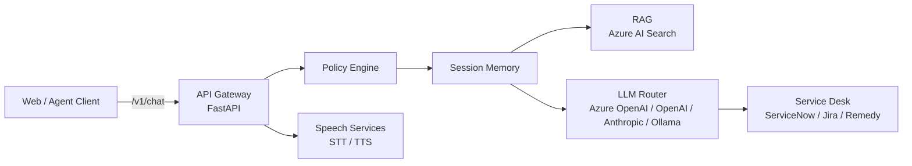

<objective>
Rewrite the enterprise-ai-gateway README with AI service bus framing and push 4 wiki pages to complete Level A documentation for TECH-01.

Purpose: Position enterprise-ai-gateway as a production-grade AI engineering project (vendor-agnostic service bus, not generic gateway) for hiring manager audiences. Complete Level A standard: README + wiki + CI badge + cross-links.

Output: 1 rewritten README.md (remote), 4 wiki pages pushed to enterprise-ai-gateway.wiki.git
</objective>

<execution_context>
@.claude/get-shit-done/workflows/execute-plan.md
@.claude/get-shit-done/templates/summary.md
</execution_context>

<context>
@.planning/PROJECT.md
@.planning/ROADMAP.md
@.planning/STATE.md
@.planning/phases/09-ogeonx-ai-core-tech-ai-reframe/09-CONTEXT.md
@.planning/phases/09-ogeonx-ai-core-tech-ai-reframe/09-RESEARCH.md
@.planning/phases/09-ogeonx-ai-core-tech-ai-reframe/09-PATTERNS.md

<interfaces>
<!-- Key patterns the executor needs. Extracted from RESEARCH.md and PATTERNS.md. -->
<!-- Executor should use these directly — no codebase exploration needed. -->

enterprise-ai-gateway is a Python/FastAPI vendor-agnostic AI service bus.
Default branch: main
CI workflow: .github/workflows/ci.yml (Python 3.11, ruff + pytest, ubuntu-latest)
CI badge URL: https://github.com/OgeonX-Ai/enterprise-ai-gateway/actions/workflows/ci.yml/badge.svg?branch=main
has_wiki: true (verify with git ls-remote before push)
Wiki remote: https://github.com/OgeonX-Ai/enterprise-ai-gateway.wiki.git

README update pattern: fetch SHA first via get_file_contents, then create_or_update_file with sha parameter.
Wiki delivery: git clone wiki.git to /tmp/eag-wiki, write pages, Windows path sync (cp C:/tmp/... to /tmp/...), commit, push to master.
</interfaces>
</context>

<tasks>

<task type="auto">
  <name>Task 1: Rewrite enterprise-ai-gateway README with AI service bus framing</name>
  <files>OgeonX-Ai/enterprise-ai-gateway/README.md (remote)</files>
  <read_first>
    - 09-RESEARCH.md (lines 112-148 for codebase findings, hero line, Mermaid diagram)
    - 09-PATTERNS.md (lines 32-116 for README section order, badge URLs, cross-links, Mermaid diagram)
    - 09-CONTEXT.md (D-01 through D-03, D-10, D-11, D-12, D-CF-01 through D-CF-05)
    - The existing remote README.md via mcp__github__get_file_contents (to capture SHA and preserve factual claims)
  </read_first>
  <action>
Rewrite the enterprise-ai-gateway README.md on the remote repo. Per D-01/D-02, framing is codebase-driven. Per D-CF-05, no source code modifications.

Step 1: Fetch current README.md SHA (MANDATORY — omitting causes 409 Conflict):
  mcp__github__get_file_contents owner:"OgeonX-Ai" repo:"enterprise-ai-gateway" path:"README.md"
  Capture the `sha` field from the response.

Step 2: Compose the full new README.md content with this EXACT structure:

```markdown
# enterprise-ai-gateway

> Vendor-agnostic AI service bus that routes chat, voice, and knowledge requests across LLM, RAG, speech, and service-desk providers — with session memory, policy enforcement, and per-request provider selection.

[](https://github.com/OgeonX-Ai/enterprise-ai-gateway/actions/workflows/ci.yml)
[](https://python.org)
[](LICENSE)

[](https://github.com/Coding-Autopilot-System)

Part of the [Coding-Autopilot-System](https://github.com/Coding-Autopilot-System) ecosystem: [gsd-orchestrator](https://github.com/Coding-Autopilot-System/gsd-orchestrator) | [Promptimprover](https://github.com/Coding-Autopilot-System/Promptimprover) | [autogen](https://github.com/Coding-Autopilot-System/autogen)

**See also:** [OgeonX-Ai/android](https://github.com/OgeonX-Ai/android) — AI voice interaction client for Android

## Architecture



The gateway receives requests through a FastAPI endpoint and passes them through a policy engine for input sanitization. Session memory maintains per-conversation context. The core routes to multiple AI providers: LLM inference (Azure OpenAI, OpenAI, Anthropic, Ollama), retrieval-augmented generation (Azure AI Search), speech-to-text and text-to-speech (Azure Speech, Whisper, ElevenLabs), and service desk integration (ServiceNow, Jira Service Management, Remedy). A service registry exposes available capabilities at runtime, and correlation IDs trace requests across all layers.

## Features

- **Multi-LLM routing** — per-request provider selection across Azure OpenAI, OpenAI, Anthropic, and Ollama
- **RAG augmentation** — retrieval-augmented generation against Azure AI Search
- **Speech services** — STT (Azure Speech, faster-whisper, OpenAI Whisper API) and TTS
- **Service desk integration** — intent detection and ticket operations for ServiceNow, Jira SM, and Remedy
- **Policy enforcement** — input sanitization before LLM submission
- **Session memory** — persistent per-session chat history
- **Service registry** — live capability discovery for front-end provider selectors
- **Correlation IDs** — `X-Correlation-ID` header propagated through all layers
- **Debug SSE stream** — `/v1/debug/stream` for live log streaming
- **Kubernetes-ready** — deployment and service manifests included

## Quick Start

```bash
git clone https://github.com/OgeonX-Ai/enterprise-ai-gateway.git
cd enterprise-ai-gateway/backend
pip install -r requirements.txt
cp .env.example .env  # configure provider keys as needed
uvicorn app.main:app --host 0.0.0.0 --port 8000 --reload
```

---

Part of the [Coding-Autopilot-System](https://github.com/Coding-Autopilot-System) ecosystem: [gsd-orchestrator](https://github.com/Coding-Autopilot-System/gsd-orchestrator) | [Promptimprover](https://github.com/Coding-Autopilot-System/Promptimprover) | [autogen](https://github.com/Coding-Autopilot-System/autogen)
```

IMPORTANT per D-CF-01: No emoji anywhere in the README.
IMPORTANT per D-03: Mermaid uses `flowchart LR` (never `graph LR`).
IMPORTANT: Use `·` (middle dot) or `/` as separators in Mermaid node labels — do NOT use `-->` directly into subgraph declarations.
NOTE: The Mermaid diagram uses `/` as separator instead of `·` to avoid rendering issues in some Mermaid parsers.

Step 3: Push the rewritten README:
  mcp__github__create_or_update_file
    owner: "OgeonX-Ai"
    repo: "enterprise-ai-gateway"
    path: "README.md"
    content: [full content from Step 2]
    message: "docs: Level A README — AI service bus framing, CI badge, architecture diagram, CAS ecosystem links"
    branch: "main"
    sha: [captured SHA from Step 1]
  </action>
  <verify>
    <automated>gh api repos/OgeonX-Ai/enterprise-ai-gateway/contents/README.md --jq '.content' | base64 -d | grep -c "flowchart LR" && gh api repos/OgeonX-Ai/enterprise-ai-gateway/contents/README.md --jq '.content' | base64 -d | grep -c "Coding--Autopilot--System" && gh api repos/OgeonX-Ai/enterprise-ai-gateway/contents/README.md --jq '.content' | base64 -d | grep -c "OgeonX-Ai/android"</automated>
  </verify>
  <acceptance_criteria>
    - README.md contains hero line starting with "Vendor-agnostic AI service bus"
    - README.md contains `[]`
    - README.md contains `flowchart LR` Mermaid block
    - README.md contains `[]`
    - README.md contains `**See also:** [OgeonX-Ai/android](https://github.com/OgeonX-Ai/android)`
    - README.md contains `## Architecture`, `## Features`, `## Quick Start` sections
    - No emoji present in README.md
    - gh api returns 200 for README.md content endpoint
  </acceptance_criteria>
  <done>enterprise-ai-gateway README.md rewritten on remote with hero line, CI badge (main), Mermaid architecture diagram, CAS ecosystem links, android cross-link, and Quick Start section. Per D-02 codebase-driven framing, per D-11 CAS links, per D-12 intra-OgeonX-Ai link.</done>
</task>

<task type="auto">
  <name>Task 2: Push 4 wiki pages to enterprise-ai-gateway.wiki.git</name>
  <files>
    enterprise-ai-gateway.wiki.git/Home.md (remote)
    enterprise-ai-gateway.wiki.git/Setup-Guide.md (remote)
    enterprise-ai-gateway.wiki.git/Architecture.md (remote)
    enterprise-ai-gateway.wiki.git/Configuration-Reference.md (remote)
  </files>
  <read_first>
    - 09-RESEARCH.md (lines 386-412 for Configuration Reference env var table, lines 112-148 for architecture components)
    - 09-PATTERNS.md (lines 119-240 for wiki page structures, lines 479-505 for wiki delivery pattern)
    - 09-CONTEXT.md (D-05, D-CF-03)
  </read_first>
  <action>
Push 4 wiki pages to enterprise-ai-gateway.wiki.git. Per D-05 standard wiki page names. Per D-CF-03 Home follows hero + badges + quick-start + nav table pattern.

Step 1: Verify wiki is initialized:
```bash
git ls-remote https://github.com/OgeonX-Ai/enterprise-ai-gateway.wiki.git HEAD
```
If empty: the wiki needs initialization — open https://github.com/OgeonX-Ai/enterprise-ai-gateway/wiki, create the first page via web UI, then re-run ls-remote. If SHA returned: proceed.

Step 2: Clone wiki repo:
```bash
rm -rf /tmp/eag-wiki
git clone https://x-access-token:$(gh auth token)@github.com/OgeonX-Ai/enterprise-ai-gateway.wiki.git /tmp/eag-wiki
```

Step 3: Write all 4 wiki pages using the Write tool. Each page goes to `C:/tmp/eag-wiki/<filename>`.

**Home.md** — EXACT content:
```markdown
# enterprise-ai-gateway

[](https://github.com/OgeonX-Ai/enterprise-ai-gateway/actions/workflows/ci.yml)
[](https://python.org)
[](LICENSE)

Vendor-agnostic AI service bus built on FastAPI. Routes chat, voice, and knowledge requests across LLM, RAG, speech, and service-desk providers with session memory, policy enforcement, and per-request provider selection.

## Quick Start

```bash
git clone https://github.com/OgeonX-Ai/enterprise-ai-gateway.git
cd enterprise-ai-gateway/backend
pip install -r requirements.txt
uvicorn app.main:app --reload
```

## Documentation

| Page | Description |
|------|-------------|
| [Setup Guide](Setup-Guide) | Prerequisites, installation, and first request |
| [Architecture](Architecture) | Pipeline components and provider routing |
| [Configuration Reference](Configuration-Reference) | Environment variables and connector configuration |
```

**Setup-Guide.md** — EXACT content:
```markdown
# Setup Guide

## Prerequisites

- Python 3.11 or later
- pip (package manager)
- Git

## Installation

```bash
git clone https://github.com/OgeonX-Ai/enterprise-ai-gateway.git
cd enterprise-ai-gateway/backend
pip install -r requirements.txt
```

## Configuration

Copy the example environment file and configure provider keys:

```bash
cp .env.example .env
```

Edit `.env` to enable the providers you need:

| Variable | Purpose |
|----------|---------|
| `USE_AZURE_OPENAI=true` | Enable Azure OpenAI LLM connector |
| `AZURE_OPENAI_ENDPOINT` | Azure OpenAI resource endpoint |
| `AZURE_OPENAI_API_KEY` | Azure OpenAI API key |
| `USE_AZURE_SPEECH=true` | Enable Azure Speech STT/TTS |
| `USE_AZURE_SEARCH=true` | Enable Azure AI Search RAG |
| `DEV_MODE=true` | Expose debug data and unconfigured providers |

See [Configuration Reference](Configuration-Reference) for the full environment variable list.

## Running the Service

```bash
uvicorn app.main:app --host 0.0.0.0 --port 8000 --reload
```

## What a Successful Setup Looks Like

1. Server starts on port 8000 without errors
2. `GET http://localhost:8000/docs` returns the FastAPI Swagger UI
3. `GET http://localhost:8000/v1/services` returns available providers (may be empty if no providers are configured)
4. `POST http://localhost:8000/v1/chat` with a JSON body `{"message": "hello"}` returns an AI-generated response (requires at least one LLM provider configured)
```

**Architecture.md** — EXACT content:
```markdown
# Architecture

The enterprise-ai-gateway is a vendor-agnostic AI service bus built on FastAPI. Every inbound request flows through a layered pipeline: policy enforcement, session memory, provider routing, and response assembly.

## Pipeline Diagram


## Components

### API Gateway (FastAPI)

The gateway exposes REST endpoints under `/v1/`. The primary endpoint `/v1/chat` accepts user messages and orchestrates the AI pipeline. Correlation IDs (`X-Correlation-ID`) propagate through all layers for request tracing.

### Policy Engine

Located at `app/runtime/policy.py`. Sanitizes user messages before they reach any LLM provider. Enforces content rules and input validation.

### Session Memory

Located at `app/runtime/memory_store.py`. Maintains persistent per-session conversation history. Each session accumulates context that the LLM receives as chat history.

### LLM Router

Located at `app/connectors/llm/`. Supports per-request provider selection: Azure OpenAI, OpenAI, Anthropic, Ollama, and a mock provider for testing. The router resolves the target provider from request parameters or configuration defaults.

### RAG Connector

Located at `app/connectors/rag/`. Performs retrieval-augmented generation against Azure AI Search. When enabled, relevant documents are retrieved and injected into the LLM prompt context.

### Service Desk Integration

Located at `app/connectors/servicedesk/`. Detects service desk intents in user messages and routes to ServiceNow, Jira Service Management, or Remedy for ticket creation and lookup.

### Speech Services

Located at `app/connectors/speech/`. Provides speech-to-text (Azure Speech, faster-whisper, OpenAI Whisper API) and text-to-speech capabilities. Supports both streaming and batch processing.

### Service Registry

Located at `app/registry/service_registry.py`. Exposes a `/v1/services` endpoint that returns all currently available providers and their capabilities. Front-end clients use this for dynamic provider selector dropdowns.

### Debug SSE Stream

Available at `/v1/debug/stream` when `ENABLE_DEBUG_STREAM=true`. Provides a server-sent events stream of internal log messages for real-time debugging.
```

**Configuration-Reference.md** — EXACT content:
```markdown
# Configuration Reference

All configuration is managed through environment variables. Copy `.env.example` to `.env` and set the values for your deployment.

## Environment Variables

| Name | Type | Required | Default | Description |
|------|------|----------|---------|-------------|
| `APP_NAME` | string | no | `enterprise-ai-gateway` | Application name |
| `APP_VERSION` | string | no | `0.1.0` | Application version |
| `BUILD_COMMIT` | string | no | — | Build commit SHA |
| `DEV_MODE` | bool | no | `true` | Expose debug data and unconfigured providers |
| `STT_PROVIDER` | string | no | `local_whisper` | Default STT provider |
| `STT_DEFAULT_MODEL` | string | no | `tiny` | Whisper model size |
| `STT_DEFAULT_LANGUAGE` | string | no | `fi` | Default transcription language |
| `ENABLE_DEBUG_STREAM` | bool | no | `true` | Enable SSE debug stream at `/v1/debug/stream` |
| `USE_AZURE_OPENAI` | bool | no | `false` | Enable Azure OpenAI LLM connector |
| `USE_AZURE_SPEECH` | bool | no | `false` | Enable Azure Speech STT/TTS connector |
| `USE_AZURE_SEARCH` | bool | no | `false` | Enable Azure AI Search RAG connector |
| `USE_SERVICENOW` | bool | no | `false` | Enable ServiceNow service desk connector |
| `USE_JIRASM` | bool | no | `false` | Enable Jira Service Management connector |
| `USE_REMEDY` | bool | no | `false` | Enable Remedy service desk connector |
| `AZURE_OPENAI_ENDPOINT` | string | if `USE_AZURE_OPENAI` | — | Azure OpenAI resource endpoint |
| `AZURE_OPENAI_API_KEY` | string | if `USE_AZURE_OPENAI` | — | Azure OpenAI API key |
| `AZURE_SPEECH_KEY` | string | if `USE_AZURE_SPEECH` | — | Azure Speech service key |
| `AZURE_SPEECH_REGION` | string | if `USE_AZURE_SPEECH` | — | Azure region (e.g., `eastus`) |
| `SERVICENOW_INSTANCE_URL` | string | if `USE_SERVICENOW` | — | ServiceNow instance URL |
| `SERVICENOW_MOCK_MODE` | bool | no | `true` | Use mock ServiceNow data |
| `CORS_ALLOW_ORIGINS` | string | no | `https://ogeonx-ai.github.io,...` | Allowed CORS origins (comma-separated) |

## Provider Activation

Each provider is activated by setting its `USE_*` flag to `true`. When a provider is disabled, its API keys are not required and the connector is not loaded. In `DEV_MODE=true`, unconfigured providers appear in the service registry with a "not configured" status.
```

Step 4: Windows path sync (CRITICAL — Write tool creates files at C:/tmp/eag-wiki/ but git clone is at /tmp/eag-wiki/):
```bash
cp C:/tmp/eag-wiki/Home.md /tmp/eag-wiki/Home.md
cp C:/tmp/eag-wiki/Setup-Guide.md /tmp/eag-wiki/Setup-Guide.md
cp C:/tmp/eag-wiki/Architecture.md /tmp/eag-wiki/Architecture.md
cp C:/tmp/eag-wiki/Configuration-Reference.md /tmp/eag-wiki/Configuration-Reference.md
```

Step 5: Commit and push:
```bash
git -C /tmp/eag-wiki add Home.md Setup-Guide.md Architecture.md Configuration-Reference.md
git -C /tmp/eag-wiki -c user.email="bot@gsd" -c user.name="GSD Bot" commit -m "docs: add enterprise-ai-gateway wiki pages — Home, Setup Guide, Architecture, Configuration Reference"
git -C /tmp/eag-wiki push origin master
```

CRITICAL: wiki.git always uses `master` branch even though enterprise-ai-gateway source repo uses `main`.

If non-fast-forward error on push:
```bash
git -C /tmp/eag-wiki pull origin master --rebase
git -C /tmp/eag-wiki push origin master
```
  </action>
  <verify>
    <automated>git ls-remote https://github.com/OgeonX-Ai/enterprise-ai-gateway.wiki.git HEAD && echo "Wiki HEAD exists"</automated>
  </verify>
  <acceptance_criteria>
    - `git ls-remote https://github.com/OgeonX-Ai/enterprise-ai-gateway.wiki.git HEAD` returns a 40-character SHA
    - Home.md contains `## Documentation` with navigation table linking to `Setup-Guide`, `Architecture`, `Configuration-Reference`
    - Setup-Guide.md contains `## What a Successful Setup Looks Like`
    - Architecture.md contains `flowchart LR` Mermaid block identical to README diagram
    - Configuration-Reference.md contains `| `APP_NAME` | string | no | `enterprise-ai-gateway` |`
    - All 4 .md files present in the wiki.git commit (verify via `git -C /tmp/eag-wiki log --oneline -1 --name-only`)
    - No emoji in any wiki page
  </acceptance_criteria>
  <done>4 wiki pages pushed to enterprise-ai-gateway.wiki.git: Home (hero + badges + quick-start + nav table per D-CF-03), Setup-Guide (standalone with success criteria), Architecture (same Mermaid as README per D-03), Configuration-Reference (22-row env var table from verified settings.py). Per D-05 standard page names.</done>
</task>

</tasks>

<threat_model>
## Trust Boundaries

| Boundary | Description |
|----------|-------------|
| Local executor to GitHub API | All writes go to remote OgeonX-Ai/enterprise-ai-gateway via GitHub MCP and git push |
| Wiki git push | Authenticated via `gh auth token` — pushes to enterprise-ai-gateway.wiki.git master |

## STRIDE Threat Register

| Threat ID | Category | Component | Disposition | Mitigation Plan |
|-----------|----------|-----------|-------------|-----------------|
| T-09-01 | Tampering | README.md remote write | accept | Docs-only change; SHA-verified update prevents overwrite of concurrent changes (409 Conflict on stale SHA) |
| T-09-02 | Information Disclosure | Wiki content | accept | All content is public documentation for a public repo; no secrets or PII in wiki pages |
| T-09-03 | Spoofing | git push authentication | mitigate | Wiki push uses `gh auth token` (OAuth-scoped); no hardcoded tokens in plan or commit messages |
| T-09-04 | Tampering | Wiki push to master | accept | Wiki.git is a documentation-only repo; force-push risk is low and content is reproducible from this plan |
</threat_model>

<verification>
After both tasks complete:

1. README verification:
```bash
gh api repos/OgeonX-Ai/enterprise-ai-gateway/contents/README.md --jq '.content' | base64 -d | head -20
```
Expected: hero line "Vendor-agnostic AI service bus", CI badge with `?branch=main`, CAS ecosystem badge.

2. Wiki verification:
```bash
git ls-remote https://github.com/OgeonX-Ai/enterprise-ai-gateway.wiki.git
```
Expected: HEAD ref with recent commit SHA.

3. CI badge resolution:
```bash
gh run list --repo OgeonX-Ai/enterprise-ai-gateway --workflow ci.yml --limit 1 --json conclusion --jq '.[0].conclusion'
```
Expected: `success`
</verification>

<success_criteria>
- enterprise-ai-gateway README.md on GitHub shows AI service bus framing with hero line, 3 badges (CI, Python 3.11, MIT), CAS ecosystem badge + line, android cross-link, flowchart LR Mermaid diagram, Features list, and Quick Start
- Wiki accessible at https://github.com/OgeonX-Ai/enterprise-ai-gateway/wiki with 4 pages
- CI badge resolves to green (existing CI, no new workflow created per D-CF-05)
- TECH-01 requirement fully satisfied
</success_criteria>

<output>
After completion, create `.planning/phases/09-ogeonx-ai-core-tech-ai-reframe/09-01-SUMMARY.md`
</output>
