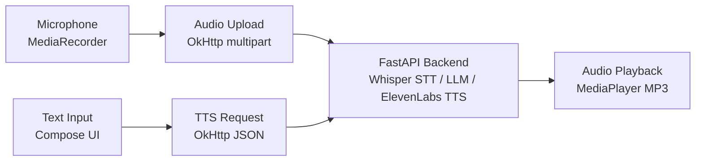

<objective>
Initialize the android wiki, rewrite the android README with AI voice interaction framing, and push 4 wiki pages to complete Level A documentation for TECH-02.

Purpose: Position the android repo as AI engineering work (AI-powered voice interaction client, not generic demo) for hiring manager audiences. Complete Level A standard: README + wiki + CI badge + cross-links. Handle android-specific constraints: default branch is `master` (not `main`), wiki must be initialized before push.

Output: 1 rewritten README.md (remote, branch: master), 4 wiki pages pushed to android.wiki.git
</objective>

<execution_context>
@.claude/get-shit-done/workflows/execute-plan.md
@.claude/get-shit-done/templates/summary.md
</execution_context>

<context>
@.planning/PROJECT.md
@.planning/ROADMAP.md
@.planning/STATE.md
@.planning/phases/09-ogeonx-ai-core-tech-ai-reframe/09-CONTEXT.md
@.planning/phases/09-ogeonx-ai-core-tech-ai-reframe/09-RESEARCH.md
@.planning/phases/09-ogeonx-ai-core-tech-ai-reframe/09-PATTERNS.md

<interfaces>
<!-- Key patterns the executor needs. Extracted from RESEARCH.md and PATTERNS.md. -->
<!-- Executor should use these directly — no codebase exploration needed. -->

android is a Kotlin/Jetpack Compose AI voice interaction client (com.example.aitalkdemo).
Default branch: master (NOT main — ALL file writes and badge URLs must use master)
CI workflow: .github/workflows/ci.yml (Gradle + JVM unit tests + backend Python check, ubuntu-latest)
CI badge URL: https://github.com/OgeonX-Ai/android/actions/workflows/ci.yml/badge.svg?branch=master
has_wiki: false — wiki MUST be initialized before push
Wiki remote: https://github.com/OgeonX-Ai/android.wiki.git (does not exist until initialized)

README update pattern: fetch SHA first via get_file_contents, then create_or_update_file with sha parameter and branch: "master".
Wiki delivery: git clone wiki.git to /tmp/android-wiki, write pages, Windows path sync, commit, push to master.
</interfaces>
</context>

<tasks>

<task type="checkpoint:human-action" gate="blocking">
  <name>Task 0: Initialize android wiki via GitHub web UI</name>
  <what-built>The android repo at OgeonX-Ai/android has `has_wiki: false`. The wiki git remote does not exist until the first page is created via the GitHub web UI. This must be done before Task 2 can push wiki pages.</what-built>
  <how-to-verify>
    1. Open https://github.com/OgeonX-Ai/android/wiki in your browser
    2. Click "Create the first page" (green button)
    3. Leave title as "Home" (default)
    4. Type: "android wiki — content coming soon"
    5. Click "Save Page"
    6. Verify initialization by running:
       ```
       git ls-remote https://github.com/OgeonX-Ai/android.wiki.git HEAD
       ```
    7. Expected output: a 40-character SHA followed by a tab and "HEAD"
    8. If the command returns empty output, the wiki is not initialized — repeat steps 1-5

    ALTERNATIVE: If the wiki is ALREADY initialized (the ls-remote returns a SHA), skip steps 1-5 and type "approved".
  </how-to-verify>
  <resume-signal>Type "approved" after verifying `git ls-remote` returns a SHA for android.wiki.git HEAD</resume-signal>
</task>

<task type="auto">
  <name>Task 1: Rewrite android README with AI voice interaction framing</name>
  <files>OgeonX-Ai/android/README.md (remote)</files>
  <read_first>
    - 09-RESEARCH.md (lines 154-177 for codebase findings, hero line, Mermaid diagram)
    - 09-PATTERNS.md (lines 243-313 for README section order, badge URLs, cross-links, Mermaid diagram)
    - 09-CONTEXT.md (D-01, D-04, D-06, D-07, D-08, D-09, D-11, D-12, D-CF-01 through D-CF-05)
    - The existing remote README.md via mcp__github__get_file_contents (to capture SHA and preserve factual claims)
  </read_first>
  <action>
Rewrite the android README.md on the remote repo. Per D-01 codebase scan required (already done in RESEARCH.md). Per D-04 frame as AI-powered Android app, AI capabilities lead. Per D-CF-05 no source code modifications.

CRITICAL: android default branch is `master` — ALL file writes MUST use branch: "master".

Step 1: Fetch current README.md SHA (MANDATORY — omitting causes 409 Conflict):
  mcp__github__get_file_contents owner:"OgeonX-Ai" repo:"android" path:"README.md"
  Capture the `sha` field from the response.

Step 2: Compose the full new README.md content with this EXACT structure:

```markdown
# android

> AI-powered voice interaction client for Android — Jetpack Compose front-end that captures microphone input, sends it to an AI pipeline (Whisper STT, LLM reasoning, ElevenLabs TTS), and plays back synthesised speech responses.

[](https://github.com/OgeonX-Ai/android/actions/workflows/ci.yml)
[](https://kotlinlang.org)
[](LICENSE)

[](https://github.com/Coding-Autopilot-System)

Part of the [Coding-Autopilot-System](https://github.com/Coding-Autopilot-System) ecosystem: [gsd-orchestrator](https://github.com/Coding-Autopilot-System/gsd-orchestrator) | [Promptimprover](https://github.com/Coding-Autopilot-System/Promptimprover) | [autogen](https://github.com/Coding-Autopilot-System/autogen)

**See also:** [OgeonX-Ai/enterprise-ai-gateway](https://github.com/OgeonX-Ai/enterprise-ai-gateway) — vendor-agnostic AI service bus

## Architecture



The app provides two interaction paths. Voice input: the user records audio via `MediaRecorder`, which is uploaded as a multipart M4A file to the FastAPI backend. The backend transcribes speech (Whisper STT), generates a response (LLM), synthesises audio (ElevenLabs TTS), and returns an MP3 stream. Text input: the user types a message and selects a voice persona; the app sends a JSON request to the backend, which returns synthesised speech. Both paths end with `MediaPlayer` playback of the MP3 response.

## Features

- **Voice capture** — `MediaRecorder` M4A audio with runtime permission handling
- **AI voice pipeline** — microphone input to Whisper STT to LLM reasoning to ElevenLabs TTS
- **Text-to-speech** — text input with selectable voice personas (Kim, Milla, John, Lily)
- **Jetpack Compose UI** — Material 3 interface with gradient background, voice dropdown, and action buttons
- **FastAPI backend** — included Python backend with Whisper, Hugging Face LLM, and ElevenLabs integrations
- **JVM unit tests** — `MainActivityTest` validating backend URL configuration and voice list integrity

## Quick Start

```bash
git clone https://github.com/OgeonX-Ai/android.git
```

1. Open the project in Android Studio
2. Set `backendUrl` in `MainActivity.kt` to your FastAPI backend endpoint
3. Start the backend: `cd backend && pip install -r requirements.txt && uvicorn main:app --port 8000`
4. Run on a device or emulator (min SDK 26 / Android 8.0)

---

Part of the [Coding-Autopilot-System](https://github.com/Coding-Autopilot-System) ecosystem: [gsd-orchestrator](https://github.com/Coding-Autopilot-System/gsd-orchestrator) | [Promptimprover](https://github.com/Coding-Autopilot-System/Promptimprover) | [autogen](https://github.com/Coding-Autopilot-System/autogen)
```

IMPORTANT per D-CF-01: No emoji anywhere in the README.
IMPORTANT per D-06: Mermaid uses `flowchart LR`.
IMPORTANT: Badge URL uses `?branch=master` (NOT `?branch=main`). Using `?branch=main` produces a grey "no status" badge.
NOTE: The Mermaid diagram uses `/` as separator in multi-provider labels to avoid rendering issues.

Step 3: Push the rewritten README:
  mcp__github__create_or_update_file
    owner: "OgeonX-Ai"
    repo: "android"
    path: "README.md"
    content: [full content from Step 2]
    message: "docs: Level A README — AI voice interaction framing, CI badge, architecture diagram, CAS ecosystem links"
    branch: "master"
    sha: [captured SHA from Step 1]
  </action>
  <verify>
    <automated>gh api repos/OgeonX-Ai/android/contents/README.md --jq '.content' | base64 -d | grep -c "flowchart LR" && gh api repos/OgeonX-Ai/android/contents/README.md --jq '.content' | base64 -d | grep -c "Coding--Autopilot--System" && gh api repos/OgeonX-Ai/android/contents/README.md --jq '.content' | base64 -d | grep -c "enterprise-ai-gateway"</automated>
  </verify>
  <acceptance_criteria>
    - README.md contains hero line starting with "AI-powered voice interaction client for Android"
    - README.md contains `[]`
    - README.md does NOT contain `?branch=main` (android uses master)
    - README.md contains `flowchart LR` Mermaid block
    - README.md contains `[]`
    - README.md contains `**See also:** [OgeonX-Ai/enterprise-ai-gateway](https://github.com/OgeonX-Ai/enterprise-ai-gateway)`
    - README.md contains `## Architecture`, `## Features`, `## Quick Start` sections
    - No emoji present in README.md
    - gh api returns 200 for README.md content endpoint
  </acceptance_criteria>
  <done>android README.md rewritten on remote (branch: master) with AI-powered voice interaction hero line, CI badge (?branch=master per D-09), Mermaid architecture diagram (per D-06), CAS ecosystem links (per D-11), enterprise-ai-gateway cross-link (per D-12), and Quick Start section. Per D-04 AI capabilities lead.</done>
</task>

<task type="auto">
  <name>Task 2: Push 4 wiki pages to android.wiki.git</name>
  <files>
    android.wiki.git/Home.md (remote)
    android.wiki.git/Setup-Guide.md (remote)
    android.wiki.git/Architecture.md (remote)
    android.wiki.git/Configuration-Reference.md (remote)
  </files>
  <read_first>
    - 09-RESEARCH.md (lines 416-424 for Configuration Reference table, lines 154-163 for architecture components)
    - 09-PATTERNS.md (lines 316-434 for wiki page structures, lines 479-505 for wiki delivery pattern)
    - 09-CONTEXT.md (D-05, D-CF-03)
  </read_first>
  <action>
Push 4 wiki pages to android.wiki.git. Per D-05 standard wiki page names. Per D-CF-03 Home follows hero + badges + quick-start + nav table pattern.

PREREQUISITE: Task 0 must be complete (wiki initialized). Verify before proceeding:
```bash
git ls-remote https://github.com/OgeonX-Ai/android.wiki.git HEAD
```
Must return a SHA. If empty, do NOT proceed — wiki is not initialized.

Step 1: Clone wiki repo:
```bash
rm -rf /tmp/android-wiki
git clone https://x-access-token:$(gh auth token)@github.com/OgeonX-Ai/android.wiki.git /tmp/android-wiki
```

Step 2: Write all 4 wiki pages using the Write tool. Each page goes to `C:/tmp/android-wiki/<filename>`.

**Home.md** — EXACT content:
```markdown
# android

[](https://github.com/OgeonX-Ai/android/actions/workflows/ci.yml)
[](https://kotlinlang.org)
[](LICENSE)

AI-powered voice interaction client for Android. Captures microphone input, sends it to an AI pipeline (Whisper STT, LLM reasoning, ElevenLabs TTS), and plays back synthesised speech responses. Built with Jetpack Compose and Material 3.

## Quick Start

```bash
git clone https://github.com/OgeonX-Ai/android.git
# Open in Android Studio, set backendUrl, run on device (min SDK 26)
```

## Documentation

| Page | Description |
|------|-------------|
| [Setup Guide](Setup-Guide) | Prerequisites, installation, and first voice interaction |
| [Architecture](Architecture) | AI voice pipeline and component design |
| [Configuration Reference](Configuration-Reference) | Backend URL, voice personas, and API keys |
```

**Setup-Guide.md** — EXACT content:
```markdown
# Setup Guide

## Prerequisites

- Android Studio (latest stable)
- JDK 17 (temurin recommended)
- Android SDK 34 (compile/target SDK)
- A physical Android device or emulator running Android 8.0+ (min SDK 26)
- Python 3.x (for the FastAPI backend)

## Installation

### Android App

```bash
git clone https://github.com/OgeonX-Ai/android.git
```

Open the project in Android Studio. Gradle sync will download all dependencies (Kotlin 2.0.21, Jetpack Compose, OkHttp 4.12.0, Material 3).

### Backend

```bash
cd android/backend
pip install -r requirements.txt
```

## Configuration

### App Configuration

Edit `MainActivity.kt` to set your backend endpoint:

| Constant | Default | Description |
|----------|---------|-------------|
| `backendUrl` | `http://10.0.2.2:8000/talk` | FastAPI backend URL (emulator default maps to host localhost) |
| `voices` | `["Kim", "Milla", "John", "Lily"]` | Available TTS voice persona names |

### Backend Configuration

Create a `.env` file in the `backend/` directory:

| Variable | Required | Description |
|----------|----------|-------------|
| `HF_API_TOKEN` | if using HF LLM | Hugging Face Inference API token |
| `ELEVENLABS_API_KEY` | if using ElevenLabs TTS | ElevenLabs API key |
| `VOICE_ID` | no | Override ElevenLabs voice ID |

## Running the App

1. Start the backend:
   ```bash
   cd backend
   uvicorn main:app --host 0.0.0.0 --port 8000
   ```
2. In Android Studio, select your device or emulator
3. Click Run (or `Shift+F10`)

## What a Successful Setup Looks Like

1. The app launches without crash, displaying the home screen with a text input, voice dropdown, and Speak/Record buttons
2. Pressing "Speak" with text input sends a request to the backend and plays back an MP3 audio response
3. Pressing "Record" opens the microphone, captures audio, sends it to the backend, and plays back the AI-generated speech response
4. The backend logs show Whisper transcription, LLM inference, and ElevenLabs TTS synthesis steps completing successfully
```

**Architecture.md** — EXACT content:
```markdown
# Architecture

The android app is an AI voice interaction client that connects to a FastAPI backend for speech-to-text, language model inference, and text-to-speech processing.

## Pipeline Diagram


## Components

### HomeScreen (Jetpack Compose)

`HomeScreen.kt` provides the primary UI: a text input field, a voice/persona dropdown selector, and two action buttons (Speak and Record). Built with Material 3 and a gradient background. The voice dropdown selects from predefined personas (Kim, Milla, John, Lily).

### MainActivity

`MainActivity.kt` handles audio recording via `MediaRecorder` (M4A format) and runtime permission management for microphone access. It coordinates between the UI layer and the network requests.

### Audio Upload (Voice Path)

When the user records audio, the app captures M4A data via `MediaRecorder` and uploads it as a multipart POST request to the backend `/talk` endpoint using OkHttp 4.12.0. The backend returns an MP3 audio stream.

### TTS Request (Text Path)

When the user types text and presses Speak, the app sends a JSON POST request containing the text and selected voice persona to the backend. The backend synthesises speech and returns an MP3 audio stream.

### FastAPI Backend

Located in the `backend/` directory. The backend implements the AI pipeline:

1. **Whisper STT** — transcribes incoming audio to text
2. **Hugging Face LLM** — generates a response from the transcribed or typed input
3. **ElevenLabs TTS** — synthesises the response text into speech audio (MP3)

### Audio Playback

`MediaPlayer` handles MP3 byte stream playback from the backend response. Audio bytes are written to a temporary file and played through the device speaker.

### JVM Unit Tests

`MainActivityTest.kt` contains 2 JVM unit tests validating that the backend URL is configured and the voice list is non-empty. `ExampleUnitTest.kt` provides a basic assertion test. These run via `gradlew test` without requiring an emulator.
```

**Configuration-Reference.md** — EXACT content:
```markdown
# Configuration Reference

## Android App Configuration

These values are set as code constants in `MainActivity.kt`:

| Name | Type | Required | Default | Description |
|------|------|----------|---------|-------------|
| `backendUrl` | string | yes | `http://10.0.2.2:8000/talk` | FastAPI backend endpoint (emulator default maps to host localhost) |
| `voices` | list | yes | `["Kim", "Milla", "John", "Lily"]` | Available TTS voice/persona names displayed in the dropdown |

## Backend Environment Variables

Set these in `backend/.env`:

| Name | Type | Required | Default | Description |
|------|------|----------|---------|-------------|
| `HF_API_TOKEN` | string | if using HF LLM | — | Hugging Face Inference API token |
| `ELEVENLABS_API_KEY` | string | if using ElevenLabs TTS | — | ElevenLabs API key |
| `VOICE_ID` | string | no | — | Override default ElevenLabs voice ID |

## Build Configuration

Key values from `app/build.gradle.kts` and `gradle/libs.versions.toml`:

| Property | Value | Description |
|----------|-------|-------------|
| Kotlin version | 2.0.21 | Kotlin compiler version |
| Compose BOM | latest | Jetpack Compose Bill of Materials |
| Compile SDK | 34 | Android API level for compilation |
| Target SDK | 34 | Target Android API level |
| Min SDK | 26 | Minimum supported Android version (8.0) |
| JVM target | 17 | Java bytecode target |
| AGP | 8.13.1 | Android Gradle Plugin version |
| OkHttp | 4.12.0 | HTTP client for backend communication |
```

Step 3: Windows path sync (CRITICAL — Write tool creates files at C:/tmp/android-wiki/ but git clone is at /tmp/android-wiki/):
```bash
cp C:/tmp/android-wiki/Home.md /tmp/android-wiki/Home.md
cp C:/tmp/android-wiki/Setup-Guide.md /tmp/android-wiki/Setup-Guide.md
cp C:/tmp/android-wiki/Architecture.md /tmp/android-wiki/Architecture.md
cp C:/tmp/android-wiki/Configuration-Reference.md /tmp/android-wiki/Configuration-Reference.md
```

Step 4: Commit and push:
```bash
git -C /tmp/android-wiki add Home.md Setup-Guide.md Architecture.md Configuration-Reference.md
git -C /tmp/android-wiki -c user.email="bot@gsd" -c user.name="GSD Bot" commit -m "docs: add android wiki pages — Home, Setup Guide, Architecture, Configuration Reference"
git -C /tmp/android-wiki push origin master
```

CRITICAL: wiki.git always uses `master` branch.

If non-fast-forward error on push:
```bash
git -C /tmp/android-wiki pull origin master --rebase
git -C /tmp/android-wiki push origin master
```
  </action>
  <verify>
    <automated>git ls-remote https://github.com/OgeonX-Ai/android.wiki.git HEAD && echo "Wiki HEAD exists"</automated>
  </verify>
  <acceptance_criteria>
    - `git ls-remote https://github.com/OgeonX-Ai/android.wiki.git HEAD` returns a 40-character SHA (distinct from the initialization commit)
    - Home.md contains `## Documentation` with navigation table linking to `Setup-Guide`, `Architecture`, `Configuration-Reference`
    - Home.md badge URL contains `?branch=master` (not `?branch=main`)
    - Setup-Guide.md contains `## What a Successful Setup Looks Like`
    - Architecture.md contains `flowchart LR` Mermaid block identical to README diagram
    - Configuration-Reference.md contains `| `backendUrl` | string | yes | `http://10.0.2.2:8000/talk` |`
    - All 4 .md files present in the wiki.git commit (verify via `git -C /tmp/android-wiki log --oneline -1 --name-only`)
    - No emoji in any wiki page
  </acceptance_criteria>
  <done>4 wiki pages pushed to android.wiki.git: Home (hero + badges + quick-start + nav table per D-CF-03), Setup-Guide (standalone with success criteria), Architecture (same Mermaid as README per D-06), Configuration-Reference (app constants + backend env vars + build config). Per D-05 standard page names.</done>
</task>

</tasks>

<threat_model>
## Trust Boundaries

| Boundary | Description |
|----------|-------------|
| Local executor to GitHub API | All writes go to remote OgeonX-Ai/android via GitHub MCP and git push |
| Wiki git push | Authenticated via `gh auth token` — pushes to android.wiki.git master |
| Human checkpoint | Wiki initialization requires manual browser action (Task 0) |

## STRIDE Threat Register

| Threat ID | Category | Component | Disposition | Mitigation Plan |
|-----------|----------|-----------|-------------|-----------------|
| T-09-05 | Tampering | README.md remote write | accept | Docs-only change; SHA-verified update prevents overwrite of concurrent changes (409 Conflict on stale SHA) |
| T-09-06 | Information Disclosure | Wiki content | accept | All content is public documentation for a public repo; no secrets or PII in wiki pages |
| T-09-07 | Spoofing | git push authentication | mitigate | Wiki push uses `gh auth token` (OAuth-scoped); no hardcoded tokens in plan or commit messages |
| T-09-08 | Tampering | Wiki push to master | accept | Wiki.git is a documentation-only repo; force-push risk is low and content is reproducible from this plan |
| T-09-09 | Denial of Service | Wiki initialization checkpoint | accept | Single manual action; if wiki already initialized, checkpoint is skipped |
</threat_model>

<verification>
After all tasks complete:

1. README verification:
```bash
gh api repos/OgeonX-Ai/android/contents/README.md --jq '.content' | base64 -d | head -20
```
Expected: hero line "AI-powered voice interaction client for Android", CI badge with `?branch=master`, CAS ecosystem badge.

2. README branch verification (CRITICAL):
```bash
gh api repos/OgeonX-Ai/android/contents/README.md --jq '.content' | base64 -d | grep -c "branch=main"
```
Expected: 0 (android uses master, not main).

3. Wiki verification:
```bash
git ls-remote https://github.com/OgeonX-Ai/android.wiki.git
```
Expected: HEAD ref with recent commit SHA.

4. CI badge resolution:
```bash
gh run list --repo OgeonX-Ai/android --workflow ci.yml --limit 1 --json conclusion --jq '.[0].conclusion'
```
Expected: `success` (most recent successful run)
</verification>

<success_criteria>
- android README.md on GitHub shows AI voice interaction framing with hero line, 3 badges (CI with ?branch=master, Kotlin 2.0, MIT), CAS ecosystem badge + line, enterprise-ai-gateway cross-link, flowchart LR Mermaid diagram, Features list, and Quick Start
- Wiki accessible at https://github.com/OgeonX-Ai/android/wiki with 4 pages
- CI badge resolves correctly (existing CI on master, no new workflow created per D-CF-05)
- No occurrence of `?branch=main` anywhere in android README or wiki (android uses master)
- TECH-02 requirement fully satisfied
</success_criteria>

<output>
After completion, create `.planning/phases/09-ogeonx-ai-core-tech-ai-reframe/09-02-SUMMARY.md`
</output>
