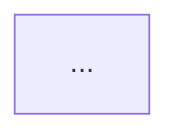
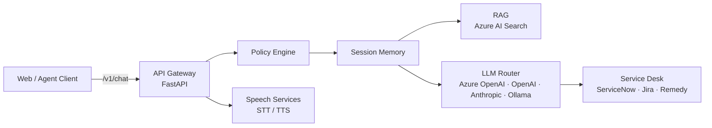
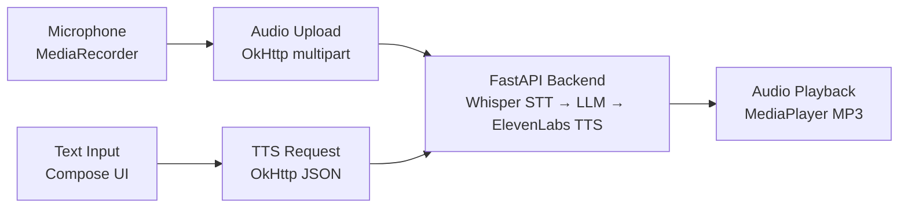

# Phase 9: OgeonX-Ai Core Tech AI Reframe + Level A — Pattern Map

**Mapped:** 2026-05-27
**Files analyzed:** 10 deliverables (2 README rewrites + 8 wiki pages; CI workflows already exist)
**Analogs found:** 10 / 10

---

## File Classification

| New/Modified File | Role | Data Flow | Closest Analog | Match Quality |
|-------------------|------|-----------|----------------|---------------|
| `OgeonX-Ai/enterprise-ai-gateway/README.md` | documentation (README rewrite) | transform (rewrite existing) | `08-03-PLAN.md` Task 1 — cloud-security-service-model README rewrite (existing README, CI badge insertion, hero line, cross-links) | exact |
| `enterprise-ai-gateway.wiki.git/Home.md` | documentation (wiki) | file-I/O (git clone + push) | `05-03-PLAN.md` — autogen Home.md wiki delivery | exact |
| `enterprise-ai-gateway.wiki.git/Setup-Guide.md` | documentation (wiki) | file-I/O | `05-03-PLAN.md` — autogen Setup-Guide.md | exact |
| `enterprise-ai-gateway.wiki.git/Architecture.md` | documentation (wiki) | file-I/O | `05-03-PLAN.md` — autogen Architecture.md | exact |
| `enterprise-ai-gateway.wiki.git/Configuration-Reference.md` | documentation (wiki) | file-I/O | `05-03-PLAN.md` — autogen Configuration-Reference.md | exact |
| `OgeonX-Ai/android/README.md` | documentation (README rewrite/create) | transform | `08-01-PLAN.md` Task 3 — autopilot-core README rewrite (hero line, Mermaid, badges, cross-links) | exact |
| `android.wiki.git/Home.md` | documentation (wiki) | file-I/O | `05-03-PLAN.md` — autogen Home.md | exact |
| `android.wiki.git/Setup-Guide.md` | documentation (wiki) | file-I/O | `05-03-PLAN.md` — autogen Setup-Guide.md | exact |
| `android.wiki.git/Architecture.md` | documentation (wiki) | file-I/O | `05-03-PLAN.md` — autogen Architecture.md | exact |
| `android.wiki.git/Configuration-Reference.md` | documentation (wiki) | file-I/O | `05-03-PLAN.md` — autogen Configuration-Reference.md | exact |
| Wave 0: android wiki initialization checkpoint | checkpoint (human gate) | event-driven | `05-00-PLAN.md` — autogen wiki initialization | exact |
| Wave 0: enterprise-ai-gateway wiki check | checkpoint (verification) | event-driven | `05-00-PLAN.md` — autogen ls-remote check | exact |

**Note:** CI workflows are NOT new files. Both `OgeonX-Ai/enterprise-ai-gateway` and `OgeonX-Ai/android` already have working `.github/workflows/ci.yml`. Badge URLs only are inserted into README files.

---

## Pattern Assignments

### `OgeonX-Ai/enterprise-ai-gateway/README.md` (documentation, transform)

**Analog:** `.planning/phases/08-cas-secondary-repos-level-a/08-03-PLAN.md` Task 1 — cloud-security-service-model README (existing README enhanced with hero line, CI badge, cross-links)

**Fetch-SHA-then-update pattern** (08-03-PLAN.md lines 58-73, mandatory for existing files):
```
Step 1: mcp__github__get_file_contents owner:"OgeonX-Ai" repo:"enterprise-ai-gateway" path:"README.md"
        → capture the `sha` field (MANDATORY — omitting causes 409 Conflict)
Step 2: Compose full new README content (structural rewrite — preserve factual claims from existing README)
Step 3: mcp__github__create_or_update_file with sha: [captured], branch: "main"
```

**README section order** (from 09-CONTEXT.md code_context + 09-RESEARCH.md Architecture Patterns lines 241-263):
```markdown
# enterprise-ai-gateway

[Hero line — one sentence, enterprise tone, codebase-derived]

[](actions-url)  [](python.org)  [](LICENSE)

[](https://github.com/Coding-Autopilot-System)

Part of the Coding-Autopilot-System ecosystem: [gsd-orchestrator](url) | [Promptimprover](url) | [autogen](url)

**See also:** [OgeonX-Ai/android](https://github.com/OgeonX-Ai/android) — AI voice interaction client for Android

## Architecture



[prose description]

## Quick Start

...
```

**CI badge URL pattern** (09-RESEARCH.md lines 335-338, VERIFIED):
```markdown
[](https://github.com/OgeonX-Ai/enterprise-ai-gateway/actions/workflows/ci.yml)
```
Branch param: `?branch=main` — default branch is `main` [VERIFIED in RESEARCH.md].

**Language badge** (09-RESEARCH.md lines 345-348):
```markdown
[](https://python.org)
[](LICENSE)
```

**CAS ecosystem badge + line** (09-RESEARCH.md lines 355-360, from Phase 4/5 D-11 pattern):
```markdown
[](https://github.com/Coding-Autopilot-System)

Part of the Coding-Autopilot-System ecosystem: [gsd-orchestrator](https://github.com/Coding-Autopilot-System/gsd-orchestrator) | [Promptimprover](https://github.com/Coding-Autopilot-System/Promptimprover) | [autogen](https://github.com/Coding-Autopilot-System/autogen)
```

**Intra-OgeonX-Ai cross-link** (09-RESEARCH.md lines 365-368, D-12):
```markdown
**See also:** [OgeonX-Ai/android](https://github.com/OgeonX-Ai/android) — AI voice interaction client for Android
```

**Mermaid diagram** (09-RESEARCH.md lines 136-148, codebase-derived):


**Commit message pattern** (from 08-03-PLAN.md line 75, adapted):
```
docs: Level A README — hero line, CI badge, architecture diagram, CAS ecosystem link, android cross-link
```

**Mermaid anti-patterns** (04-PATTERNS.md lines 139-141):
- Do NOT use `-->` directly into a subgraph declaration
- Do NOT use `graph LR` (legacy) — use `flowchart LR`

---

### `enterprise-ai-gateway.wiki.git/Home.md` (documentation/wiki, file-I/O)

**Analog:** `.planning/phases/05-autogen-polish/05-PATTERNS.md` autogen Home.md pattern (lines 164-197)

**Wiki clone delivery pattern** (05-PATTERNS.md Shared Patterns — Wiki Clone + Push, lines 321-343):
```bash
rm -rf /tmp/gsd-wiki
git clone https://x-access-token:$(gh auth token)@github.com/OgeonX-Ai/enterprise-ai-gateway.wiki.git /tmp/gsd-wiki
# Write .md files to /tmp/gsd-wiki/ (and C:/tmp/gsd-wiki/ for Write tool)
# Windows path sync: cp C:/tmp/gsd-wiki/Home.md /tmp/gsd-wiki/Home.md  (etc.)
git -C /tmp/gsd-wiki add Home.md Setup-Guide.md Architecture.md Configuration-Reference.md
git -C /tmp/gsd-wiki -c user.email="bot@gsd" -c user.name="GSD Bot" commit -m "docs: add enterprise-ai-gateway wiki pages"
git -C /tmp/gsd-wiki push origin master
# CRITICAL: wiki.git always uses `master` branch — even when source repo uses `main`
```

**Home.md structure** (05-PATTERNS.md lines 172-197, adapted for enterprise-ai-gateway):
```markdown
# enterprise-ai-gateway

[](https://github.com/OgeonX-Ai/enterprise-ai-gateway/actions/workflows/ci.yml)
[](https://python.org)
[](LICENSE)

[hero paragraph — same as README]

## Quick Start

```bash
git clone https://github.com/OgeonX-Ai/enterprise-ai-gateway.git
cd enterprise-ai-gateway
pip install -r backend/requirements.txt
uvicorn backend.app.main:app --reload
```

## Documentation

| Page | Description |
|------|-------------|
| [Setup Guide](Setup-Guide) | Prerequisites, installation, and first request |
| [Architecture](Architecture) | Pipeline components and provider routing |
| [Configuration Reference](Configuration-Reference) | Environment variables and connector configuration |
```

**Wiki navigation link convention** (05-PATTERNS.md line 200): use bare page names WITHOUT `.md` extension.

**Home.md constraint** (04-PATTERNS.md line 198): Home.md must NOT contain `git clone` — move full clone sequence to Setup Guide. (Exception: a short 3-line snippet is allowed; full step-by-step clone belongs in Setup-Guide.)

---

### `enterprise-ai-gateway.wiki.git/Setup-Guide.md` (documentation/wiki, file-I/O)

**Analog:** `.planning/phases/05-autogen-polish/05-PATTERNS.md` autogen Setup-Guide.md (lines 204-232)

**Structure** (05-PATTERNS.md lines 210-217):
```
## Prerequisites
## Installation
## Configuration
## Running the Service
## What a Successful Setup Looks Like
```

**"What a Successful Setup Looks Like" section is REQUIRED** (05-PATTERNS.md line 219). Include expected output: server starts on port 8000, `/v1/health` returns 200, `/v1/services` returns available providers.

**Standalone principle** (04-PATTERNS.md line 229): Setup Guide must be fully self-contained — no "see README" references.

**Python setup commands pattern** (05-PATTERNS.md lines 222-226, adapted):
```bash
git clone https://github.com/OgeonX-Ai/enterprise-ai-gateway.git
cd enterprise-ai-gateway/backend
pip install -r requirements.txt
cp .env.example .env  # edit as needed
uvicorn app.main:app --host 0.0.0.0 --port 8000 --reload
```

---

### `enterprise-ai-gateway.wiki.git/Architecture.md` (documentation/wiki, file-I/O)

**Analog:** `.planning/phases/05-autogen-polish/05-PATTERNS.md` autogen Architecture.md (lines 235-261)

**Structure** (05-PATTERNS.md lines 241-249):
```
# Architecture
[intro sentence]
## Pipeline Diagram
[Mermaid flowchart LR — IDENTICAL to README diagram — do not create a different diagram]
## Components
[per-component prose — one sub-section per major component]
```

**Diagram reuse rule** (04-PATTERNS.md line 279): Architecture wiki page MUST use the IDENTICAL `flowchart LR` diagram from the README.

**Components to document** (from 09-RESEARCH.md lines 117-129):
- `AgentRuntime` — policy engine, session memory, RAG augmentation, LLM routing
- `Policy Engine` — `app/runtime/policy.py` — sanitizes user messages before LLM submission
- `Session Memory` — `app/runtime/memory_store.py` — persistent per-session chat history
- `RAG Connector` — `app/connectors/rag/` — Azure AI Search retrieval augmentation
- `LLM Router` — `app/connectors/llm/` — Azure OpenAI, OpenAI, Anthropic, Ollama, mock
- `Service Desk` — `app/connectors/servicedesk/` — ServiceNow, Jira SM, Remedy intent+ticket
- `Speech Services` — `app/connectors/speech/` — STT (Azure Speech, Whisper) + TTS
- `Service Registry` — `app/registry/service_registry.py` — live capability discovery
- `Correlation IDs` — `X-Correlation-ID` header propagated through all layers

---

### `enterprise-ai-gateway.wiki.git/Configuration-Reference.md` (documentation/wiki, file-I/O)

**Analog:** `.planning/phases/05-autogen-polish/05-PATTERNS.md` autogen Configuration-Reference.md (lines 264-281)

**Table format** (05-PATTERNS.md lines 271-275, identical column structure):
```markdown
## Environment Variables

| Name | Type | Required | Default | Description |
|------|------|----------|---------|-------------|
| `APP_NAME` | string | no | `enterprise-ai-gateway` | Application name |
```

**Full env var data** (09-RESEARCH.md lines 387-412): Use the complete verified table — 22 rows covering APP_NAME, DEV_MODE, STT_PROVIDER, STT_DEFAULT_MODEL, STT_DEFAULT_LANGUAGE, ENABLE_DEBUG_STREAM, USE_AZURE_OPENAI, USE_AZURE_SPEECH, USE_AZURE_SEARCH, USE_SERVICENOW, USE_JIRASM, USE_REMEDY, AZURE_OPENAI_ENDPOINT, AZURE_OPENAI_API_KEY, AZURE_SPEECH_KEY, AZURE_SPEECH_REGION, SERVICENOW_INSTANCE_URL, SERVICENOW_MOCK_MODE, CORS_ALLOW_ORIGINS (and others from settings.py). Source: [VERIFIED: backend/app/settings.py].

---

### `OgeonX-Ai/android/README.md` (documentation, transform)

**Analog:** `.planning/phases/08-cas-secondary-repos-level-a/08-01-PLAN.md` Task 3 — autopilot-core README (hero line, Mermaid, badges, cross-links to org, sibling link)

**Fetch-SHA-then-update pattern** (same as enterprise-ai-gateway — existing file):
```
Step 1: mcp__github__get_file_contents owner:"OgeonX-Ai" repo:"android" path:"README.md"
        → capture `sha` (MANDATORY)
Step 2: Compose full new README content
Step 3: mcp__github__create_or_update_file with sha: [captured], branch: "master"
        CRITICAL: android default branch is `master` (not `main`)
```

**README section order** (09-RESEARCH.md lines 241-263, same structure as enterprise-ai-gateway):
```markdown
# android

[Hero line — AI-powered framing leads, then explains the app]

[](actions-url)  [](kotlin)  [](LICENSE)

[](https://github.com/Coding-Autopilot-System)

Part of the Coding-Autopilot-System ecosystem: [gsd-orchestrator](url) | [Promptimprover](url) | [autogen](url)

**See also:** [OgeonX-Ai/enterprise-ai-gateway](https://github.com/OgeonX-Ai/enterprise-ai-gateway) — vendor-agnostic AI service bus

## Architecture


## Quick Start

...
```

**CI badge URL — CRITICAL: branch=master not main** (09-RESEARCH.md lines 338-340, VERIFIED):
```markdown
[](https://github.com/OgeonX-Ai/android/actions/workflows/ci.yml)
```
`?branch=master` — android default branch is `master`. Using `?branch=main` produces a grey "no status" badge.

**Language badge** (09-RESEARCH.md lines 351-352):
```markdown
[](https://kotlinlang.org)
[](LICENSE)
```

**Intra-OgeonX-Ai cross-link** (09-RESEARCH.md lines 368-370, D-12):
```markdown
**See also:** [OgeonX-Ai/enterprise-ai-gateway](https://github.com/OgeonX-Ai/enterprise-ai-gateway) — vendor-agnostic AI service bus
```

**Mermaid diagram** (09-RESEARCH.md lines 170-177, codebase-derived):


**Commit message pattern**:
```
docs: Level A README — hero line, CI badge, architecture diagram, CAS ecosystem link, enterprise-ai-gateway cross-link
```

---

### `android.wiki.git/Home.md` (documentation/wiki, file-I/O)

**Analog:** `.planning/phases/05-autogen-polish/05-PATTERNS.md` autogen Home.md (lines 164-201)

**Wiki clone delivery pattern** (05-PATTERNS.md Shared Patterns, adapted for android — branch is master):
```bash
rm -rf /tmp/gsd-wiki
git clone https://x-access-token:$(gh auth token)@github.com/OgeonX-Ai/android.wiki.git /tmp/gsd-wiki
# Windows path sync after Write tool calls (CRITICAL):
# cp C:/tmp/gsd-wiki/Home.md /tmp/gsd-wiki/Home.md  (etc. for all 4 pages)
git -C /tmp/gsd-wiki add Home.md Setup-Guide.md Architecture.md Configuration-Reference.md
git -C /tmp/gsd-wiki -c user.email="bot@gsd" -c user.name="GSD Bot" commit -m "docs: add android wiki pages"
git -C /tmp/gsd-wiki push origin master
```

**Home.md structure** (same pattern as enterprise-ai-gateway, adapted for Kotlin/Android):
```markdown
# android

[](...)
[](https://kotlinlang.org)
[](LICENSE)

[hero paragraph — same as README; AI-powered framing leads]

## Quick Start

```bash
git clone https://github.com/OgeonX-Ai/android.git
# Open in Android Studio
# Set backendUrl in MainActivity.kt to your FastAPI endpoint
# Run on device or emulator (min SDK 26)
```

## Documentation

| Page | Description |
|------|-------------|
| [Setup Guide](Setup-Guide) | Prerequisites, installation, and first voice interaction |
| [Architecture](Architecture) | AI voice pipeline and component design |
| [Configuration Reference](Configuration-Reference) | Backend URL, voice personas, API keys |
```

---

### `android.wiki.git/Setup-Guide.md` (documentation/wiki, file-I/O)

**Analog:** `.planning/phases/05-autogen-polish/05-PATTERNS.md` autogen Setup-Guide.md (lines 204-232)

**Structure** (same 5-section pattern, adapted for Android/Kotlin):
```
## Prerequisites
## Installation
## Configuration
## Running the App
## What a Successful Setup Looks Like
```

**"What a Successful Setup Looks Like" section REQUIRED.** Include: app launches without crash, Speak button triggers audio playback, Record button captures and sends microphone audio, response plays back as MP3.

**Backend setup commands** (09-RESEARCH.md lines 154-160, derived from backend/ FastAPI service):
```bash
cd android/backend
pip install -r requirements.txt
# Set HF_API_TOKEN and ELEVENLABS_API_KEY in .env
uvicorn main:app --host 0.0.0.0 --port 8000
```

---

### `android.wiki.git/Architecture.md` (documentation/wiki, file-I/O)

**Analog:** `.planning/phases/05-autogen-polish/05-PATTERNS.md` autogen Architecture.md (lines 235-261)

**Structure** (identical to autogen analog):
```
# Architecture
[intro sentence]
## Pipeline Diagram
[Mermaid flowchart LR — IDENTICAL to README diagram]
## Components
[per-component prose]
```

**Components to document** (from 09-RESEARCH.md lines 154-163):
- `HomeScreen.kt` (Compose UI) — text input, voice/persona dropdown, Speak + Record buttons
- `MainActivity.kt` — MediaRecorder for M4A audio capture, permission handling
- `Audio Upload` — OkHttp multipart POST to backend `/talk` endpoint
- `TTS Request` — OkHttp JSON POST to backend (text + voice persona)
- `FastAPI Backend` (`backend/`) — Whisper STT → Hugging Face LLM → ElevenLabs TTS
- `MediaPlayer` — MP3 audio byte playback
- JVM Unit Tests: `MainActivityTest.kt` (2 tests: backendUrl configured, voice list non-empty)

---

### `android.wiki.git/Configuration-Reference.md` (documentation/wiki, file-I/O)

**Analog:** `.planning/phases/05-autogen-polish/05-PATTERNS.md` autogen Configuration-Reference.md (lines 264-281)

**Table format** (identical column structure — Name | Type | Required | Default | Description):
```markdown
## Android App Configuration

| Name | Type | Required | Default | Description |
|------|------|----------|---------|-------------|
| `backendUrl` (code constant) | string | yes | `http://10.0.2.2:8000/talk` | FastAPI backend endpoint |
| `voices` (code constant) | list | yes | `["Kim","Milla","John","Lily"]` | Available TTS voice/persona names |

## Backend Environment Variables (.env)

| Name | Type | Required | Default | Description |
|------|------|----------|---------|-------------|
| `HF_API_TOKEN` | string | if using HF LLM | — | Hugging Face Inference API token |
| `ELEVENLABS_API_KEY` | string | if using ElevenLabs TTS | — | ElevenLabs API key |
| `VOICE_ID` | string | no | — | Override ElevenLabs voice ID |
```

**Full config data** (09-RESEARCH.md lines 419-424): Use the complete verified table. Source: [VERIFIED: MainActivity.kt, README].

---

### Wave 0: android wiki initialization checkpoint

**Analog:** `.planning/phases/05-autogen-polish/05-00-PLAN.md` (autogen wiki init checkpoint — identical platform constraint)

**Human action required** (05-00 pattern, adapted for android):
```
1. Open https://github.com/OgeonX-Ai/android/wiki in browser
2. Click "Create the first page" (green button)
3. Leave title as "Home" (default)
4. Add stub text (e.g., "android wiki — content coming soon")
5. Click "Save Page"
6. Run verification:
   git ls-remote https://github.com/OgeonX-Ai/android.wiki.git HEAD
7. Expected: 40-character SHA followed by tab and "HEAD"
```

**Acceptance criteria** (05-00-PLAN.md pattern):
```bash
git ls-remote https://github.com/OgeonX-Ai/android.wiki.git HEAD
# Must return: [0-9a-f]{40}\tHEAD
# Empty output = wiki not initialized = do NOT proceed to wiki push plan
```

**Why required:** android API returns `has_wiki: false` [VERIFIED in RESEARCH.md line 281]. Wiki.git remote does not exist until the first page is created via the GitHub web UI.

---

### Wave 0: enterprise-ai-gateway wiki verification

**Analog:** `.planning/phases/04-promptimprover-polish/04-PATTERNS.md` Shared Patterns — Wave Structure

**Verification step** (09-RESEARCH.md lines 277-279):
```bash
git ls-remote https://github.com/OgeonX-Ai/enterprise-ai-gateway.wiki.git HEAD
# Returns SHA → wiki is initialized → proceed with wiki push plan
# Returns empty → needs manual checkpoint (same as android Wave 0)
```

**Note:** enterprise-ai-gateway has `has_wiki: true` in the API but this does NOT guarantee the wiki.git remote is provisioned. The `git ls-remote` check is the definitive test. [RESEARCH.md line 282]

---

## Shared Patterns

### Wiki Delivery (git clone + push to wiki.git)
**Source:** `.planning/phases/05-autogen-polish/05-PATTERNS.md` Shared Patterns — Wiki Clone + Push (lines 321-343)
**Apply to:** All 8 wiki pages (4 per repo)

```bash
# Pattern (substitute <REPO> and <WIKIDIR>):
rm -rf /tmp/<WIKIDIR>
git clone https://x-access-token:$(gh auth token)@github.com/OgeonX-Ai/<REPO>.wiki.git /tmp/<WIKIDIR>

# Write files using Write tool (creates C:/tmp/<WIKIDIR>/ — different path than /tmp/)
# Windows path sync is CRITICAL:
cp C:/tmp/<WIKIDIR>/Home.md /tmp/<WIKIDIR>/Home.md
cp C:/tmp/<WIKIDIR>/Setup-Guide.md /tmp/<WIKIDIR>/Setup-Guide.md
cp C:/tmp/<WIKIDIR>/Architecture.md /tmp/<WIKIDIR>/Architecture.md
cp C:/tmp/<WIKIDIR>/Configuration-Reference.md /tmp/<WIKIDIR>/Configuration-Reference.md

git -C /tmp/<WIKIDIR> add Home.md Setup-Guide.md Architecture.md Configuration-Reference.md
git -C /tmp/<WIKIDIR> -c user.email="bot@gsd" -c user.name="GSD Bot" commit -m "docs: add <REPO> wiki pages"
git -C /tmp/<WIKIDIR> push origin master
# wiki.git ALWAYS uses `master` branch — never `main`

# Non-fast-forward recovery (from 05-PATTERNS.md lines 344-347):
git -C /tmp/<WIKIDIR> pull origin master --rebase
git -C /tmp/<WIKIDIR> push origin master
```

### GitHub MCP File Update (SHA-safe pattern)
**Source:** `.planning/phases/02-gsd-orchestrator-ci-diagrams/02-02-PLAN.md` lines 130-161 (referenced in 04-PATTERNS.md lines 327-335)
**Apply to:** Both README.md rewrites (both are existing files)

```
1. mcp__github__get_file_contents → capture live `sha` field
2. Compose full new content
3. mcp__github__create_or_update_file:
   - sha: [captured] — MANDATORY for existing files; omitting causes 409 Conflict
   - branch: "main"  (enterprise-ai-gateway)  or  branch: "master"  (android)
   - For new files only: omit sha parameter entirely
```

### Enterprise Tone Constraint
**Source:** `.planning/PROJECT.md` Constraints section
**Apply to:** All deliverables (README, wiki pages, commit messages)

- No emoji anywhere
- No toy/demo language ("simple", "easy", "just")
- Precise, technical language; assume tech lead / hiring manager audience
- Feature list ordered for credibility (AI capabilities lead, implementation details follow)
- D-CF-01: "No emoji in README or wiki" [CONTEXT.md]

### CAS Ecosystem Badge + Line Pattern
**Source:** `.planning/phases/09-ogeonx-ai-core-tech-ai-reframe/09-RESEARCH.md` lines 355-360 (from Phase 4/5 D-11)
**Apply to:** Both README files

```markdown
[](https://github.com/Coding-Autopilot-System)

Part of the Coding-Autopilot-System ecosystem: [gsd-orchestrator](https://github.com/Coding-Autopilot-System/gsd-orchestrator) | [Promptimprover](https://github.com/Coding-Autopilot-System/Promptimprover) | [autogen](https://github.com/Coding-Autopilot-System/autogen)
```

### Mermaid Diagram Pattern
**Source:** `.planning/phases/04-promptimprover-polish/04-PATTERNS.md` lines 123-141
**Apply to:** Both README files and both Architecture.md wiki pages

```mermaid
flowchart LR
    [nodes and edges — codebase-derived]
```

- Always `flowchart LR` — never `graph LR`
- Never connect `-->` directly into a subgraph declaration — connect to nodes inside
- Architecture wiki page must use IDENTICAL diagram from README (no new diagram)

### Verification Pattern (per deliverable)
**Source:** `.planning/phases/08-cas-secondary-repos-level-a/08-01-PLAN.md` verification blocks
**Apply to:** After each README write, after wiki push

```bash
# README verification:
gh api repos/OgeonX-Ai/<REPO>/contents/README.md --jq '.content' | base64 -d | grep -E "CI|flowchart|Coding-Autopilot-System"

# Wiki push verification:
git ls-remote https://github.com/OgeonX-Ai/<REPO>.wiki.git
# Expected: HEAD ref with commit SHA
```

---

## Critical Differences Table

| Property | enterprise-ai-gateway | android |
|----------|-----------------------|---------|
| Default branch | `main` | `master` |
| CI badge `?branch=` | `?branch=main` | `?branch=master` |
| `create_or_update_file` branch | `"main"` | `"master"` |
| CI workflow exists | Yes — Python 3.11 + pytest | Yes — Kotlin/Gradle + JVM tests |
| New CI needed | NO | NO |
| Wiki state | `has_wiki: true` — verify with git ls-remote | `has_wiki: false` — Wave 0 mandatory |
| Wiki temp dir (suggested) | `/tmp/eag-wiki` | `/tmp/android-wiki` |
| Language badge | Python 3.11 (blue) | Kotlin 2.0 (purple) |
| Hero framing | vendor-agnostic AI service bus | AI-powered voice interaction client |
| Cross-link direction | links TO android | links TO enterprise-ai-gateway |

---

## Known CI Gotchas (do NOT introduce in any new CI steps)
**Source:** `.planning/phases/08-cas-secondary-repos-level-a/08-04-SUMMARY.md` D-13 + CONTEXT.md

- `rg` (ripgrep) is NOT on ubuntu-latest — use `grep -rl` for recursive search, `find` for file discovery
- Bash backticks inside double-quoted strings cause EOF parser errors — use single-quoted strings
- Workflow scope PAT (`GITHUB_MCP_PAT`) required for `.github/workflows/` file writes — NOT needed here (no new workflows in Phase 9)

**Phase 9 note:** Neither plan requires creating or modifying workflow files. Both `ci.yml` files already exist and are correct. Only README and wiki files are written.

---

## No Analog Found

All deliverables have direct analogs from Phases 4, 5, and 8. No files without analog.

| File | Reason |
|------|--------|
| (none) | All covered by Phase 4/5/8 patterns |

---

## Metadata

**Analog search scope:**
- `.planning/phases/04-promptimprover-polish/` — 04-PATTERNS.md, 04-01-PLAN.md, 04-02-PLAN.md, 04-03-PLAN.md
- `.planning/phases/05-autogen-polish/` — 05-PATTERNS.md, 05-00-SUMMARY.md
- `.planning/phases/08-cas-secondary-repos-level-a/` — 08-01-PLAN.md, 08-03-PLAN.md, 08-04-SUMMARY.md, 08-RESEARCH.md

**Files scanned:** 10 plan/pattern/summary files
**Pattern extraction date:** 2026-05-27
