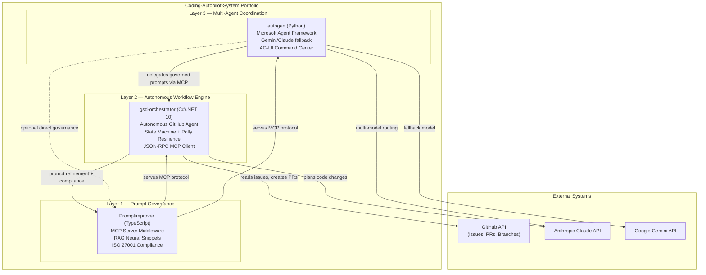
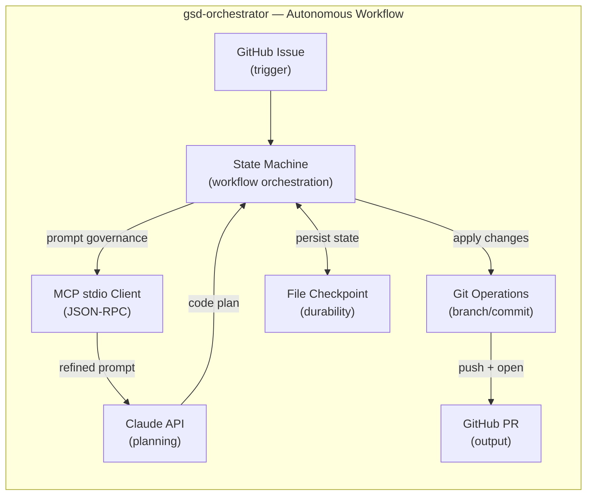
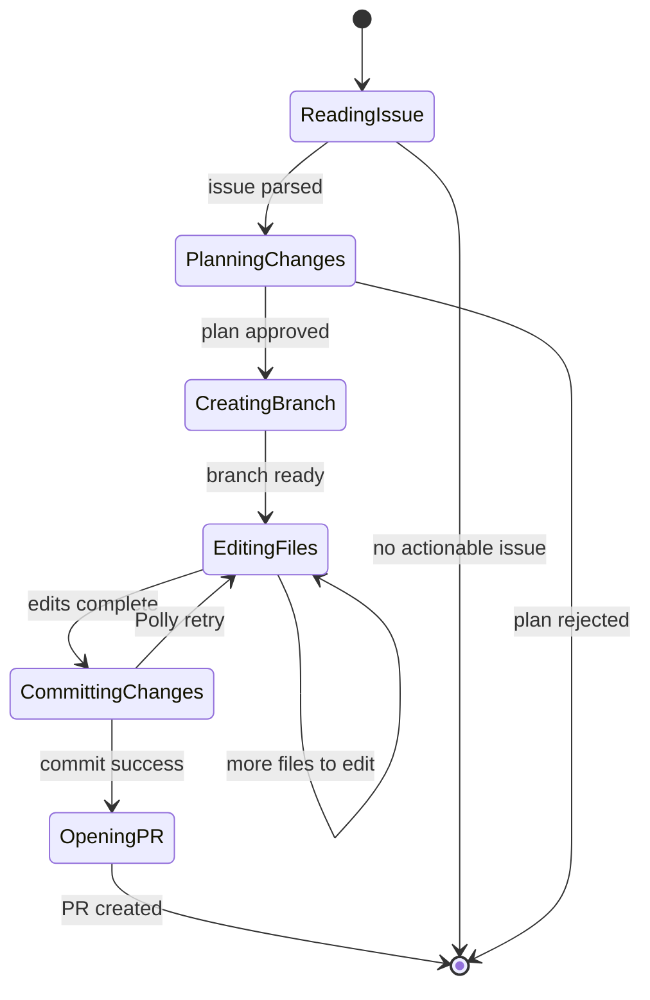

# Architecture Research — Portfolio Narrative

**Project:** Enterprise GitHub Portfolio (Coding-Autopilot-System org)
**Researched:** 2026-05-21
**Overall confidence:** HIGH — GitHub documentation patterns and portfolio framing are stable, well-documented practices

---

## Cross-Repo Story Structure

The three projects are not independent demos. They form a layered AI engineering platform, and that is the story to tell.

### The Narrative Arc

**Layer 1 — Prompt Quality (Promptimprover)**
Before any AI agent acts, the prompts it receives must be governed. Promptimprover is the MCP server that ensures every prompt entering the system is validated, refined, and traceable. It is the compliance and quality gate.

**Layer 2 — Single-Agent Orchestration (gsd-orchestrator)**
With governed prompts, a single autonomous agent can be trusted to operate on real infrastructure. gsd-orchestrator is the crown jewel: it reads GitHub issues, plans via Claude + MCP, branches, edits code, commits, and opens PRs — all autonomously. It consumes Promptimprover as a dependency for prompt governance.

**Layer 3 — Multi-Agent Coordination (autogen)**
When single-agent systems need to scale to parallel workstreams or heterogeneous models (Gemini/Claude fallback), autogen provides the coordination layer. It orchestrates multiple agents using Microsoft's Agent Framework, with AG-UI and DevUI integration for observability.

### The One-Sentence Pitch
"A full-stack AI automation platform: prompt governance at the foundation, autonomous single-agent workflows in the middle, and multi-agent coordination at the top."

### Why This Order Matters for Hiring Managers
- Shows systems thinking: the candidate built at every layer, not just one tool
- Shows production mindset: prompt governance before agent action (compliance-first)
- Shows progression: from MCP protocol knowledge → autonomous agents → multi-agent orchestration
- Covers three enterprise languages: TypeScript, C#/.NET 10, Python — polyglot credibility

---

## System Interaction Diagram

This Mermaid diagram should appear in the org profile README and be referenced from each repo README. Use `graph TB` (top-to-bottom) for architectural clarity.



### Diagram Placement Strategy

| Location | Diagram Type | Purpose |
|----------|--------------|---------|
| Org profile README | Full system diagram (above) | Portfolio landing — show the whole system |
| gsd-orchestrator README | Internal state machine diagram | Show enterprise patterns within the repo |
| gsd-orchestrator Wiki | Detailed data flow diagrams | Deep-dive for technical evaluators |
| autogen README | Agent coordination diagram | Show multi-agent topology |
| Promptimprover README | MCP protocol flow diagram | Show middleware integration pattern |

### gsd-orchestrator Internal Architecture Diagram (for that repo's README)



---

## Cross-Linking Strategy

### Principle: Every repo should be findable from every other repo.

#### In each repo's README — "Part of the Coding-Autopilot-System"

Add a section near the top of every README:

```markdown
## Part of the Coding-Autopilot-System

This project is one component of a multi-layer AI automation platform.

| Layer | Repo | Role |
|-------|------|------|
| Prompt Governance | [Promptimprover](https://github.com/Coding-Autopilot-System/Promptimprover) | MCP server — prompt refinement and compliance |
| Autonomous Workflow | [gsd-orchestrator](https://github.com/Coding-Autopilot-System/gsd-orchestrator) | C#/.NET 10 autonomous GitHub agent |
| Multi-Agent Coordination | [autogen](https://github.com/Coding-Autopilot-System/autogen) | Python multi-agent framework |

See the [org profile](https://github.com/Coding-Autopilot-System) for the full system overview.
```

#### GitHub Cross-Repo References (Issue/PR Linking)

GitHub renders cross-repo links in a specific format. Use full URLs rather than `org/repo#123` shorthand in documentation, because shorthand only resolves within the same org when GitHub processes issue/PR text — in README markdown, full URLs are more reliable.

Format: `https://github.com/Coding-Autopilot-System/gsd-orchestrator`

#### Badge Strategy

Each README should carry four badges in this order:

```markdown


```

The CI badge must link to the workflow: `[](https://github.com/Coding-Autopilot-System/{repo}/actions)` so clicking it goes to the Actions tab.

#### GitHub Topics (Critical for Discoverability)

Topics are how GitHub search surfaces repos to hiring managers browsing by skill. Each repo needs 10-15 topics. Recommended:

**gsd-orchestrator:**
`autonomous-agents`, `github-automation`, `mcp`, `model-context-protocol`, `dotnet`, `csharp`, `dotnet10`, `ai-agents`, `claude-ai`, `state-machine`, `polly`, `github-actions`, `agentic-workflow`, `code-generation`

**Promptimprover:**
`mcp-server`, `model-context-protocol`, `prompt-engineering`, `typescript`, `ai-governance`, `prompt-governance`, `rag`, `llm`, `iso27001`, `middleware`, `ai-safety`

**autogen:**
`autogen`, `multi-agent`, `python`, `microsoft-autogen`, `ag-ui`, `claude-ai`, `gemini`, `llm-orchestration`, `agent-framework`, `developer-tools`

---

## Org Profile Structure

The `.github` repo in `Coding-Autopilot-System` org renders its `profile/README.md` as the org landing page. This is the most important document in the portfolio.

### Structure of `profile/README.md`

```
1. Headline (1 line)
2. Value proposition (2-3 sentences)
3. System overview diagram (Mermaid)
4. Project cards (3 cards, one per repo)
5. Tech stack grid
6. Author bio link
```

### Detailed Content Specification

**Section 1 — Headline**
```markdown
# Coding-Autopilot-System
```

**Section 2 — Value Proposition**
```markdown
An enterprise-grade AI automation platform built at the intersection of autonomous agents,
prompt governance, and multi-agent coordination.

Three production-quality systems — written in C#/.NET 10, TypeScript, and Python —
that demonstrate how AI agents should be built for real-world reliability, compliance, and scale.
```

**Section 3 — System Diagram**
Use the full system interaction Mermaid diagram from the "System Interaction Diagram" section above.

**Section 4 — Project Cards**
Each card follows this template:
```markdown
### [gsd-orchestrator](https://github.com/Coding-Autopilot-System/gsd-orchestrator) — Autonomous GitHub Agent

![CI badge] ![version badge]

**C# / .NET 10** — Reads GitHub issues and autonomously plans, branches, edits, and opens PRs
using Claude AI. Implements a state machine with Polly resilience, file checkpointing for
durability, and a JSON-RPC MCP stdio client for prompt governance integration.

**Enterprise patterns:** State machine, dependency injection, resilience policies, structured logging
```

**Section 5 — Tech Stack Grid**
```markdown
## Technology Coverage

| Area | Technologies |
|------|-------------|
| Languages | C# / .NET 10 · TypeScript · Python |
| AI Providers | Anthropic Claude · Google Gemini |
| Protocols | Model Context Protocol (MCP) |
| Patterns | State machine · RAG · Multi-agent |
| Infrastructure | GitHub Actions · GitHub API |
| Compliance | ISO 27001 framing |
```

**Section 6 — Author Link**
```markdown
Built by [@OgeonX-Ai](https://github.com/OgeonX-Ai) — AI Engineer and Senior .NET Developer
```

### Key Constraint: GitHub Org Profile Rendering

GitHub renders `profile/README.md` without a sidebar. The full width is available, but there is no automatic project listing — all three repo cards must be explicit in the README. Mermaid diagrams render correctly in org profile READMEs as of 2022+.

---

## Wiki Architecture

### Principle: Wikis are for technical evaluators, not for scanners.

A hiring manager scans the README in 30 seconds. A tech lead who is interested clicks into the Wiki for depth. Structure wikis to reward that deeper investigation.

### gsd-orchestrator Wiki (4 pages minimum, as required)

```
Home.md                     ← Navigation hub, system overview
Architecture.md             ← State machine diagram, component map, design decisions
Configuration-Guide.md      ← How to configure and run the system
Development-Guide.md        ← How to extend, add new workflow steps, contribute
```

**Home.md structure:**
- What this system does (3 sentences)
- Quick navigation table to other pages
- Link back to org profile

**Architecture.md structure:**
- State machine diagram (Mermaid)
- Component responsibility table
- Key design decisions with rationale (why Polly, why file checkpointing vs DB, why stdio MCP)
- Integration points (Promptimprover MCP, GitHub API, Claude API)

**Configuration-Guide.md structure:**
- Prerequisites
- Environment variables table (name, purpose, example value, required/optional)
- Step-by-step setup
- Troubleshooting section

**Development-Guide.md structure:**
- Repository layout
- How to add a new workflow state
- How to add a new MCP tool call
- Testing approach (even if tests don't exist yet — document the intent)

### Promptimprover Wiki (2-3 pages)

```
Home.md                     ← What it is, MCP protocol overview
MCP-Integration.md          ← How to connect a client (gsd-orchestrator example)
Governance-Model.md         ← ISO 27001 framing, compliance design decisions
```

### autogen Wiki (2-3 pages)

```
Home.md                     ← What it is, agent topology
Agent-Configuration.md      ← How to configure agents, model routing
AG-UI-Guide.md              ← DevUI and AG-UI Command Center usage
```

### Wiki Cross-Linking

Every wiki Home.md should end with:
```markdown
## Related Systems
- [Promptimprover](https://github.com/Coding-Autopilot-System/Promptimprover) — MCP prompt governance
- [gsd-orchestrator](https://github.com/Coding-Autopilot-System/gsd-orchestrator) — Autonomous workflow engine
- [autogen](https://github.com/Coding-Autopilot-System/autogen) — Multi-agent coordination
```

---

## Enterprise Framing

### What "Enterprise Grade" Actually Means (Verifiable in Code)

Hiring managers and tech leads have seen too many portfolios that claim enterprise quality. The framing must point to concrete, inspectable evidence in the code.

#### gsd-orchestrator — Enterprise Evidence

| Claim | Evidence to Point To |
|-------|---------------------|
| Production resilience | Polly retry + circuit breaker policies |
| Observability | Structured logging with Microsoft.Extensions.Logging |
| Dependency injection | DI-wired services, not static classes |
| Durability | File checkpoint state recovery (not in-memory only) |
| Protocol compliance | JSON-RPC 2.0 MCP stdio client implementation |
| Async-first | Async/await throughout, CancellationToken propagation |

**Framing sentence for README:** "Built with production reliability in mind: Polly resilience policies, structured DI, file-based state checkpointing for crash recovery, and full async/await with CancellationToken propagation."

#### Promptimprover — Enterprise Evidence

| Claim | Evidence to Point To |
|-------|---------------------|
| Standards compliance | ISO 27001 compliance framing in design |
| Memory architecture | Compounding memory / RAG neural snippets |
| Middleware pattern | Auto-heal middleware — not just a script |
| Protocol implementation | Full MCP server (not a wrapper) |

**Framing sentence:** "MCP server middleware implementing prompt governance as a first-class infrastructure concern, with ISO 27001 compliance framing and RAG-based compounding memory."

#### autogen — Enterprise Evidence

| Claim | Evidence to Point To |
|-------|---------------------|
| Resilience | Gemini/Claude fallback routing |
| Observability | AG-UI Command Center for agent state inspection |
| Standard framework | Microsoft AutoGen (not a bespoke framework) |
| UI integration | DevUI integration for operator control |

**Framing sentence:** "Multi-agent automation built on Microsoft AutoGen with model-fallback resilience (Claude/Gemini), AG-UI observability, and DevUI for operator-in-the-loop control."

### Language to Use vs. Avoid

| Avoid | Use Instead |
|-------|-------------|
| "toy project" / "demo" | "production-quality" / "enterprise-grade" |
| "learning exercise" | "implements [pattern] from [standard]" |
| "simple" | "focused" or "purpose-built" |
| "I made a thing that..." | "[Project] is a [noun] that [does X]" |
| "work in progress" | omit, or "v1.0.0 — stable" |
| passive voice | active: "orchestrates", "validates", "enforces" |

### The Hiring Manager's 5-Minute Journey

Design the portfolio for this specific reading pattern:

1. **0:00-0:30** — Org profile README. Do I understand what this person builds? Do I see evidence of seniority?
2. **0:30-1:30** — gsd-orchestrator README. Is this real? Does it have CI? Does it have a diagram?
3. **1:30-2:30** — gsd-orchestrator Wiki Architecture page. Can they explain their own system?
4. **2:30-3:30** — Promptimprover README. Do they understand protocols and compliance?
5. **3:30-4:30** — autogen README. Polyglot? Multi-framework? Yes.
6. **4:30-5:00** — Personal profile (OgeonX-Ai). Who is this person?

Every artifact must be optimized for this sequence. The org profile must hook in 30 seconds. The gsd-orchestrator README must answer "is this real?" immediately (CI badge + diagram above the fold).

### Above-the-Fold Rule

The top 600px of any README (before any scroll) must contain:
- Project name and one-line description
- CI badge (proves it builds)
- A diagram OR a code snippet showing the core mechanism
- No installation instructions (that comes later)

This is the difference between a portfolio that gets read and one that gets closed.

---

## Mermaid Best Practices for GitHub

### What Renders Reliably

GitHub uses Mermaid.js for diagram rendering in markdown. As of 2024, the following diagram types render correctly in:
- README.md files
- Wiki pages
- Org profile README
- Issue/PR descriptions (limited — avoid complex diagrams here)

Reliable types: `graph`, `sequenceDiagram`, `classDiagram`, `flowchart`, `stateDiagram-v2`

### Syntax Rules That Prevent Rendering Failures

1. Use a fenced code block with `mermaid` as the language identifier — no spaces, no capital M.
2. Node labels with special characters (parentheses, slashes, dots) must be quoted: `A["label (with parens)"]`
3. Subgraph labels must not contain colons or quotes: use `subgraph "Layer 1"` not `subgraph "Layer 1: Governance"`
4. Keep diagrams under ~25 nodes. Beyond that, GitHub's renderer times out silently and shows nothing.
5. Do not nest subgraphs more than two levels deep — GitHub's Mermaid version does not support deep nesting reliably.
6. Use `<br/>` (not `\n`) for line breaks within node labels.
7. Always test diagrams at https://mermaid.live before committing.

### State Machine Diagram for gsd-orchestrator



---

## Confidence Assessment

| Area | Confidence | Notes |
|------|------------|-------|
| GitHub org profile mechanics | HIGH | Official GitHub Docs — org profile/README.md in .github repo is documented |
| Mermaid rendering in GitHub | HIGH | Officially supported since 2022, syntax rules are stable |
| Cross-repo linking format | HIGH | GitHub URL format is stable |
| Badge syntax (shields.io) | HIGH | shields.io is the canonical badge service |
| Portfolio framing strategy | MEDIUM | Based on established hiring pattern knowledge; employer preferences vary |
| Enterprise framing language | MEDIUM | Based on job description patterns; validate against target job postings |

## Sources

- GitHub Docs: Organization profile — https://docs.github.com/en/organizations/collaborating-with-groups-in-organizations/customizing-your-organizations-profile
- GitHub Mermaid support announcement — https://github.blog/2022-02-14-include-diagrams-markdown-files-mermaid/
- shields.io badge service — https://shields.io
- Mermaid live editor for validation — https://mermaid.live
- Microsoft AutoGen documentation — https://microsoft.github.io/autogen/
- Anthropic MCP protocol specification — https://spec.modelcontextprotocol.io
