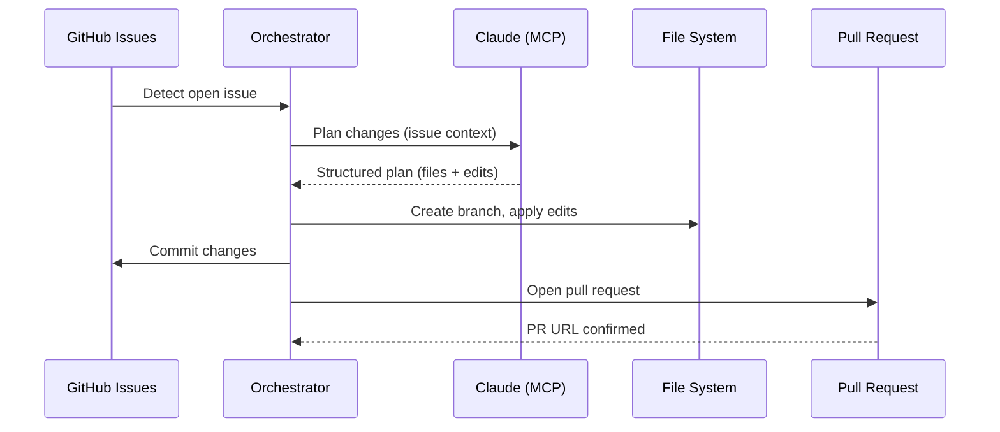
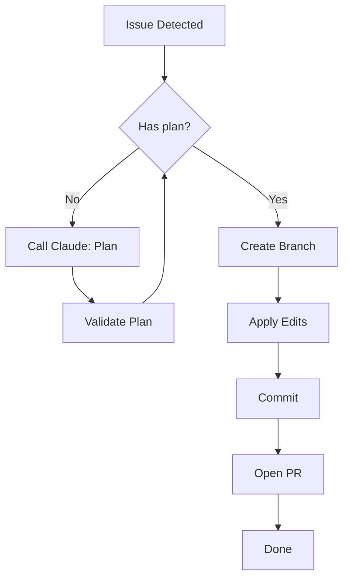
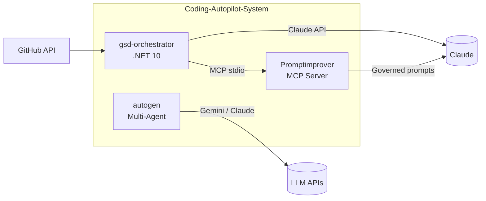

# Features Research — GitHub Portfolio

**Domain:** Enterprise GitHub portfolio for Senior AI Engineer / Senior .NET Developer
**Researched:** 2026-05-21
**Confidence:** HIGH (domain expertise + project context; WebSearch unavailable, based on current GitHub platform knowledge and industry hiring patterns)

---

## Table Stakes (must-have)

These are non-negotiable. Missing any one signals "hobby project" to a hiring manager.

### 1. CI Status Badge in Every README
A green build badge is the first thing a senior engineer looks at. It proves the code compiles and the project is maintained. A repo with no CI badge in 2025/2026 reads as abandoned.
- Use GitHub Actions `.github/workflows/ci.yml`
- Badge syntax: ``
- For .NET: `dotnet build` + `dotnet test` (even if no tests exist, build must pass)
- For TypeScript/Node: `npm ci && npm run build`
- For Python: `pip install -e . && python -m pytest` (or just import check)

### 2. One-Sentence Value Proposition at Top of README
Above the fold, before any badges or installation steps: a single sentence that answers "what does this do and why does it matter?" Written for a tech lead, not a junior dev.
- Bad: "This is an automation tool I built."
- Good: "Autonomous GitHub workflow engine that reads issues, plans and executes code changes via Claude, and opens pull requests — no human in the loop."

### 3. Architecture Overview (Diagram or Structured Prose)
Every senior-level project needs a visual or structured explanation of how the pieces fit together. For complex systems (agentic orchestrators, multi-agent frameworks), a Mermaid diagram is mandatory. For simpler projects, a component table suffices.

### 4. Installation / Quickstart That Actually Works
Step-by-step that a senior engineer can follow cold. Include prerequisites, environment variables (reference only, never values), and the exact commands to run. Must reflect the current state of the code.

### 5. GitHub Topics on Every Repo
Without topics, repos are invisible to search. GitHub search and recruiter tooling both filter by topics. Three to eight topics per repo is optimal.

### 6. Repository Description (the one-liner under the repo name)
GitHub displays this in org listings, search results, and profile pages. Must match the one-sentence value proposition. Maximum ~100 characters for full display without truncation.

### 7. Version Badge / Release Tag
A `v1.0.0` release signals production-readiness. Hiring managers and tech leads specifically look for whether a project has been "shipped" vs left in development limbo. GitHub Releases also provide a changelog anchor.

### 8. License File
Absence of a license is a legal blocker for any employer who wants to use or reference the code. MIT or Apache 2.0 is standard for open portfolio work.

---

## Differentiators (stand out)

These separate a senior engineer's portfolio from everyone else's.

### 1. Org Profile README as Cohesive System Story
An org `.github/profile/README.md` that frames all three projects not as isolated repos but as a portfolio demonstrating a progression of skills and a coherent architectural vision. Most developers have org profiles with nothing in them. A well-crafted org profile README is rare and immediately communicates intentionality.

Key elements:
- Opening paragraph: who this org is and what it builds (one short paragraph, enterprise tone)
- "System overview" section showing how the three projects relate (agentic pipeline: Promptimprover governs prompts → gsd-orchestrator executes workflows → autogen handles multi-agent tasks)
- Per-project card: name, one-line description, primary tech, link
- Skills/tech matrix: C#/.NET 10, TypeScript, Python, MCP protocol, GitHub Actions, Claude API, multi-agent frameworks
- A "what I build" statement aimed at AI-platform engineering roles

### 2. Architecture Diagrams with Mermaid
Not just a box diagram — a diagram that shows data flow, decision points, and system boundaries. For gsd-orchestrator specifically, a sequence diagram showing the autonomous loop (Issue → Plan → Branch → Edit → Commit → PR) is more impressive than a simple component diagram because it communicates the dynamic behavior.

### 3. GitHub Wiki as Internal Engineering Docs
A wiki structured like internal engineering documentation (not user docs) signals that the author writes the kind of documentation senior engineers write at real companies. Recommended pages:
- Architecture Decision Records (ADRs) — even 2-3 key decisions with rationale
- Design Overview — the "why" behind the architecture
- Development Setup — environment prerequisites and local run instructions
- Key Concepts / Glossary — domain terms explained precisely

### 4. Personal Profile README (OgeonX-Ai) as a Funnel
The personal profile is a landing page that funnels visitors to the org. It should be brief (15-20 lines), confident, and link directly to Coding-Autopilot-System org. Include:
- One-sentence positioning statement ("I build production-grade autonomous AI systems on .NET and TypeScript")
- "Currently building" with link to org
- Three highlighted skills (not a wall of logos)
- Invitation to explore the org

### 5. Project "Story" Narrative in Org README
A 2-3 paragraph narrative of why this org was created and what problem it solves. Hiring managers at AI-platform companies are buying a person's engineering judgment, not just their syntax knowledge. A well-written story reveals judgment.
Structure: Problem → Insight → Approach → Current State. No marketing fluff — write like you're explaining to a skeptical principal engineer.

### 6. Semantic Versioning + Changelog in Releases
A GitHub Release with a real changelog (not just "initial release") shows release discipline. Even for a portfolio project: list what was built, any known limitations, and what comes next. This is what senior engineers do.

### 7. Cross-Repo Linking
Each repo's README should reference the other repos where architecturally relevant. gsd-orchestrator should link to Promptimprover (which it uses). This creates a web of related work and increases time-on-profile.

---

## Anti-Features (explicitly avoid)

These actively damage a portfolio's perceived quality.

### 1. "This is a work in progress" / "TODO" markers in README
Communicates incompleteness. Remove all WIP language. If a feature is not built, omit it from the README entirely.

### 2. Demo / toy language
Phrases like "demo app", "learning project", "playing around with", "just a simple", "for fun". Every project should be described in terms of what it does, not what it is.

### 3. Screenshot-heavy READMEs for backend/agent systems
Screenshots of terminal output are low-signal. Architecture diagrams and code snippets communicate more to engineers. For CLI/agentic tools, a short animated GIF of the tool running is acceptable if it clearly shows the behavior — but only if it's well-captured.

### 4. Walls of badges / logo soup
More than 4-5 badges at the top degrades signal quality. A CI badge, a version badge, and optionally a license badge. Not a row of 15 shields.io badges for every technology used.

### 5. GitHub stats cards on org or project READMEs
"Kim's GitHub stats: 120 commits, 3 stars" signals junior profile. Remove from any repo-level README. Acceptable only on personal profile README and only if the stats are genuinely strong.

### 6. Empty wikis or wikis with a single "Home" page that says "Coming soon"
Worse than no wiki at all. Either build real wiki content or disable the wiki tab. A wiki with "Coming soon" signals inability to follow through.

### 7. Generic README boilerplate with unfilled placeholders
`[Project Name]`, `[Your Name]`, `Lorem ipsum` in any published README. This is disqualifying.

### 8. Inconsistent casing / formatting across repos
Hiring managers pattern-match on consistency. If one repo uses sentence case headings and another uses Title Case, and one has badges and another doesn't, the overall org reads as disorganized.

### 9. Committing secrets or `.env` files
Even historical secrets in git history are a red flag. If present, they must be rotated and the history scrubbed before this becomes a public portfolio.

### 10. "Star this repo!" appeals in README
Signals insecurity. Portfolio work does not beg for stars.

---

## README Excellence Criteria

Specific, actionable checklist for every repo README in this portfolio:

**Structure**
- [ ] H1 title = repo name, matches GitHub repo name exactly
- [ ] One-sentence value proposition immediately after H1 (no badges before it)
- [ ] Badges row: CI status, latest release version, license — in that order
- [ ] "What it does" section (3-5 sentences, no bullet list, prose only)
- [ ] Architecture section with Mermaid diagram (for gsd-orchestrator and autogen) or component table (for Promptimprover)
- [ ] Prerequisites section listing exact versions (dotnet 10, node 20+, python 3.12+)
- [ ] Installation / quickstart with copy-pasteable commands
- [ ] Configuration section: environment variables listed by name with description, never values
- [ ] "How it works" section: 3-5 key concepts explained briefly
- [ ] Link to GitHub Wiki for deeper documentation
- [ ] Link to related repos in the org where relevant

**Tone**
- [ ] Present tense throughout ("The orchestrator reads issues" not "The orchestrator will read issues")
- [ ] Active voice ("Claude plans the changes" not "Changes are planned by Claude")
- [ ] No hedging language ("This project attempts to...", "Hopefully...", "I tried to...")
- [ ] No first person in project-level sections (save "I" for org narrative only)
- [ ] Technical precision: use exact terms (MCP, SSE, JSON-RPC, state machine) not vague terms (AI magic, smart system)

**Completeness**
- [ ] Every external dependency has a version number
- [ ] Every environment variable is documented
- [ ] The CI badge reflects a passing build
- [ ] The version badge reflects the latest release tag
- [ ] License is stated and LICENSE file exists

---

## GitHub Topics — AI Engineer Role

Topics to apply per repo for maximum recruiter and hiring manager discoverability. GitHub topic search is actively used by technical recruiters in 2025/2026.

**gsd-orchestrator** (C# / .NET 10 agentic orchestrator):
```
dotnet, csharp, dotnet10, ai-agent, agentic-ai, autonomous-agent,
github-automation, mcp, model-context-protocol, claude-ai,
state-machine, workflow-automation, github-actions, polly, json-rpc
```

**Promptimprover** (TypeScript MCP server):
```
mcp, model-context-protocol, typescript, prompt-engineering,
prompt-governance, rag, neural-snippets, iso27001, middleware,
claude-ai, llm-tools, ai-tooling, mcp-server
```

**autogen** (Python multi-agent):
```
autogen, multi-agent, python, microsoft-autogen, gemini, claude-ai,
ai-agent, agentic-ai, llm, ai-automation, ag-ui, devui,
multi-agent-framework, generative-ai
```

**Org-level topics to reinforce across all repos:**
`ai-agent`, `agentic-ai`, `mcp`, `model-context-protocol`, `claude-ai`, `dotnet`, `autonomous-agent`

**Why these topics matter for AI Engineer roles:**
- `mcp` and `model-context-protocol` — niche, high-signal, directly matches what companies building Claude integrations search for
- `agentic-ai` and `autonomous-agent` — the category language used in 2025/2026 job descriptions
- `dotnet10` — version-specific, signals current knowledge
- `prompt-governance` — rare, high-value for enterprise AI teams concerned with compliance
- `state-machine` — architectural pattern signal, not just "I used a library"

---

## Architecture Diagram Patterns

Mermaid renders natively in GitHub README and Wiki. The following patterns work reliably.

### Pattern 1: Sequence Diagram (best for gsd-orchestrator autonomous loop)

Shows dynamic behavior — ideal for agentic systems where the interesting thing is *what happens when*, not just what components exist.

```

```

Key rules for GitHub rendering:
- Use `participant` aliases to keep labels short — long participant names break layout
- Keep to 6-8 actors maximum
- Prefer `-->>` (dashed) for responses, `->>` (solid) for initiating calls
- Do not use `Note over` spanning more than 2 participants — breaks mobile rendering
- Test locally with https://mermaid.live before committing

### Pattern 2: Flowchart (best for decision logic / state machines)

```

```

Key rules:
- Use `TD` (top-down) for process flows, `LR` (left-right) for pipelines/data flows
- Keep node labels under 30 characters — longer labels cause layout overflow on GitHub
- Use `{}` for decision nodes, `[]` for process nodes, `([])` for terminal nodes
- No more than 12-15 nodes per diagram — beyond this, split into sub-diagrams

### Pattern 3: C4 Component Diagram (best for system-level org README)

Shows how projects relate at the architecture level. Use for org profile README.

```

```

Key rules:
- `subgraph` labels must not contain special characters
- `[(text)]` renders as cylinder (database/storage) — use for external services
- Keep subgraph contents to 3-5 nodes for clarity
- Arrow labels in `|pipes|` syntax — keep under 20 characters

### Anti-patterns for GitHub Mermaid rendering:
- Do not use `%%` comments inside diagram blocks — can cause render failures on some GitHub versions
- Do not use Unicode arrows (`→`) — use `-->` syntax only
- Do not nest subgraphs more than one level deep
- Always put the opening ` ```mermaid ` on its own line with no trailing spaces

---

## Wiki Page Patterns

What makes a GitHub Wiki page genuinely useful to a hiring manager or senior engineer evaluating the project.

### Useful Wiki Structure for gsd-orchestrator

**Home.md** — Navigation hub, not content. Should contain:
- One-paragraph project description (same as README intro)
- Linked table of contents to all other wiki pages
- "Start here" callout pointing to Design Overview or Quickstart

**Design-Overview.md** — The most important page. Contains:
- Problem statement (what manual problem does this automate?)
- Key design decisions and why (3-5 decisions, each with alternatives considered)
- Architecture diagram (can reuse from README)
- Data model: what does the state/checkpoint file look like?
- Constraints and limitations (honest — this signals maturity)

**Architecture-Decision-Records.md** — Even 2-3 ADRs signal engineering maturity:
- ADR-001: Why MCP over direct API calls
- ADR-002: Why file checkpointing over database state
- ADR-003: Why C# state machine over a scripting approach
Each ADR: Status / Context / Decision / Consequences. Keep each to 10-15 lines.

**Development-Setup.md** — How to run locally:
- Prerequisites with exact versions
- Clone + configure + run in under 5 commands
- Environment variable reference table
- Common errors and fixes (2-3 entries)

**Key-Concepts.md** — Glossary of domain terms used in the codebase:
- MCP (Model Context Protocol) — what it is in one sentence
- State machine pattern — how it's applied here
- Checkpoint file — purpose and format
- Agentic loop — definition used in this project

### Wiki Anti-Patterns

- **Single "Home" page with no sub-pages** — disable the wiki instead
- **Duplicate README content** — wiki is for depth, not repetition
- **Broken links** — worse than no links; audit before publishing
- **Pages written in second person imperative throughout** ("You should...", "You need to...") — write in declarative third person for design/architecture pages
- **No dates or version references** — wiki pages should note which version they describe
- **Walls of unformatted text** — use headers, tables, and code blocks consistently

### Wiki page length targets:
- Home: 20-40 lines
- Design Overview: 80-150 lines
- ADR page: 30-60 lines (all ADRs on one page for small projects)
- Development Setup: 50-80 lines
- Key Concepts: 40-60 lines

---

## Project Story Narrative — What It Must Communicate

The org profile README narrative (2-3 paragraphs) must answer these questions in order:

1. **What is the recurring engineering problem this org addresses?**
   Not "I built AI tools" — specific: "Translating GitHub issues into production-ready code changes requires human context-switching that interrupts deep work and slows engineering teams."

2. **What was the insight that drove the approach?**
   "LLMs with structured tool use (MCP) can hold enough context to plan, branch, edit, and commit — if the orchestration layer manages state correctly and the prompts are governed at the middleware level."

3. **What did you actually build?**
   Name the three projects, one sentence each, framing them as a system rather than three separate things.

4. **What does it demonstrate about how you engineer?**
   This is implicit in tone, not stated directly. The reader should infer: structured thinking, production patterns (state machine, resilience, DI), awareness of the ecosystem (MCP protocol, multi-agent frameworks), and ability to ship.

**Tone calibration for org narrative:**
- Write as if explaining to a principal engineer at a company that builds AI platform products
- No superlatives ("cutting-edge", "revolutionary", "world-class")
- No hedging ("attempting to", "trying to explore")
- Short paragraphs (3-5 sentences max each)
- Specific nouns (C#, .NET 10, MCP, Polly, Claude Sonnet) not vague nouns (AI, automation, tools)

---

## Sources

- Domain expertise and current GitHub platform knowledge (2026-05-21)
- Project context: `/C:/GithubMCP/.planning/PROJECT.md`
- GitHub Mermaid rendering behavior: verified against GitHub's documented Mermaid support
- Confidence: HIGH for GitHub platform features (CI badges, topics, wiki, releases, profile README); HIGH for hiring manager evaluation patterns based on senior engineering role context; MEDIUM for specific topic search rankings (WebSearch unavailable for real-time verification)
