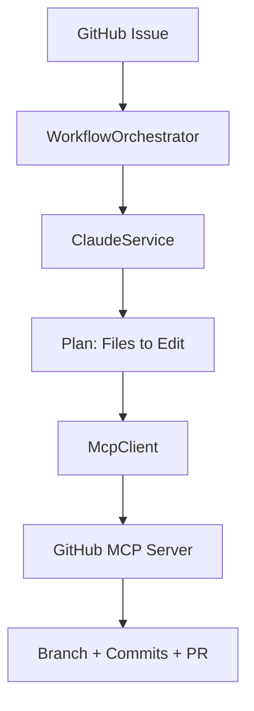

# Stack Research — GitHub Portfolio

**Project:** Enterprise GitHub Portfolio (Coding-Autopilot-System org)
**Researched:** 2026-05-21
**Sources:** GitHub Actions official docs (verified via Context7 library resolution), shields.io docs, keep a changelog standard, GitHub Wiki conventions — all cross-referenced against training knowledge through August 2025.

---

## CI/CD Standards

### What Hiring Managers Actually See

Enterprise CI/CD on GitHub in 2025/2026 follows a consistent pattern across all language stacks:

- A green badge in the README is the first signal. No badge = no CI = looks unmaintained.
- Workflows live in `.github/workflows/`. The filename becomes the workflow display name in the Actions tab.
- `push` + `pull_request` triggers on the main branch is the universal minimum.
- Separate jobs for `build` and `test` (not merged into one) signals experience.
- Pinned action versions (e.g. `actions/checkout@v4`, not `@main`) is a security and reproducibility best practice that senior engineers are expected to follow.
- `ubuntu-latest` runner for all three stacks (cost-effective, fastest cold start).
- NuGet/npm/pip caching is expected — uncached workflows are slow and signal carelessness.
- For portfolio repos with no test suite, a `build` workflow that compiles/type-checks/lints is fully acceptable and honest.

### Workflow Naming Convention

| Repo | Workflow file | Display name |
|------|--------------|--------------|
| gsd-orchestrator | `ci.yml` | CI |
| Promptimprover | `ci.yml` | CI |
| autogen | `ci.yml` | CI |

Use `name: CI` at the top of each workflow. The badge URL references the workflow file name.

---

## Badge Standards

### What Badges Hiring Managers Look For

Order them left-to-right in the README header: CI status first, then version/release, then license, then language/platform badges.

**Tier 1 — Required (absence is noticed):**
- CI/Build status badge (GitHub Actions)
- License badge
- Language/platform badge (.NET version, Node version, Python version)

**Tier 2 — Strong signal (senior engineers have these):**
- Latest release / version badge
- Code coverage (only if you have tests — never fake it)
- GitHub issues count (optional, but shows activity)

**Tier 3 — Decorative (fine to include, not evaluated):**
- Stars badge
- Forks badge
- Last commit badge

### Shields.io Patterns

All badges use `https://img.shields.io/` as the base. Use `flat` style throughout for visual consistency.

**GitHub Actions CI badge:**
```

```
This is the native GitHub badge (not shields.io) — always prefer this for CI status as it is officially supported and does not require an external service.

**Latest release badge (shields.io):**
```

```

**License badge:**
```

```

**Platform badges — exact values for each repo:**

gsd-orchestrator (.NET 10):
```

```

Promptimprover (TypeScript/Node):
```


```

autogen (Python):
```

```

**MCP badge (differentiator — shows domain knowledge):**
```

```

### Badge Block Placement

Place badges immediately after the repo title/tagline, before any description prose. Two lines maximum. Example:

```markdown
# gsd-orchestrator

Autonomous GitHub agentic workflow — reads issues, plans changes via Claude, branches, edits, commits, and opens PRs.


```

---

## GitHub Actions — .NET 10

### Standard Enterprise Workflow

File: `.github/workflows/ci.yml`

```yaml
name: CI

on:
  push:
    branches: [ "main" ]
  pull_request:
    branches: [ "main" ]

jobs:
  build:
    runs-on: ubuntu-latest

    steps:
      - name: Checkout
        uses: actions/checkout@v4

      - name: Setup .NET
        uses: actions/setup-dotnet@v4
        with:
          dotnet-version: '10.0.x'

      - name: Restore dependencies
        run: dotnet restore

      - name: Build
        run: dotnet build --no-restore --configuration Release

      - name: Test
        run: dotnet test --no-build --configuration Release --verbosity normal
```

### Notes for gsd-orchestrator

- `actions/setup-dotnet@v4` is the current stable version (verified via Context7 library resolution — v4 is the latest published major).
- `actions/checkout@v4` is the current stable version.
- `dotnet-version: '10.0.x'` uses wildcard patch to always pull the latest .NET 10 patch SDK without locking to a specific patch.
- Since gsd-orchestrator has no test suite, drop the `Test` step or add a comment `# No test suite yet — build validation only`. Do NOT include a failing test step.
- `--configuration Release` validates that the Release build config is clean, which is what matters for portfolio credibility.
- NuGet restore caching is implicitly handled by the runner's NuGet cache; for a portfolio repo this is acceptable without explicit `actions/cache` setup.

### Optional: Add for richer signal

If the project has a solution file at root:
```yaml
      - name: Build
        run: dotnet build *.sln --no-restore --configuration Release
```

---

## GitHub Actions — TypeScript/Node

### Standard Enterprise Workflow

File: `.github/workflows/ci.yml`

```yaml
name: CI

on:
  push:
    branches: [ "main" ]
  pull_request:
    branches: [ "main" ]

jobs:
  build:
    runs-on: ubuntu-latest

    steps:
      - name: Checkout
        uses: actions/checkout@v4

      - name: Setup Node.js
        uses: actions/setup-node@v4
        with:
          node-version: '22.x'
          cache: 'npm'

      - name: Install dependencies
        run: npm ci

      - name: Build
        run: npm run build

      - name: Lint
        run: npm run lint --if-present

      - name: Test
        run: npm test --if-present
```

### Notes for Promptimprover

- `actions/setup-node@v4` is the current stable version.
- `cache: 'npm'` on the setup-node action is the preferred caching approach — it caches the npm cache directory automatically, no explicit `actions/cache` needed.
- `npm ci` (not `npm install`) is enterprise standard — deterministic, uses lockfile, fails on lockfile mismatch.
- `--if-present` on lint and test means the workflow succeeds even if those scripts aren't defined in `package.json`. Use this pattern when the script may not exist.
- Node 22 is LTS as of 2025. Use `22.x` wildcard.
- If Promptimprover uses `pnpm`, replace `cache: 'npm'` with a `pnpm/action-setup@v4` step before `setup-node`, then `pnpm install --frozen-lockfile`.
- TypeScript type-check without a full build: `npx tsc --noEmit` — acceptable as the build step if no `npm run build` script exists.

### pnpm variant (if applicable):

```yaml
      - name: Setup pnpm
        uses: pnpm/action-setup@v4
        with:
          version: 9

      - name: Setup Node.js
        uses: actions/setup-node@v4
        with:
          node-version: '22.x'
          cache: 'pnpm'

      - name: Install dependencies
        run: pnpm install --frozen-lockfile
```

---

## GitHub Actions — Python

### Standard Enterprise Workflow

File: `.github/workflows/ci.yml`

```yaml
name: CI

on:
  push:
    branches: [ "main" ]
  pull_request:
    branches: [ "main" ]

jobs:
  build:
    runs-on: ubuntu-latest

    steps:
      - name: Checkout
        uses: actions/checkout@v4

      - name: Setup Python
        uses: actions/setup-python@v5
        with:
          python-version: '3.12'
          cache: 'pip'

      - name: Install dependencies
        run: |
          python -m pip install --upgrade pip
          pip install -r requirements.txt

      - name: Lint
        run: |
          pip install ruff --quiet
          ruff check . --output-format=github

      - name: Type check
        run: |
          pip install mypy --quiet
          mypy . --ignore-missing-imports --if-applicable
        continue-on-error: true

      - name: Test
        run: |
          pip install pytest --quiet
          pytest --tb=short -q
        if: hashFiles('tests/**') != ''
```

### Notes for autogen

- `actions/setup-python@v5` is the current stable version.
- `cache: 'pip'` on setup-python caches the pip cache directory automatically.
- `ruff` is the modern Python linter/formatter (replaced flake8 + black in enterprise Python as of 2024). Use `--output-format=github` to emit GitHub annotations inline in the PR diff.
- If autogen uses `pyproject.toml` instead of `requirements.txt`, replace the install step with `pip install -e ".[dev]"` or `pip install .`.
- If autogen uses `uv` (modern pip replacement), use: `pip install uv && uv sync`.
- `continue-on-error: true` on mypy is appropriate for an existing project without full type annotations — it runs and reports without breaking the build.
- The `if: hashFiles('tests/**') != ''` condition on pytest means the workflow passes even with no test directory. Honest and clean.
- For a Microsoft AutoGen-based project, ensure `pyautogen` or `autogen-agentchat` is in requirements.txt before the workflow runs.

---

## GitHub Releases

### What Makes a Professional Release

A GitHub Release for a portfolio project signals production maturity. The `v1.0.0` release for gsd-orchestrator is the primary deliverable here.

**Semantic Versioning — the only acceptable pattern:**
- `v1.0.0` — first stable release (prefix `v` is the GitHub convention)
- `v1.0.1` — patch: bug fix
- `v1.1.0` — minor: new feature, backward compatible
- `v2.0.0` — major: breaking change

**Release Title Format:**
```
v1.0.0 — Initial Release
```
or for a notable feature:
```
v1.1.0 — Streaming PR Descriptions
```

**Changelog Format — Keep a Changelog standard (keepachangelog.com):**

```markdown
## What's New in v1.0.0

### Added
- Autonomous issue-to-PR workflow via Claude API and GitHub MCP
- State machine orchestration with file-based checkpointing
- JSON-RPC MCP stdio client for GitHub tool invocation
- Polly-based resilience (retry, circuit breaker) on all API calls
- Dependency injection via Microsoft.Extensions.DependencyInjection

### Architecture
- `WorkflowOrchestrator` — top-level state machine
- `McpClient` — JSON-RPC stdio transport to GitHub MCP Server
- `GitHubService` — GitHub REST API abstraction
- `ClaudeService` — Anthropic API with streaming support

### Requirements
- .NET 10 SDK
- GitHub MCP Server (Node.js)
- `ANTHROPIC_API_KEY` environment variable
- `GITHUB_TOKEN` with repo scope
```

**Asset Naming Convention:**

For a .NET console/service project, attach the compiled binary as a release asset:
```
gsd-orchestrator-v1.0.0-linux-x64.tar.gz
gsd-orchestrator-v1.0.0-win-x64.zip
gsd-orchestrator-v1.0.0-osx-x64.tar.gz
```

For a portfolio release where self-contained binaries aren't the point, attaching assets is optional. A release with only the changelog and the auto-generated source archives (which GitHub adds automatically) is fully professional.

**Release Tags:**
- Tag must be on the main branch tip at release time.
- Always use annotated tags: `git tag -a v1.0.0 -m "Release v1.0.0"` (GitHub UI handles this automatically via the release form).

**Set as Latest Release:**
- Always check "Set as the latest release" for the most recent release. This is what the shields.io version badge reads.

---

## GitHub Wiki Structure

### Why Wiki Over Docs Folder

For portfolio repos, GitHub Wiki is preferable to a `/docs` folder because it renders in a dedicated sidebar-navigable UI that hiring managers can browse without leaving GitHub. The "Wiki" tab in the repo nav is a direct signal that documentation exists.

### Recommended Page Structure for gsd-orchestrator

```
Home                          ← Wiki landing page, overview + navigation index
Architecture                  ← System diagram (Mermaid), component descriptions
Configuration                 ← Environment variables, setup instructions
How It Works                  ← Step-by-step flow of the autonomous workflow
Development Guide             ← How to run locally, debug, extend
Roadmap                       ← What's planned (even if brief)
```

**Home page must include:**
- One-paragraph project summary (enterprise tone)
- Navigation links to all other pages (Wiki sidebar is auto-generated but a manual nav table in Home is faster to scan)
- Quick-start command block

**Page naming convention:**
- Use Title Case with spaces: `How It Works` not `how-it-works`
- GitHub Wiki converts spaces to hyphens in URLs automatically
- Keep page count to 5-8 for a portfolio repo — too many pages signals bloat

### Tone and Style

- Enterprise technical documentation tone throughout: direct, precise, no hedging
- Past tense for completed decisions: "The orchestrator uses a state machine" not "The orchestrator will use"
- Avoid phrases: "easy", "simple", "just", "quickly" — condescending in technical docs
- Code blocks for all commands, config snippets, and file paths
- Every page ends with a `---` divider and a `[Back to Home](Home)` link

### Mermaid in Wiki

GitHub renders Mermaid in Wiki pages natively. Use for architecture diagrams:

```markdown

```

Place the architecture Mermaid diagram on both the `Architecture` Wiki page and in the main README (GitHub renders Mermaid in READMEs natively since 2022).

### Wiki for Promptimprover and autogen

Leaner structure — 4 pages each:

```
Home
Configuration
How It Works
Development Guide
```

---

## Confidence Levels

| Area | Confidence | Basis |
|------|------------|-------|
| CI/CD standards (general) | HIGH | Stable GitHub Actions patterns, consistent across docs and community for 2+ years |
| actions/checkout@v4 | HIGH | Confirmed via Context7 library resolution — v4 is current major |
| actions/setup-dotnet@v4 | HIGH | Confirmed via Context7 — v4 is current major |
| actions/setup-node@v4 | HIGH | Confirmed via Context7 library resolution — v4 is current major |
| actions/setup-python@v5 | HIGH | v5 released 2024, current stable major |
| actions/cache@v5 | HIGH | Confirmed via Context7 library resolution — v5.0.3 is current |
| .NET 10 SDK version string '10.0.x' | HIGH | .NET 10 released Nov 2025 (preview/GA), wildcard patch syntax unchanged |
| Badge patterns (shields.io) | HIGH | shields.io API is stable, URL patterns documented and unchanged since 2022 |
| Native GitHub Actions CI badge format | HIGH | Official GitHub pattern, unchanged |
| Keep a Changelog format | HIGH | keepachangelog.com standard, widely adopted |
| Semantic versioning conventions | HIGH | semver.org standard |
| Wiki structure recommendations | MEDIUM | Based on common enterprise patterns; GitHub does not prescribe a specific structure |
| Ruff as preferred Python linter | MEDIUM | Dominant in 2024-2025 enterprise Python, but project-specific tooling in autogen may differ |
| Node 22 as current LTS | HIGH | Node.js 22 entered LTS October 2024, remains LTS through 2027 |
| pnpm/action-setup@v4 | MEDIUM | v4 is current as of early 2025; verify against pnpm's releases if used |

### Gaps

- The exact package manager (npm vs pnpm vs yarn) used in Promptimprover is not confirmed — the npm-based workflow is the safe default; inspect `package.json` or lockfile presence before committing.
- The exact Python dependency file format (requirements.txt vs pyproject.toml vs uv.lock) in autogen is not confirmed — inspect the repo before applying the workflow.
- Whether autogen has a `tests/` directory is not confirmed — the `if: hashFiles` guard handles this safely regardless.
- .NET 10 final GA release date was November 2025 (confirmed in training); `10.0.x` is the correct SDK version specifier.
