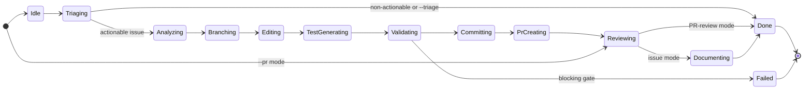
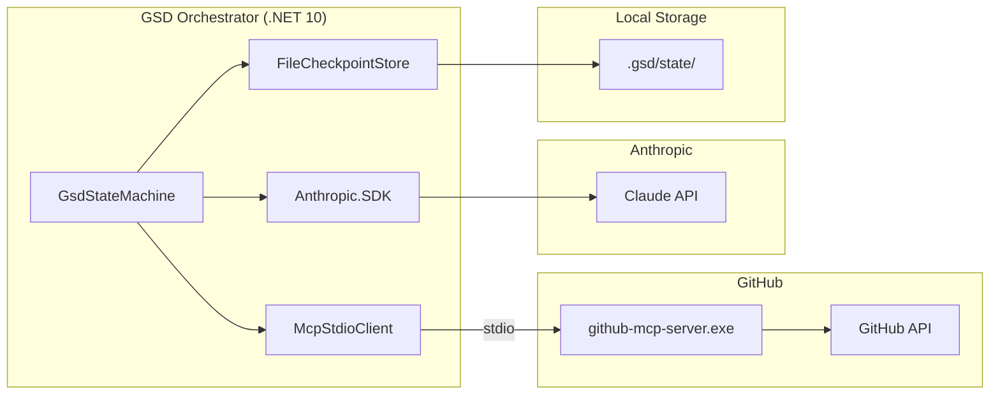

# GSD Orchestrator

[](https://github.com/Coding-Autopilot-System/gsd-orchestrator/actions/workflows/ci.yml) [](https://github.com/Coding-Autopilot-System/gsd-orchestrator/actions/workflows/codeql.yml)


Autonomous GitHub issue-to-PR engine. Point it at a real issue and it reads the
task, plans the work, creates a branch, edits code, validates the result, and
opens a pull request with durable workflow state.

**Stack:** .NET 10 (C#) · GitHub MCP Server · Anthropic Claude · Polly

[](https://github.com/Coding-Autopilot-System/gsd-orchestrator/actions/workflows/ci.yml)
[](https://github.com/Coding-Autopilot-System/gsd-orchestrator/actions/workflows/ci.yml)
[](https://dotnet.microsoft.com/download/dotnet/10.0)
[](LICENSE)

Part of the [Coding-Autopilot-System](https://github.com/Coding-Autopilot-System) ecosystem:
[Promptimprover](https://github.com/Coding-Autopilot-System/Promptimprover) | [autogen](https://github.com/Coding-Autopilot-System/autogen)

---

## Why This Repo Matters

`gsd-orchestrator` is the execution-focused flagship in the portfolio. Its value is
not just "AI edits code." The stronger signal is the operational model around that:

- state-machine controlled execution instead of a single opaque loop
- checkpoint and resume behavior for long-running workflows
- explicit validation gates before PR creation
- GitHub operations routed through MCP tooling rather than hard-coded scripts
- a design that can later sit behind a workstation bundle or a hosted control plane

## Enterprise Proof Points

- **Durability**: workflow state is checkpointed so interrupted runs can be resumed.
- **Guardrails**: validation blocks unsafe diffs, merge-conflict surprises, and weak test intent.
- **Operational separation**: GitHub tool access is mediated through MCP rather than being spread across ad hoc shell calls.
- **Auditability**: the lifecycle from issue to branch to PR is explicit and reproducible.

See [docs/portfolio-proof.md](docs/portfolio-proof.md) for a concise reviewer-oriented summary.

## How It Works

```text
Issue -> Idle -> Triaging -> Analyzing -> Branching -> Editing -> TestGenerating -> Validating -> Committing -> PrCreating -> Reviewing -> Documenting -> Done
```

Actionable issues follow the full path. Non-actionable issues and `--triage` runs
exit after `Triaging`. The separate `--pr` mode enters at `Reviewing` and exits
after submitting its structured review. Each state uses GitHub MCP tools via stdio
to interact with GitHub and Claude to reason about what to do next. Checkpoints are
written to disk so an interrupted or failed run can be inspected and resumed.

## State Machine



Any unhandled state exception also transitions the workflow to `Failed`.

### State Responsibilities

- **Idle** - Fetches repository metadata and full issue body from GitHub via MCP.
- **Triaging** - Classifies the issue, checks for duplicates, posts the triage result, and routes actionable issues to analysis or exits.
- **Analyzing** - Produces an implementation plan, branch intent, file targets, and test expectations.
- **Branching** - Creates or resumes the feature branch.
- **Editing** - Runs iterative edit loops and commits each changed file to the feature branch.
- **TestGenerating** - Generates or extends xUnit tests for eligible edited C# source files.
- **Validating** - Applies file-safety, merge-conflict, diff-size, test-intent, and generated-test structure checks.
- **Committing** - Confirms and records the latest commit on the feature branch.
- **PrCreating** - Creates or reuses the pull request for the work branch.
- **Reviewing** - Posts issue-mode reviewer guidance and requests reviewers, or submits a structured review in `--pr` mode.
- **Documenting** - Refreshes the MCP tool catalog and changelog on the default branch, then optionally auto-merges.
- **Done / Failed** - Terminal outcomes recorded by the state machine.

## Component Topology



## Prerequisites

- Windows
- [.NET 10 SDK](https://dotnet.microsoft.com/download/dotnet/10.0)
- `github-mcp-server.exe` already included in the repo root
- A GitHub Personal Access Token with `repo` and `read:org` scopes
- An Anthropic API key

## Setup

```bash
git clone https://github.com/Coding-Autopilot-System/gsd-orchestrator.git
cd gsd-orchestrator
cp .env.example .env
```

Edit `.env` and set:

```env
GITHUB_PERSONAL_ACCESS_TOKEN=ghp_...
ANTHROPIC_API_KEY=sk-ant-...
GSD_GITHUB_OWNER=Coding-Autopilot-System
GSD_GITHUB_REPO=gsd-orchestrator
GSD_REVIEWERS=
```

## Run The Orchestrator

```bash
cd src/GsdOrchestrator
dotnet run -- --issue 42
dotnet run -- --resume <workflow-id>
```

On success:

```text
✓ PR created:   https://github.com/.../pull/N
✓ Docs updated: docs/github-mcp-tools.md, CHANGELOG.md
  Workflow ID:  <id>
```

## Demo Review Path

For a fast evaluation of the repo:

1. Read this README for the control flow and operational model.
2. Read [docs/portfolio-proof.md](docs/portfolio-proof.md) for the concise reviewer summary.
3. Inspect `src/GsdOrchestrator/Workflows/States` for the state-machine structure.
4. Inspect the GitHub MCP startup scripts to see how local CLI use and orchestrator use are separated.

## Use GitHub MCP Tools In AI CLIs

The `github-mcp-server.exe` also runs as an HTTP server on `localhost:8765` and can
serve GitHub tools to any MCP-compatible AI CLI.

### Auto-Start At Windows Logon

```powershell
powershell -ExecutionPolicy Bypass -File install-autostart.ps1
```

### Manual Start

```powershell
powershell -ExecutionPolicy Bypass -File start-mcp-server.ps1
```

### Claude Code

```json
{
  "mcpServers": {
    "github": {
      "type": "sse",
      "url": "http://localhost:8765/sse"
    }
  }
}
```

### Gemini CLI / Codex CLI

Point MCP configuration at `http://localhost:8765/sse`.

## Architecture Summary

The MCP server is spawned as a stdio child process by the orchestrator, separate from
the HTTP instance used by AI CLIs.

```text
GithubMCP/
|-- github-mcp-server.exe
|-- start-mcp-server.ps1
|-- install-autostart.ps1
|-- .env.example
`-- src/GsdOrchestrator/
    |-- Program.cs
    |-- Auth/
    |-- Checkpointing/
    |-- Mcp/
    `-- Workflows/
        |-- GsdStateMachine.cs
        |-- Models/
        `-- States/
```
