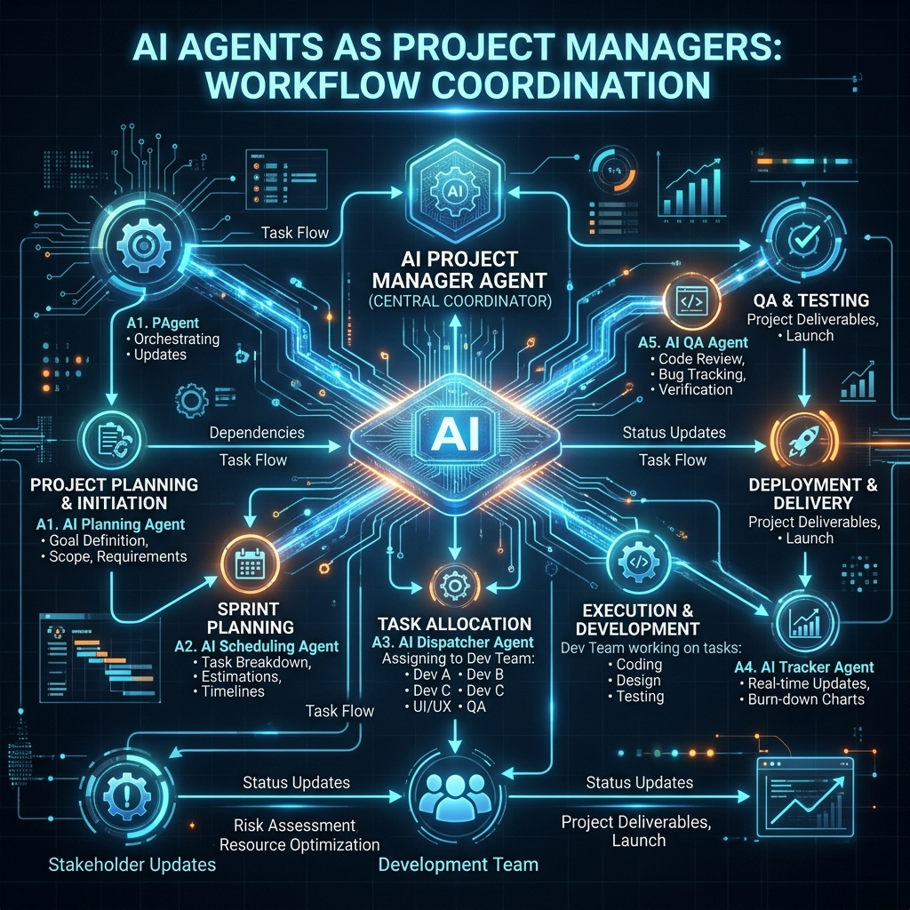

# ?? GSD Orchestrator: The Autonomous Issue-to-PR Engine

**GSD Orchestrator** is an elite, fully autonomous GitHub engine. Point it at a raw GitHub Issue, and it reads the task, plans the architecture, spins up an isolated branch, edits the code, validates the results, and opens a robust Pull Request. 

## ?? Elite Features
* **Zero-Touch Resolution**: Paste an issue URL, get a merged PR.
* **Anthropic Claude Integration**: Leverages frontier models for hyper-intelligent code synthesis.
* **GitHub MCP Server**: Uses the Model Context Protocol to seamlessly pull repo state, issues, and PR schemas.
* **Durable Workflow State**: Powered by Polly for insane resilience against network drops and rate limits.

## ? Quickstart
1. Ensure .NET 10 is installed.
2. Clone and build:
   \\\ash
   dotnet build
   \\\
3. Run the orchestrator against an issue:
   \\\ash
   dotnet run -- --issue-url https://github.com/org/repo/issues/1
   \\\

---
*For a deep dive into the internal graph architecture, please see the [Wiki](WIKI/Home.md).*
