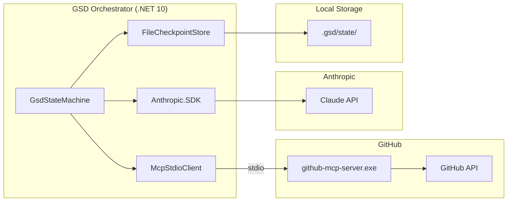

# GSD Orchestrator

Autonomous GitHub agentic workflow system. Point it at a GitHub issue and it reads the issue, creates a branch, edits code, commits, and opens a PR — all without human intervention.

**Stack:** .NET 10 (C#) · GitHub MCP Server · Anthropic Claude · Polly

[](https://github.com/Coding-Autopilot-System/gsd-orchestrator/actions/workflows/ci.yml)
[](https://dotnet.microsoft.com/download/dotnet/10.0)
[](LICENSE)

Part of the [Coding-Autopilot-System](https://github.com/Coding-Autopilot-System) ecosystem:
[Promptimprover](https://github.com/Coding-Autopilot-System/Promptimprover) | [autogen](https://github.com/Coding-Autopilot-System/autogen)

---

## How it works

```
Issue → Analyzing → Branching → Editing → Validating → Committing → PR Creating → Reviewing → Documenting → Done
```

The state machine drives the entire flow. Each state uses GitHub MCP tools via stdio to interact with GitHub and Claude to reason about what to do next. Checkpoints are written to disk so a failed run can be resumed.

---

## Diagrams

### State Machine


**State descriptions:**

- **Idle** — Fetches repository metadata and full issue body from GitHub via MCP. Reads labels and default branch.
- **Analyzing** — Asks Claude to produce an implementation plan: branch name, files to modify, summary, and whether tests are required. Retries up to 3 times if JSON parse fails.
- **Branching** — Creates a new feature branch from the default branch. Idempotent: if the branch already exists, resumes from it.
- **Editing** — For each file in the plan, runs a ReAct loop: reads current content, asks Claude to edit it, commits the result via `create_or_update_file`. Max 20 turns per file.
- **Validating** — Runs four gates: file safety blocklist, merge conflict pre-flight, diff size, and test coverage intent. Blocks on critical failures; warns on soft failures.
- **Committing** — Confirms the final commit SHA is present on the branch by calling `get_branch`. Records the commit URL.
- **PrCreating** — Generates a PR title and body via Claude, then opens the pull request. Idempotent: checks for an existing open PR from the same branch before creating.
- **Reviewing** — Posts a bot review comment explaining what changed and why. Requests reviewers from `GSD_REVIEWERS` env var if configured.
- **Documenting** — Updates `docs/github-mcp-tools.md` and `CHANGELOG.md` on the default branch. If `GSD_AUTO_MERGE=true`, squash-merges the PR.

---

### Component Topology



## Prerequisites

- Windows (Task Scheduler integration for auto-start)
- [.NET 10 SDK](https://dotnet.microsoft.com/download/dotnet/10.0)
- `github-mcp-server.exe` — already included in the repo root
- A GitHub Personal Access Token with `repo` and `read:org` scopes
- An Anthropic API key (for the autonomous orchestrator)

---

## Setup

```bash
# 1. Clone
git clone https://github.com/Coding-Autopilot-System/gsd-orchestrator.git
cd gsd-orchestrator

# 2. Create .env
cp .env.example .env
```

Edit `.env` and fill in your values:

```env
GITHUB_PERSONAL_ACCESS_TOKEN=ghp_...
ANTHROPIC_API_KEY=sk-ant-...
GSD_GITHUB_OWNER=Coding-Autopilot-System
GSD_GITHUB_REPO=gsd-orchestrator
GSD_REVIEWERS=                          # optional, comma-separated usernames
```

---

## Run the autonomous orchestrator

```bash
cd src/GsdOrchestrator

# Start a new workflow for issue #42
dotnet run -- --issue 42

# Resume a failed/interrupted workflow
dotnet run -- --resume <workflow-id>
```

On success:
```
✓ PR created:   https://github.com/.../pull/N
✓ Docs updated: docs/github-mcp-tools.md, CHANGELOG.md
  Workflow ID:  <id>
```

On failure the workflow ID is printed — use `--resume` to continue from the last checkpoint.

---

## Use GitHub MCP tools in AI CLIs (no orchestrator needed)

The `github-mcp-server.exe` runs as an HTTP server on `localhost:8765` and exposes all GitHub tools to any MCP-compatible AI CLI.

### Auto-start at Windows logon (run once)

```powershell
powershell -ExecutionPolicy Bypass -File install-autostart.ps1
```

This registers a Task Scheduler task that starts the MCP server at logon.

### Manual start

```powershell
powershell -ExecutionPolicy Bypass -File start-mcp-server.ps1
```

### Claude Code

Add to `~/.claude/settings.json`:

```json
{
  "mcpServers": {
    "github": {
      "type": "sse",
      "url": "http://localhost:8765/sse"
    }
  }
}
```

### Gemini CLI / Codex CLI

Point your MCP config at `http://localhost:8765/sse` (SSE transport).

---

## Architecture

```
┌─────────────────────────────────────────────┐
│              GSD Orchestrator (.NET 10)      │
│                                              │
│  Program.cs → GsdStateMachine               │
│               ├── AnalyzingState            │
│               ├── BranchingState            │
│               ├── EditingState              │
│               ├── ValidatingState           │
│               ├── CommittingState           │
│               ├── PrCreatingState           │
│               ├── ReviewingState            │
│               └── DocumentingState          │
│                                              │
│  McpStdioClient ──► github-mcp-server.exe   │
│  (stdio, spawned as child process)          │
│                                              │
│  FileCheckpointStore → .checkpoints/        │
│  Anthropic.SDK → Claude (claude-sonnet-4-6) │
│  Polly → retry + exponential backoff        │
└─────────────────────────────────────────────┘
```

The MCP server is spawned as a **stdio child process** by the orchestrator — separate from the HTTP instance used by AI CLIs.

---

## Project structure

```
GithubMCP/
├── github-mcp-server.exe          # Pre-built GitHub MCP Server binary
├── start-mcp-server.ps1           # Start HTTP MCP server (for AI CLIs)
├── install-autostart.ps1          # Register Task Scheduler auto-start
├── .env.example                   # Environment variable template
└── src/GsdOrchestrator/
    ├── Program.cs                 # Entry point, DI wiring, CLI args
    ├── Auth/                      # GitHub PAT provider
    ├── Checkpointing/             # File-based workflow checkpoints
    ├── Mcp/                       # MCP stdio client + tool dispatcher
    └── Workflows/
        ├── GsdStateMachine.cs     # Orchestrates state transitions
        ├── Models/                # WorkflowContext, enums
        └── States/                # One file per workflow state
```
