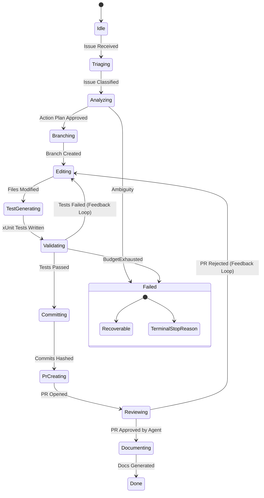

# Architecture

The heart of the `gsd-orchestrator` is a durable State Machine built around the `WorkflowState` enumeration. It decomposes the massive complexity of an autonomous coding task into discrete, verifyable phases.

## Workflow State Machine

The orchestrator guarantees that no code is pushed to a PR without passing through `TestGenerating` and `Validating`.

## Validation & SDLC Status

Beyond linear states, the Orchestrator maps operations to Software Development Life Cycle (SDLC) batches:
- `Discovery` (Triaging, Analyzing)
- `Design`
- `Change` (Branching, Editing, TestGenerating)
- `Assurance` (Validating, Reviewing)
- `Closure` (Committing, PrCreating, Documenting)

If a phase reaches `ValidationStatus.Block`, the engine triggers a `TerminalStopReason` (e.g., `PolicyDenied`, `DestructiveAction`), rolling back the branch and alerting the human operator.
