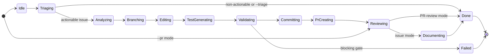
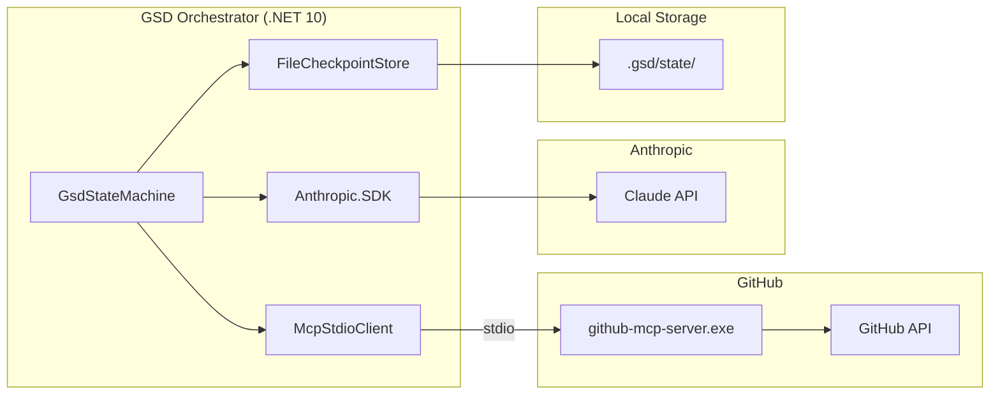

# Architecture

## Goal state machine

The orchestrator is a durable `GsdStateMachine` built around the `WorkflowState` enum
(`src/GsdOrchestrator/Workflows/GsdStateMachine.cs`, `Models/WorkflowState.cs`). Every issue
run walks the same linear path unless it is triaged out early or a state raises an unhandled
exception, which transitions the workflow to `Failed`. State is checkpointed to disk after
every transition (`FileCheckpointStore`), so `--resume <workflow-id>` can continue an
interrupted run instead of restarting it.

<!-- codex:generate-image prompt="A conveyor-belt state machine: a glowing token labeled ISSUE travels through eleven numbered gates (Idle, Triaging, Analyzing, Branching, Editing, TestGenerating, Validating, Committing, PrCreating, Reviewing, Documenting) each rendered as a small illuminated archway, ending at a checkered-flag PR gate; one side-branch peels off downward into a red Failed gate with a retry arrow looping back; isometric, enterprise blue/graphite palette" style="isometric, enterprise, clean" replaces="mermaid-above" -->

## Failure handling on `main` today

`ResumeAsync` checks `ctx.CurrentState == WorkflowState.Failed`: if `ctx.FailedState` is set,
it clears the failure and re-enters that state for a retry; if the retry fails again it maps
the exception to a `TerminalStopReason` (`BudgetExhausted`, `NoProgress`, `RuntimeExceeded`,
or `Unknown`) and halts. On the primary path, an unhandled exception during a state currently
rolls the workflow back through the SDLC phase map (`Discovery` → `Design` → `Change` →
`Assurance` → `Closure`) before settling into `Failed`, recording the *rolled-back* state as
`FailedState` rather than the state where the exception actually occurred.

## Typed-failure retry/halt path (Phase 28-01 — not yet on `main`)

Phase 28-01 hardens this: transient `McpException` failures should bypass the SDLC rollback
cascade entirely and persist the *actual* failed state, so `ResumeAsync` retries the state
that really failed (once) before halting — proven by `FaultInjectionTests.cs` and
`CheckpointCorruptionTests.cs` (see [`28-01-SUMMARY.md`](../../.planning/phases/28-fault-injection-recovery/28-01-SUMMARY.md)
in the root workstation repo for the full design). **This work exists only on a local,
unpushed branch (`feat/phase-28-fault-injection`) in the operator's workstation checkout —
it is not present on `origin/main` and there is no open PR for it yet.** Treat the failure
handling described in the previous section as the current state of `main` until that branch
is pushed and reviewed.

## Component topology

## SDLC phase mapping

Beyond the linear states, the orchestrator maps operations to SDLC batches — `Discovery`
(Triaging, Analyzing), `Design`, `Change` (Branching, Editing, TestGenerating), `Assurance`
(Validating, Reviewing), `Closure` (Committing, PrCreating, Documenting). A `Block`-level
validation status triggers a `TerminalStopReason` and rolls the branch back.

<!-- docs-verified: a01b130c98cb7833d45cc7406f6002009f33557a 2026-07-08 -->
